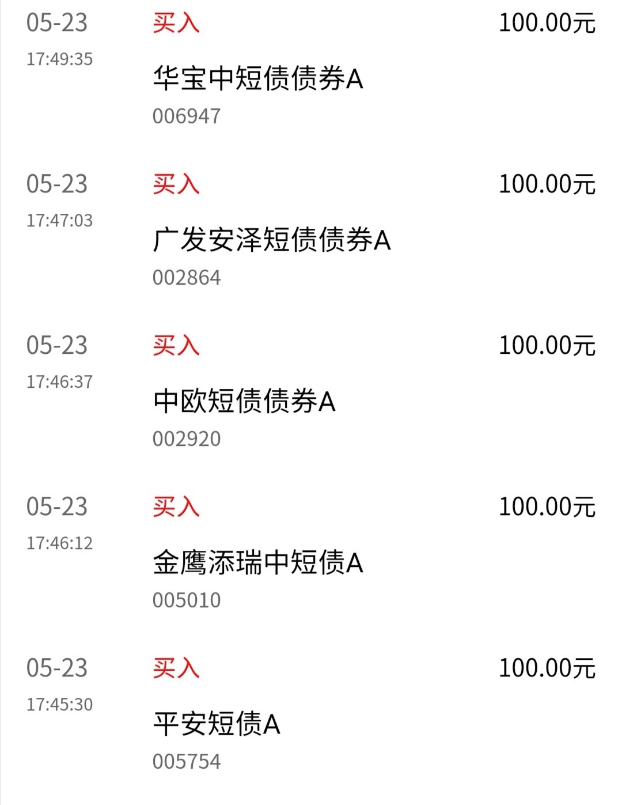
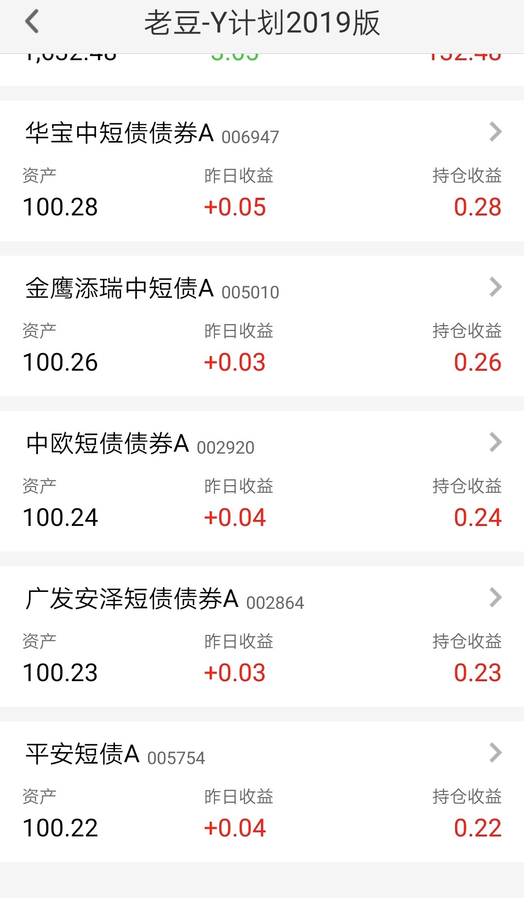

### 中短债基金不完全研究

> 对于我们这样指数基金定投的人来说，稳定的现金流很关键，配置一定比例‘较高收益且较好流动性’的资产很重要。2018 年 9 月开始 P2P 我实行‘到期后不再续投’策略，日益增多的现金除了躺余额宝还能去哪？

今年春节过后，有保险公司理赔的 P2P 已经近乎绝迹。陆金所 8.4%标再也抢不到了；小赢的众安陪标在二季度开始也已消失，后来才知道是上海地区禁售了，既然地方加强监管那我也不再续投了；拍拍贷的陪标去年 9 月起我已经严格执行只出不进策略了。P2P 的红利期已经过了，连头部公司的兜底产品都开始这样了，我不得不开始寻找流动性好又有较高收益的替代物了。

-   货币基金
-   小银行的创新存款
-   银行大额存单
-   银行理财
-   债券

因篇幅有限均简略说下，后面有机会可以单独列文：

1、货币基金选择最多、门槛最低、操作方便、流动性极强，但是缺点也是极其明显：**收益低**。

2、银行大额存单收益稍高于货币基金，安全性这个有保障，**投资门槛很高**（20 万起），且流动性满足不了我这样的定投投资者。

3、小银行的创新存款底层资产也是银行存款，安全性不错，因为做了创新使得流动性也较好，提前支取也能获得较好的收益，缺点就是**难抢**，典型代表就是富民银行的一款产品。

4、银行理财收益略高于货币基金，但是流动性欠佳，投资门槛较高，一般 5 万到 10 万不等。前几年飞单也不少，所以我主观上是比较排斥银行理财产品的，这个种类是专门‘忽悠’老年人的。

5、债券，我研究了国债、信用债、可转债，最后选中了可转债（金融可转债+AAA 级转债)已经中短债基金。可转债，熟悉我的朋友知道我去年开始一直在推荐大家破发价可以屯点高信用的转债，此处不再展开。至于中短债基金即是本文重点，且看下文分解。

其实研究债券花费的时间最多，即便如此我也只能说我仅懂些皮毛，所以本文题目叫不完全研究。

-   长期债券 >10 年
-   中期债券 0 < X < 10 年
-   短期债券 < 1 年

我的资金量以及选择债券的能力还没到直接购买中短期债券的能力，所以选择对应的债券基金是不二之选。短债基金投资范围仅限于债券、央行票据等固定收益品种以及银行存款，不投资股票和可转换债券，安全性和流动性都得到了保证。

剩下的问题就是看下短债基金的收益性，中短债基金一般投资 1~3 年的债券，因为到期日较近，债券利率较稳定。但是我喜欢质疑一切，如果相对货币基金不是很明显，我何必折腾呢？所以我决定自己去实战验证下，用真实数据告诉我中短债是一个不错的类现金资产。

我首先打开 choice 选取了最近一年中短债基金收益最高的 5 只基金（A 类和 C 类算同一个样本），在准备买入的时候发现有一只费用明显高于另外四个，我这样的高费用厌恶者果断剔除了这个样本。样本如下：

-   平安短债 A 【005754】
-   广发安泽短债债券 A 【002864】
-   中欧短债债券 A 【002920】
-   金鹰添瑞中短债 A 【005010】

在我选样本的那几天恰逢华宝中短债的大肆推广，雪球上不少大佬也纷纷发文，我也就顺手点开看了下，费用也不贵，仅有的一段实战表现感觉还不错。既然有个空缺就给‘新来的’一次机会吧。愿意给华宝一个机会主要是他们既往的固收类产品还不错，有国内最大的场内货币基金华宝添益，还有华宝宝康债券这个老牌五星债券基金。

所以我在 5 月 23 晚上下单：

[天天基金组合：【老豆-Y 计划 2019 版】](https://appunit.1234567.com.cn/ComboDetailV2/index.html?id=10130486&ttfundApp=0&hideuid=true&v=5.9.1&plat=Android&platid=2&appType=ttjj&terminal=true&isApp=0&fromWhere=native)

今天 6 月 25 日上午的截图是昨天收盘的数据：

我们算下收益率，五只债券基金我都选择了 A 类，持有 1 一个月以上免赎回费，除平安这只基金是 0.03%外其余四只申购费 0.04%

整整一个月后实战排行：
华宝 > 金鹰 > 中欧 > 广发 > 平安

我均买入 100 元，当下收益分别是：0.28、0.26、0.24、0.23、0.22 元，即收益率为最高的华宝 0.28%、最低的平安 0.22%

再严谨点算下，要先扣除申购费，那么实际收益最高的是华宝 0.32 元、最低的是平安 0.25 元，计算周期为 31 日，那么实际年化收益约 （0.28+0.04）/31\*365-0.04=3.7277，约 3.73%

同理得：

| 基金 | 年化收益 |
| ---- | -------- |
| 华宝 | 3.73%    |
| 金鹰 | 3.49%    |
| 中欧 | 3.26%    |
| 广发 | 3.14%    |
| 平安 | 2.91%    |

我们现在再去查下余额宝近七日年化收益 2.4170%，因为现在余额宝对接了多只货币，可能有一定偏差，但基本就在 2.3%~2.6%之间。其实我一开始筛选的时候，这 4 只基金一年期实际收益都在 4.5%以上，所以可以预见战胜了这 4 只基金的华宝中短债【006947】未来前途光明啊。

小结：

> 很多好的产品越来越难抢，几乎绝迹了，比如：创新存款、陆金所的 8.4%保险公司承保的网贷。为什么没了？监管是一方面，整体大环境收益率都在降低也是一个原因，所以不要嫌弃债券基金的这点收益，有时候为了流动性和安全性牺牲一部分收益是正常的。对于未来 3 个月内不使用的资金我还是建议大家可以考虑中短债基金的，即便临时要用，也是可以随时赎回，损耗极小。而且我建议大家分散购买，类似我这样买 5 个做一个组合投资，债券的一个投资原则就是分散，虽然 5 个基金也算不上什么分散，但是可以有效的规避一些问题。
