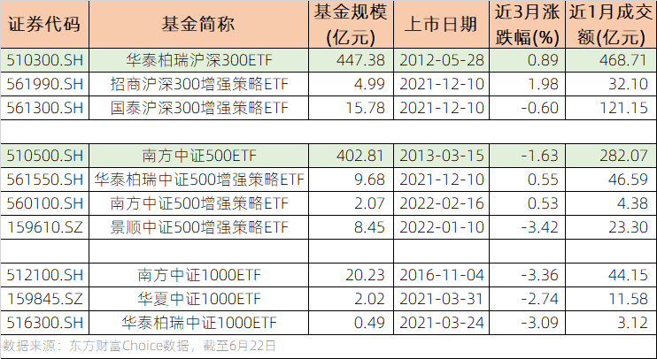

### 5只首批增强ETF现在如何了？

6月22日中国金融期货交易所（中金所）发布了中证1000股指期货和股指期权合约及相关规则的征求意见稿，意味着在上证30、沪深300、中证500后，新的股指期货、期权即将推出。**中证1000期货期权的推出，丰富了投资者的投资工具和对冲手段，这有利于量化投资策略的发展，也为市场带来了更大容量和不同的收益逻辑。**

虽然我自己不参与股指期货、期权的交易，也时常劝诫普通投资者无非必要还是别碰它们。但这不妨碍我精神上支持这种**具备双向交易属性的投资风险管理工具**，它们的存在肯定是有助于市场的健康发展。股指期货、期权的发展给量化投资带去了很多便利，所以这条新闻也让我想起了去年底获批上市的那几只策略增强型ETF，我顺手查了下这5只ETF的最新数据，整理后有几点小感想与大家一起分享。

**1、普通ETF目前仍是主流选择。**为了对比我特意在表中加入了沪深300和中证500各自最大规模的ETF，上图可以很明显地看到传统ETF无论是规模还是流动性都碾压增强ETF。但稍感欣慰的是：国泰的沪深300增强ETF与华泰柏瑞的沪深300ETF近1个月成交额没有数量级的差距；华泰柏瑞的中证500增强ETF与南方的中证500ETF近1个月成交额差距也没那么夸张。毕竟这批增强ETF最早的也不过刚成立满半年，规模及流动性这块我觉得可以后续再观察下。

**2、同管理人的增强或不被重视。**其实首批5只增强ETF的管理人原本就有相应的普通型ETF，甚至有些基金经理都是同一人。上图中南方基金的中证500增强ETF就是一个典型案例，你要说上市最晚所以规模最小这个我理解。但是你上市已四个多月了，近一月交易总额才4亿元多一点，多少有点说不过去吧。这里面是否存在同一基金管理人的类似资源被老产品挤占了，毕竟南方基金的中证500ETF是标杆型产品，是否真的只能等同行来优化自己？

**3、低费用不如高流动性更具吸引力。**这个现象我们之前的文章里也谈过，这次又遇见了。5只增强ETF中费率最便宜的就是【2】中提到南方基金的中证500增强ETF（0.5+0.05），甚至低过了南方自家普通型中证500ETF的费率，虽然现在看下来低费率策市场不一定买账（同一家基金公司的同类产品，给你加了增强策略，费用反而便宜了，但大资金就是不为所动，这想来有点意思），但我依然对基金产品降费这件事喜闻乐见。

而费率最贵的是国泰基金沪深300增强ETF（1+0.1），正好是南方基金的两倍，但这丝毫不影响它是首批5只里规模最大、流动性最强的那个。国泰的这只增强ETF规模不到20亿，每天成交额却有5亿多，难道这就是传说中的“钱多好办事”？（第二贵的也是300增强ETF队伍里流动性最好的华泰柏瑞0.7+0.1）

**4、增强效果的随机性较大。**可能是我个人水平有限，我看了半天没找出增强效果与什么有关？不是规模越大增强就越好（招商近3月业绩远超国泰）；也不是规模越小增强越好（华泰柏瑞和南方规模差好几倍，近3月业绩很接近）；和指数本身也没太大关系（毕竟每个指数系列都有正增强和负增强的例子）。想来5只产品成立时间不久，可以统一观察的区间也就近3个月，如果不考虑运气成分，那就只剩下各家基金的增强策略是否有效了。

增强ETF之间的竞争实际上就是各家超额收益策略的比拼，怎么界定超额收益好不好？我认为是基于超额收益的幅度、胜率、稳定性等指标，这就需要更长的时间去观测，我还是很希望增强ETF可以发展越来越好（费率和透明度都要优于传统的场外指数增强基金）。这两年大家总说ETF内卷越来越狠，那么增强ETF的获批又是一个卷到边际的一个体现，从以往单纯地复制到追求更多的主动超额收益，这是一个ETF行业不错的开端。

最后说回中证1000指数上来，当下已有的对应ETF仅三只，另外一只LOF我没列出。图中可看出南方基金的这只中证1000ETF规模和流动性遥遥领先，我平日对中证1000指数产品还真关注不多，看到南方这只的成交额后我还是有点小惊讶的。另外华夏基金这只流动性也还凑合，而且我相信以华夏基金的ETF做市能力，后期可作为备选。随着中证1000指数的期货期权有序推进，不知道下一批增强ETF批复的时候有没有对应的产品？

