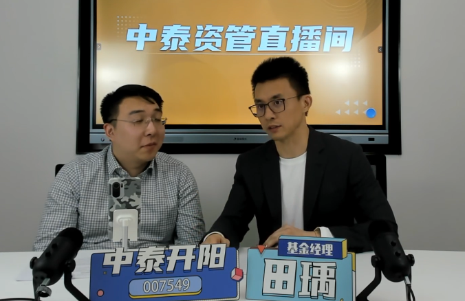
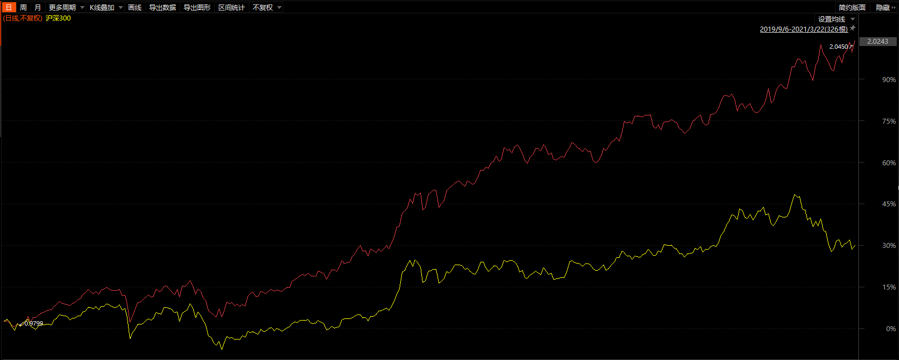
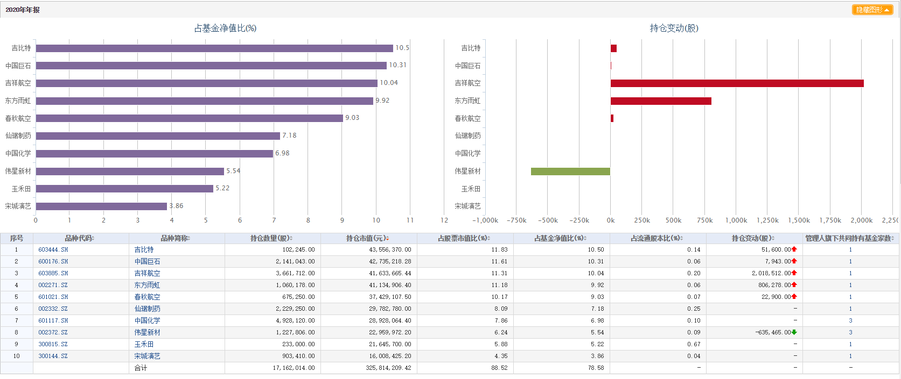

### 长坡、厚雪、慢变

可能是我那天回上海的高铁上太无聊，也可能是这场直播回放蛮对我的胃口，印象中好久没这么完整地看一场基金经理的直播了。而且有时候如果我觉得基金经理语速慢或信息量不密集我会加倍速播放，但中泰资管的田瑀直播我全程没加速。田瑀的讲述很好的做到了深入浅出，外貌形象也是很舒适，另外边上那位“捧哏”也是憨憨中带着有趣，我从没想过我会看两个男的直播看了80分钟。这场直播让我印象深刻的几个点是：做好委托信任管理很重要；老司机不会把自己轻易暴露在危险之下；均衡的配置可以让普通基民持有得更久、更容易赚钱、最终体验更友好；**在那些“长坡、厚雪、慢变”的土壤里更容易出高质量护城河的企业**。

坦率地说，这是我第一次看到这位基金经理，但好奇的我问了几个主要研究主动基金经理的自媒体朋友。得到的结果大致有：对估值有偏好、算价值风格的基金经理；做研究员时间蛮长，对其能力圈内的行业有较深的认识；执行能做到合一，管理规模适中可以做到较好的超额收益。我心想怪不得看着顺眼，原来大家评价都很正面呀，要知道我们私下讨论基金经理的时候通常都是很“实在”的，这次被大家夸得我准备花点时间去多了解下这位基金经理及其产品。

我主要看了他直播里说的 **中泰开阳价值优选混合A（007549）** 这个产品，我们先看一些直观的数据吧：2019年9月6日成立，截止3月22日，累计单位净值2.045元，**今年以来总回报12.29%，近一年总回报95.26%，成立以来年化回报58.88%（数据源：choice）**。下图为中泰开阳和同期沪深300指数的走势对比：

如果用一个字形容上图就是“稳”，我很自然地去看了下这个产品的十大持仓及其变化。持仓主要覆盖了航空、医药、建材、游戏、旅游、环保、化工、建筑等行业，这种行业均衡的配置，外加在“长坡、厚雪、慢变”的土壤里寻找那些高质量护城河企业。田瑀的持仓也不是那种摊大饼的均衡配置（2019年年报总持仓25只个股、2020年中报总持仓34只个股），在选好企业后也是敢于重仓且长期持有的（2020年年报前十重仓权重合计78.58%），最典型的就是吉比特几乎从建仓起到最近一次公布的季报，就一直满格持有的状态。这些个持仓特点也印证了上面朋友们给予的评价，对能力圈内的行业有较好的认知，知道该如何在这些行业里寻找高质量的护城河企业，应该也正因为早先多年研究员的经历，让其对自己选股是极其笃定的，这才是田瑀能知行合一、长期持有优质企业的根基。下面附上中泰开阳四季报十大重仓：

随着进一步对田瑀的挖掘，我发现中泰资管团队在公众号和雪球上经常会发布一些基金经理的文章，这点让我很欣喜。基金经理愿意时不时地分享一些他们的投资理念，是非常有利于基民更好的认知其基金产品的，这个我想就是田瑀在直播里提到的做好“委托信任”管理。我翻阅了中泰资管近半年来几乎所有相关的文章，后面又看了两场田瑀的直播，我其实就是在寻找中泰开阳价值优选是如何做到这么顺滑的上升走势的，再说直白点就是：**田瑀是如何控制回撤的？**

首先控制回撤就是抑制基金净值的波动，那么哪些因素会让基金净值波动呢？**1、市场系统性波动**（比如各种黑天鹅导致的千股跌停）；**2、行业轮动波动**（比如春节后顺周期板块的轮动上涨）；**3、个股自身波动**（这个很好理解，就不比如了）。所以我们常看到有些人热衷于通过所谓的“择时”来消解这三方面的波动，其实只要稍微有点投资经历的人都明白择时是个很随机的操作，只要把周期一放长‘择时’就极难生效。

田瑀具体的做法就是放弃控制个股的波动，透过对行业间的弱相关性来抑制组合的波动，然后不做短期的择时，通过估值水平与仓位负相关的方法来避免（或减弱）系统性波动。这点我深以为然，我自己的公开组合“薪火相传”里也用了类似办法来抑制组合的波动，可能不是最佳解决方案，但基金净值长期平稳的增长有利于让持有人获得更好的投资体验。

田瑀额外对个股波动做了一些补充，不要试图去控制个股自身的波动，大家要有这么个觉悟：个股层面的巨大波动正是价值投资者获得丰厚利益的来源，对基本面有了深入了解和研究后，敢于逆市而行是一个成熟价值投资人的必备技能。另外田瑀也坦言在不择时、不轮动后获得超额收益就剩下选股了，正因为田瑀深谙此理，他才会反复研究其“长坡、厚雪、慢变”的选股秘籍。

最后我们分享下田瑀是如何定义这三个标准的，也算是对文章题目的一个官方解答。**长坡**：长期存在且增长的行业；**厚雪**：行业规模可观，能够占据较大比例的行业利润；**慢变**：稳定的外部环境提供足够的安全边际。

> 小结

经过这两天的学习，我认为田瑀是一位拥有自洽投资框架的基金经理，对于其关于控制回撤和选股理念的讲解我还是很认同的。在这篇文章材料整理的过程中我意识到其实还是有很多好的基金经理值得我们去学习和借鉴的，为表敬意我也自己买了一点观察仓位，我一直认为只有自己参与进去了才会有更好的后续跟踪。我个人对于2021年行情的预期还是区间震荡为主，在行业风格变化如此之快的行情下，我们可以考虑一下中泰开阳价值优选混合A（007549）这样均衡配置的基金产品，我还关注到该基金今年已经出了C类（011437），当然对于这类产品我还是建议大家持仓周期尽量长一点。