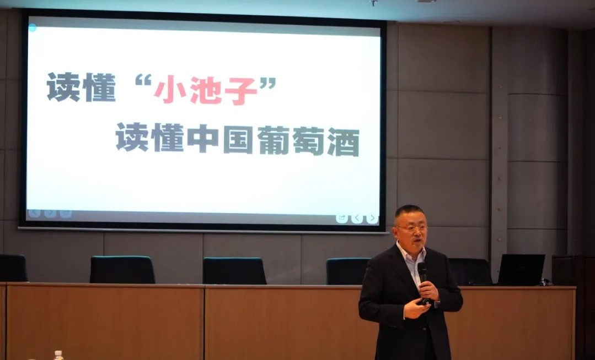
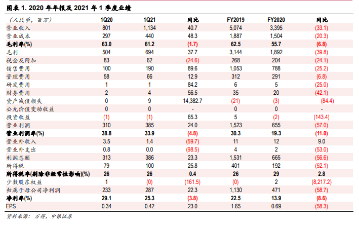

### 看张裕如何解“小池子”之困

> 中国葡萄酒行业和白酒比就像是“小池子”

这是张裕总经理在2020年度股东大会提出的一个比喻，为什么这么说呢？中国整体的葡萄酒加在一起，只有中国白酒销售额的1/58;而葡萄酒行业产生的所有利润，也只有白酒的1/600。我们可以清晰地看到白酒一直以数量级程度的优势（销售额、利润）在碾压着葡萄酒行业。所以如果把白酒行业比作标准的游泳池，那么中国葡萄酒行业就是个不起眼的“小池子”。白酒企业可以在25米的泳道里欢快游耍，时而秀一波漂亮的姿势，时而摘几个好成绩刷下新记录；而以张裕为首的中国葡萄酒企业却因赛道差异只能在边上的小池子里待着。

刚才只是财务数据上的差异，从消费量上看葡萄酒和白酒也不是一个量级的。孙总给我们估算了平均每天中国要消耗4200万瓶白酒和230万瓶葡萄酒（顺带惊叹下中国真的是消费大国），简单说就是20瓶白酒才搭配上1瓶葡萄酒。我看了下他的估算依据，虽然略显粗犷（引用了中国海关统计的葡萄酒进口量、中国酒业协会公布的国内葡萄酒产量等），但也能感受到大致情况确实这样，这种消费场景的差异是我们日常生活中能切实感受到的，也是中国葡萄酒企业不得不去面对的一个客观现象。

白酒和中国葡萄酒在消费场景上确实有大小之分，也正因为这种葡萄酒不怎么被待见的现状使得其消费市场较小，且毛利率和动不动就80%+的白酒根本没法比。而且仔细看你就发现葡萄酒行业内的净利润数据也让张裕很憋屈：中国酒业协会披露的中国所有规模以上葡萄酒企业去年净利润为2.59亿，而张裕一家就贡献了4.71亿元。这就意味着除了张裕以外的129家总计还亏损了2.1亿元，这样侧面印证了葡萄酒企业在中国葡萄酒行业这个“小池子”里极其艰难的活着。

> 跳出外部环境局限性，“小池子”也能有更好的明天

虽然张裕依然是行业龙头，但是上图显示与其自己过往比营收和净利就是明显下滑了，当然去年疫情是主要原因，但事实就是这么个事实。所以有个别股东提出说要问责，实际上张裕内部确实也做了问责：去年董事长收入下降了50.9%，总经理下降了50.3%，其他的高管下降39.3%，中层下降12.1%，员工下降了6.8%。当然这更多是企业管理层的一种表态，我们作为股东其实更多的是希望企业能做大做强，把企业做好、把股价坐高。

**1、改变消费场景。** 做大中国葡萄酒市场，最本源的解决方案就是培养国人的饮酒习惯，让更多的消费者愿意喝葡萄酒、喜欢喝葡萄酒。但这是一个行业的问题、一个民族饮食文化的问题，需要整个行业一起不懈努力，张裕作为行业龙头也理应承担更多的责任。

**2、建立消费自信。** 在培养消费习惯、扩展消费人群的同时，培养消费者的消费自信也很重要。葡萄酒行业和白酒还一个不同就是，国内葡萄酒企业面临着高压的国外葡萄酒竞争，这个就是国人消费不自信的表现之一。类似的消费品还有乳业，特别是婴幼儿奶粉这类，大家基本上都会优先选择国外品牌。这种民族品牌自信的建立是一个漫长而系统性的工程，把产品做好的同时也要让消费者逐渐信任国民品牌。

**3、持续推进聚焦战略。** 张裕如果只是满足于“吃饱”，那么凭借行业龙头地位直接躺平就可以了，但一对比白酒的飞天茅台、国窖1573、郎酒青花瓷等高端大单品（大单品毛利基本都是80%+）只能默默眼馋。张裕也意识到了这些，在两三年前就提出了聚焦战略，简单说就是：聚焦高品质、聚焦中高端、聚焦大单品。比如高端聚焦龙谕（为龙谕成立独立的小组公司）、中高端聚焦张裕解百纳、白兰地板块聚焦可雅，同时在预算可控范围内把更多的钱放在核心品牌上。只有优质大单品才能支持起超高的毛利率，我认为大单品就是“小池子”进化成泳池的钥匙，做好、做强大单品这也是企业稳健增长的根基。

**4、做好副产品相关布局。** 企业每年收到的葡萄原料里难免有些是中低品质的，那么这就可以借鉴日本经验做好扩大消费群体的责任。比如说葡萄酒加果汁的产品、低度葡萄酒、无醇葡萄酒、易拉罐葡萄酒等等，推出这些开启方式和饮用场景更普及的葡萄酒产品，很可能会逐渐打开中国葡萄酒市场。等这些人慢慢长大，消费升级后他们已经接受了更酸、更涩、更标准的葡萄酒，未来就会像日本那样有更大的消费者群体。（这个和聚焦战略不冲突，类似的产品都是与其他公司合作，不会带有张裕字样）

**5、权利推进“2+1+9+30”线上业务。** 2指的是京东和天猫两大电商平台，京东上找了全国做线上酒水生意前三大公司合资；天猫上是和另外一家线上酒水大商合作（但不是合资形式）。这两种合作方式都吸收了对方几百人的团队支持，很好的弥补了张裕作为传统企业在线上业务上的不足。1指的是刚成立的在上海的公司，年底预计扩张到200人，主要负责抖音、火山、直播带货、短视频、会员营销等最前沿的产品。公司也要顺应潮流，培养自己的线上业务人才以及相关储备，让更多的年轻消费者可以触及到张裕的产品。9是指有九个单一品牌的线上大商，这些独立品牌不带张裕字样，但网上卖的时候能释放一定的产能。30指力争发展30个独立品牌的线上经销商，以此最大限度地释放产能。

> 小结

中国葡萄酒行业的困境大家可以感受到，作为行业龙头的张裕也一直在探索破局之道。我们看到了张裕的勇气和决心，希望张裕能充分发挥自身优势，与整个中国葡萄酒行业一起做强做大。