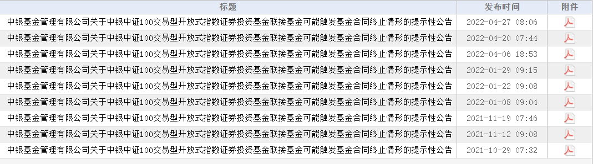

### 待清盘基金竟已“仰卧起坐”半年多

一只曾经买过且印象中早应清盘完毕的基金，我在昨晚一篇报道里看到了它的身影。今天越想越奇怪就去翻了下这只基金的一些资料，发现其半年多一直在清盘条件触发与否的边缘来回跳跃，看后我**直呼真是个“仰卧起坐”小能手！**

2021年10月29日中银基金的这只中证100联接基金就开始公告提示：本基金可能因资产净值连续50工作日低于5K万而进入清算程序，且无需召开持有人会议表决。后面11月12日、11月19日、2022年1月8日、1月22日、1月29日、4月6日、4月20日、4月27日都发布了类似公告。

为什么对这只基金印象那么深刻呢？我之前把它纳入过自己组合，主要是看中了它综合费用不高，7天免申赎费，为此也忍受了其规模极小的缺点，但考虑到其为ETF联接基金，所以也没太担心起跟踪误差问题（中证100指数产品和沪深300比是真的太稀少了）。

去年11月看到其公告即将要触发清算程序，看这规模一直没起色，按常理几乎不会有新增资金买入了，清算是板上钉钉的事。那么为了避免冗长的清算流程，我在当时仍亏损的情况下置换了等量的沪深300基金，卖出后也就删了自选没再关注，哪知道如今依然还“健在”。

那就有小伙伴问了：**为什么这基金频繁公告，可结果就是不触发清算程序呢？**我们看基金合同能发现该基金持有人少于200位或净资产低于5K万满20天就要公告预警，满50天就要触发清算流程且无需开持有人会。所以这一次次的公告预警我估计只有一种解释：中银基金在很“努力”地保住这只产品不被清算掉，而“仰卧起坐”的手法大概率就是间歇性的找帮忙资金冲下规模，只要不是连续的50工资日低于5K万即可（有没有一种ST保壳的即视感）。

基金公司找帮忙资金也不是什么新鲜事，你看这基金成立之初就是找了约3亿帮忙资金撑下场面，然后一个月后四季报就只剩0.61亿规模了（中证100指数系列产品的冷清一直是让其略显尴尬的地方）。当然这也能理解，为保产品成立基金公司找帮忙资金是很正常的，但这种努力抢救即将清算的基金还不是特别多，可能是中银基金很在乎这个当年的“冷门”指数产品吧。

好在这个产品的运气不是很差，终于在不断地抢救续命后等来了中证100指数编制规则优化的好消息。我们也看到该基金在5月开始就不再有类似公告了，不出意外半年报公示规模应该能有个不错的增长。

中证100指数编制规则优化后，无论是之前有相关产品的基金公司，还是新获批相关产品的基金公司都在努力宣传推广，大家在选择购买时还是要多一些对比，如果实在没有很好的选择，那么暂时用沪深300或者A50替代也勉强可以。