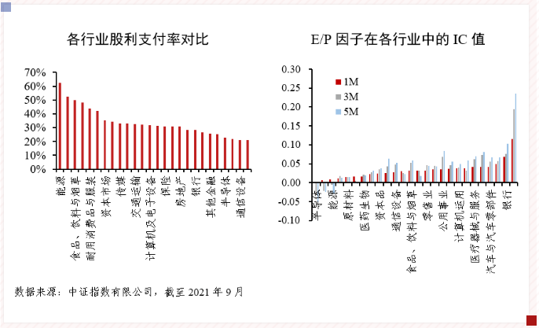

### 高股息是对散户更友好的选择

**持续、稳定、较高比例的分红才是散户在A股的正确打开方式**，虽然在A股赚钱的策略有很多，但大多方法水太深，我们普通投资者很难把握得住。对此我知道很多人不以为然，好在我也无意劝说所有人都来接受这一观点。

上周五（5月13日）中证指数官网发了篇关于红利系列指数的研究报告，读后我想着自己已经好久没写红利题材的文章了，遂敲下了本文权当自己的随感记录，若对红利因子有兴趣的朋友我建议去官方找这篇文章看一看。

为什么我说高股息是最真实的选股因子？在尔虞我诈、套路满满的A股，上市公司的大股东和管理层往往是站在我们普通投资者对立面的（至少我们小散不是他们做决策的首要考虑方），而且我们处于严重的信息不对称处境（这里的不对称包括信息的真实性、完整性、时效性）。不用说太细，但凡有些个股投资经历的朋友应该都能认可我说的这点，所以我认为普通投资者需要寻找的是那类有能力且愿意稳定分红的“友好型”大股东（管理层），又或者尽量找一些与大股东立场相近的投资标的（比如说可转债，但非本文要谈的内容，不做展开）。

市场上有很多不在乎红利的人，当然他们也不是真的不喜欢分红，而是不喜欢那些没有啥想象空间的传统股。因为企业分红与其生命周期密切相关，相较成长阶段的企业，成熟阶段的企业才具有更高股利支付率水平。

而红利因子的拥簇者们深知持续、稳定、现金分红的高股息率公司往往具备**基本面良好、现金流充沛、盈利能力稳定**等特点（也有人会说还有‘低波动’这一特点，我个人认为前三个特点是支撑企业持续稳定高分红的基础，而低波动仅仅是高股息企业的一个特征，既非因也非果），持有这些股票会有较高的安全边际。我开头也说了，在如此套路满满的A股，只有真金白银的现金分红才是相对坑最少的打开方式。说得直白点就是：你买的企业有能力分红且愿意分给你，这才是散户们的避坑之路。再来一个可能不那么恰当地比喻：渣男海王们可以撩得你很开心，但是回头来你会发现还是备胎暖男们更适合过日子，他们才是生活的常态。

当然安全起见我还是建议普通投资者通过红利指数系列的基金产品介入，或者有能力的朋友可在指数成份股里找10只以上个股自建组合。最后呢我就把自己读了中证指数官网那篇《上市公司分红表现持续改善，红利指数化投资空间广阔》研究报告后的一些内容做一个摘抄分享：

1、截至2022年3月底，境内红利（高股息）指数基金规模超过400亿元，占境内策略指数基金规模的50%以上。其中传统单因子红利指数产品规模虽占主导，但近年来产品布局已呈多元化趋势。

2、上市公司分红行为整体持续改善，A股上市公司中连续10年现金分红占比从2005年的6%提升至2022年的38%，连续3年现金分红总额增长占比从2005年的5%提升至2022年的17%，市场供给的趋势性改善将为红利指数投资需求创造广阔空间。

3、相较美股和港股，A股市场行业股息率分布结构整体上保持一致，但略有差异。A股市场中能源、金融地产以及公用事业等传统行业股息率较高，电信、工业、医药等行业股息率较低，且历史上该结构分布未有太大变化。

4、从分红持续性来看，以中证全指样本为例，截至2022年，连续10年分红的公司占上市满10年公司数量的38%（美股市场为45%）；从分红增长性来看，中证全指中连续5年股利增长上市公司数量为162家，占比7%（美股市场有480家、占比为16%），连续10年股利增长的上市公司数量仅10家（美股市场有219家、占比为9%），A股市场连续5年股利增长公司数量已从2015年的66家增长至如今的162家。

5、分红表现本质上反映了一家公司的盈利能力与现金流充裕度，虽然不同行业平均分红水平有较大差异，但投资者仍可从一家公司相较行业内其他公司分红表现的优劣，来评价其相对盈利能力与现金流充裕度，并对其股票进行定价。

6、股息率因子的有效性主要来源于分红收益和估值水平，且二者在不同行业中的表现差异明显。一是对于高分红行业而言，股息率因子的有效性更强，如公用事业、食品饮料等，这类行业经营稳定，盈利可预期，现金流较为充沛，股利支付率高，因此股息率是一个区别未来投资收益的有效指标；二是股息率因子的有效性很大程度上也来源于估值因子的有效性，如保险、银行、汽车与汽车零部件、耐用消费品与服装等行业，其估值因子IC值排名靠前，因子有效性也较强。

最后用文中的一句话结尾吧：分红是上市公司内在价值的决定性因素，长期稳定的现金分红是衡量上市公司投资价值的重要标志，也是投资者投资股票市场获取回报的重要手段。

