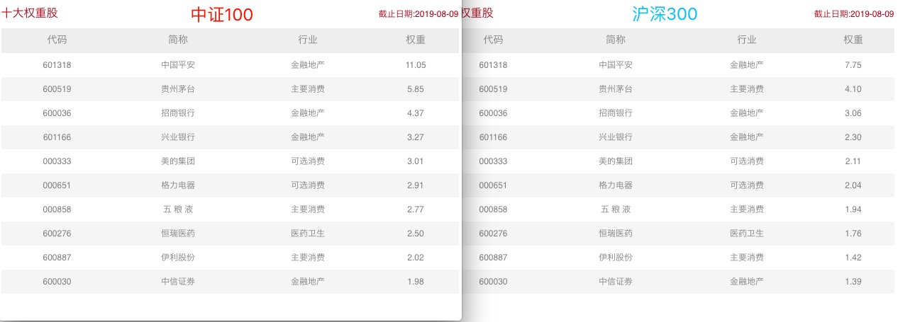
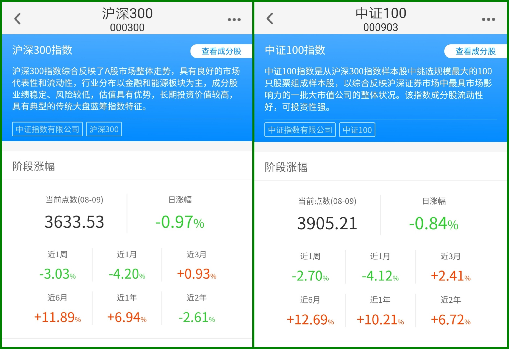
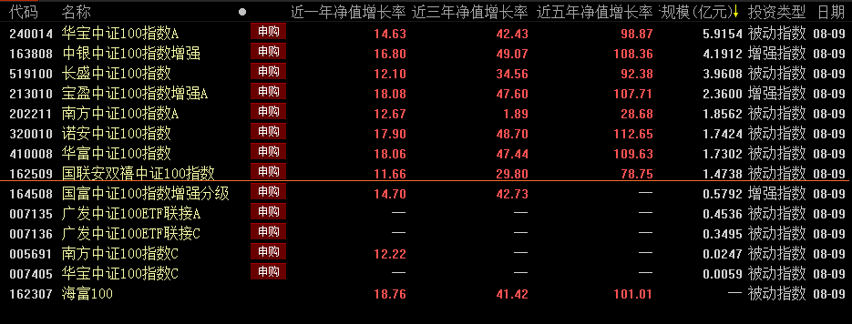

### 选择沪深 300 其实是一种无奈

今天话题的关键词是：核心资产。

开头先推荐大家去看一部十年前的纪录片：《激荡三十年》。

改革开放已经 40 多年了，中国在这 40 年间涌现出了数以万计的优秀企业。但真正做大做强且存活至今的企业如数家珍，甚至可以说即便现在如日中天的企业也不见得能一直坚挺下去，所以我们常说指数这种组合式的投资方式挺有效的。

价投者们买入一个企业的股票，就是看中了这个企业的内在业绩增长，希望企业能持续的为我们股东创造价值。简而言之就是我们本文开头的是关键词‘核心资产’，我们买入核心资产后长期持有，等待企业稳定的产生利润，最终体现在股价的上升上。

那么问题来了：怎么算核心资产？如今的中国又有多少企业符合条件？

我对核心资产的理解：

-   有持续稳定的竞争力，最好还有点护城河。
-   估值相对较低，不然再好的资产太贵也没意义。
-   稳定的管理层，健康的股权架构。

如果以上三者都符合，那真是百里挑一，整个中国估计也是屈指可数。即便符合两个条件的也不足 300 个（何况由于种种原因，有不少优秀的国内企业没在 A 股上市），这就说到了本文的题目：选择沪深 300 指数作为大盘投资其实是一种无奈的选择，是没办法。

那既然挑不出 300 个核心资产，那我挑 100 个行不行？行，而且已经有人帮我们整理好了，那就是中证 100 指数：中证 100 指数由沪深 300 指数成份股中规模最大的 100 只股票组成，综合反映中国 A 股市场中最具市场影响力的一批**超大市值**公司的股票价格表现。

从定义我们就知道中证 100 是沪深 300 的子集， 是沪深 300 的前 100 成分股的集合。下图的前十大成股份的比较图也看得出中证 100 的成分股占比更加集中，更突显了核心二字(数据源：中证指数有限公司官网)。

为什么我们买大盘有时候不得不选择沪深 300 呢？因为沪深 300 指数对应的基金太多太多，产品越多竞争越激烈，参与的人越多流动性越强，指数也就越被大众所接受。我也一度纳闷：几乎每个基金公司都有沪深 300 指数的基金，但是整个市场的中证 100 指数基金屈指可数？

接着我们来看下两者的历史表现（数据源：天天基金 app）:

截止 8 月 9 日，从近一周、近一个月、近一个季度、近半年、近一年、近两年等全维度看，中证 100 彻底碾压沪深 300 指数。要知道沪深 300 指数在近 2 年可谓风光无限，能如此完美的压制沪深 300，可见中证 100 指数是多么的优秀，**这就是‘核心资产’的魅力所在**。

那么我们就看看这些称得上‘核心资产’的中证 100 指数基金吧（数据源：choice）。

列表显示总计 14 只中证 100 指数基金（场外），剔除规模小于 1 个亿后剩 8 只基金，再剔除一只业绩异常的基金（南方中证 100 指数 A），然后以近一年收益为排序前五名：宝盈 > 华富 > 诺安 > 中银 > 华宝。

综合费用、成立年限、资产规模、基金公司、过往业绩表现后， 我的推荐结果如下：

-   增强型：宝盈中证 100 指数增强 A （费用合理，增强效果明显且稳定）
-   标准型：华宝中证 100 指数 A （规模最大，费用便宜，基金公司团队较好）

**小结**：在中国改革开放进程中涌现出了很多优秀的企业，作为普通百姓如何分享这一改革红利成了大家所关心的话题。比较有共识的一个方式就是买入‘核心资产’，耐心持有便可共享中国崛起的福利。沪深 300 作为中国股市的晴雨表成了大多数人的首选，但是相对于‘核心资产’权重更为集中的中证 100 指数，沪深 300 指数却略逊一筹。所以聪明的你可以选择更优秀的中证 100 指数基金来投资中国的‘核心资产’，得以获取更丰厚的收益。
