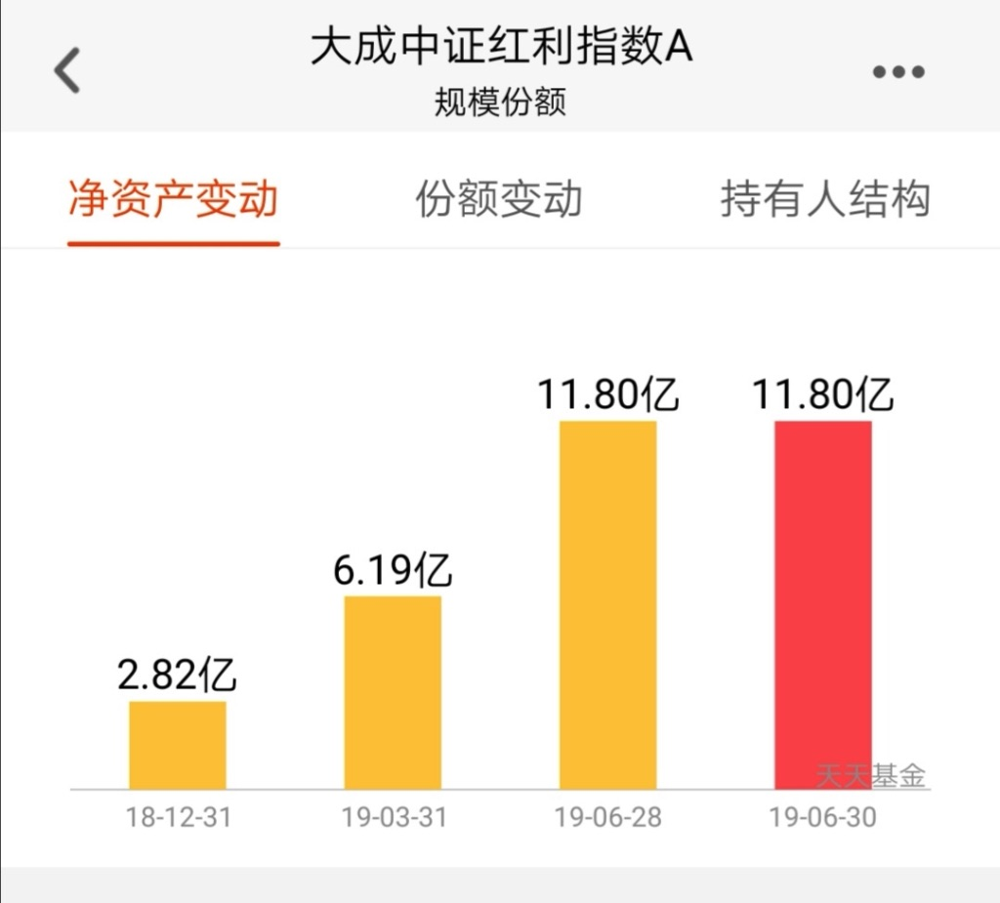
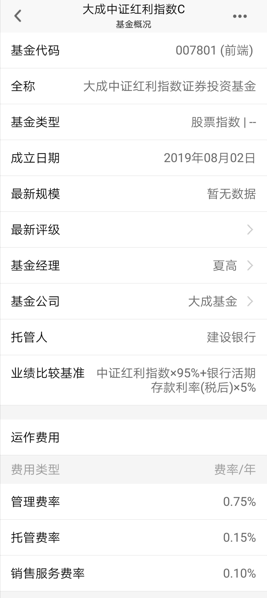
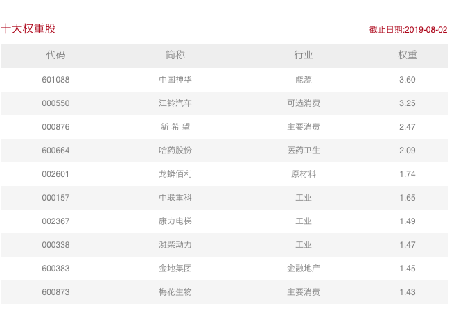

### 一个热卖的红利基金又出了个低费用的 C 类

前文我们说了[为什么我现在还在卖出沪深 300 指数](/financing/why-sell-hs300.md)。

简单的说就是相对估值还没到我们可以买入的价格，但是长期的底部震荡导致我们组合的中证 500 指数占比越来越大。无论什么理由，也不能任由单一指数**畸形的增长**，这个会使得组合的波动变大，回撤的概率以及回撤的程度也变大。

那我们该怎么办？

其实私下不少朋友也和我聊过，都劝说我这中证 500 比例太吓人了，可以考虑买点大盘股。上次发文后我也一直在找寻低价优质大盘股，苦苦追寻后发现了两个好家伙：**中证红利（8 月 2 日收盘估值百分位为 15.15%）、香港大盘（AH 溢价超过 130 且成分股大面积、大幅度的破净值）**。

说到中证红利，熟悉我的朋友知道我肯定首推大成中证红利。不为啥，就是因为费用相对便宜（其实我觉得还有下降空间）。大成中证红利有多火爆，我们看下今年上半的规模变动就清楚了：

一季度净增 3.37 亿，二季度净增 5.61 亿，要知道元旦的时候总规模才 2.82 亿，这真可谓是涨势喜人啊。这种爆发式的增长除了说明大家对这个指数产品的认可，同时也体现了该指数确实**处于一个比较适合买入的价格区间**了。

上周已经在公众号里明确提出了买入建议，本周再次正式单独写文推荐下该指数基金，对于我这种中证 500 的重度用户来说，是一个很好的弥补配置选择。

好，现在回到题目上来。卖得那么好的一只基金，基金公司也乘胜追击在上周五（8 月 2 日）发布了 C 类基金，关键销售服务费才 0.1%，这个就很有诚意了嘛。管理费不好意思降，那就把销售服务费降得彻底一点。

可惜现在蚂蚁财富和天天基金都没开通销售权限，稍安勿躁，我们可以先买点 A 类，等 C 类出来了再追加点也行。

我们持有低价的中证红利指数，实际持有了哪些股呢？下面来看下部分成分股：

我看好中证红利的另外一个原因是排雷，今年 A 股的主题就是【雷】，各种雷：财务雷、董事长雷。。。

分红主要是排财务造假雷，因为财务有问题的企业基本上都是债务很高，但账面上又有很多存款或应收款。但是如果一个企业能稳定的分红，且分红比例都能入选到中证红利，那么我觉得出这种问题的概率就小很多。用真金白银发出来的分红，那是代价很高的，几乎没人傻到用这种方式去掩饰造假。
