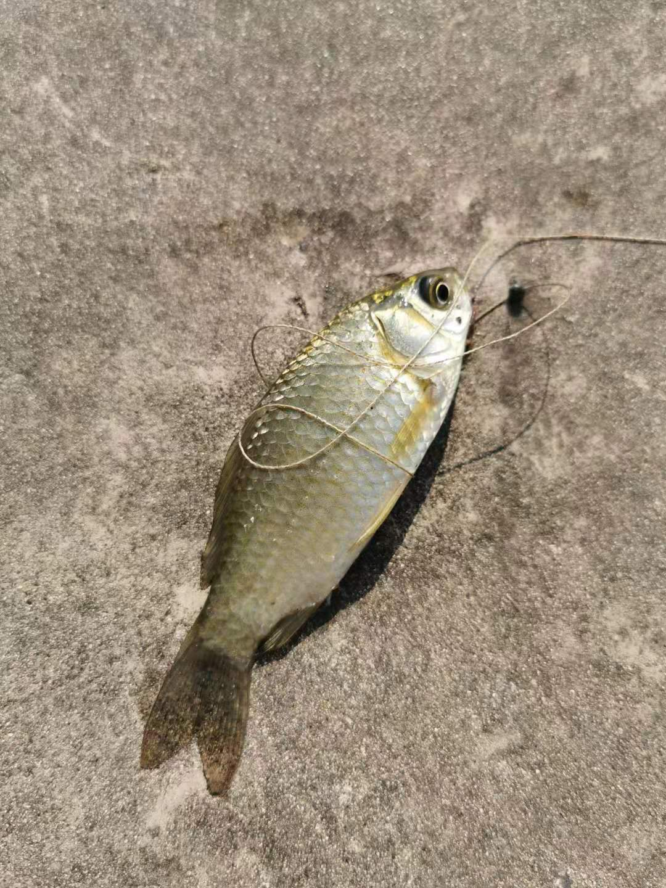
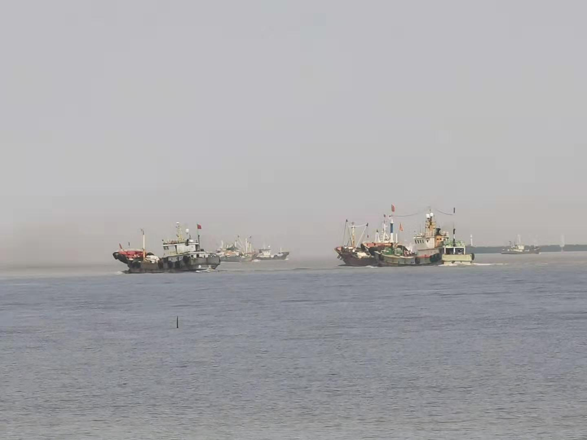
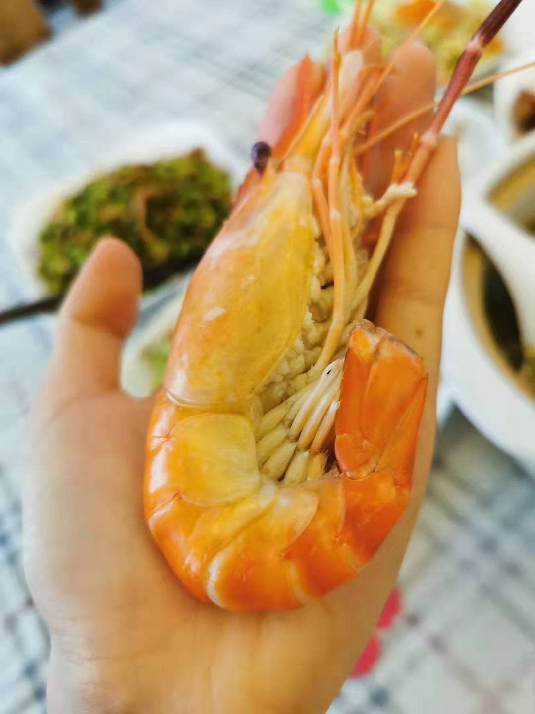

### 举国欢庆是大家，陪伴至亲是小家。

今年国庆我节前调休了2天，连着周末一共放了个10天的小长假。

我们本来准备10月2日上午回启东的，但是老丈人他们提前回家了，老婆就急着也想往回赶。9月31日下午开始G40沪陕高速崇启大桥段就已经开始堵了，直到半夜2点我起床上厕所，看了下高德地图还是严重拥堵，就知道原打算早点5点出发是没戏了，安心的去继续睡觉了。

10月1日的上午在老婆的组织下，全家人在客厅围着电视机看阅兵大典。连女儿也被安排坐在小椅子上看，可能她有些还不是很理解，看了一会就走开了。

阅兵还是很壮观的，这种大规模方阵整齐划一的步伐，是让人内心极其震撼的。阅兵大典看过后，感觉还是很有民族自豪感的，中国透过阅兵也向世界传达了很多信号，中国的国力确实得到了很好的增长。

阅兵结束后全家简单的吃了个午饭就准备回启东了，即便路还是堵着，老婆已经迫切的想回家了。结果就是高速堵成狗，开了4小时才到家，天还下着雨，到家都天黑了。

陪老婆看了场电影《我和我的祖国》，这种电影看看还是不错了，有利于培养中国人的凝聚力。

黄渤演的林治元，代表的就是建国初期，真的是一穷二白的情况下，靠着一股倔强干出了不少优秀的事迹。

高远代表着一批为国家核建设默默贡献的科研工作者们，他们做到了为大家而舍小家。

徐峥那个很逗，角度也很好，主角那个小男孩演绎的也很丰满，徐峥：我一个很喜欢的导演兼演员。

准点回归祖国，一秒都不能少，这个切入点极好。

葛优演绎的北京出租车司机也很鲜活，四川男孩的故事让我有所触动。

这种电影，不要太苛求，记住闪光点即可。

陪老丈人钓了半天的鱼，钓鱼还是他老人家厉害，他钓了一桶，我才几天小鱼：

陪女儿去了趟海边，还抓了几只寄居蟹，其实我也是第一次亲手抓到野生的寄居蟹：

说起寄居蟹，正好给大家看下从壳里爬出来的寄居蟹长啥样？挺意外，有点像蝎子：

快结束的时候又赶上涨潮，看到了渔船队伍出港，朋友说偶尔来看海，能看到涨潮出港，是为大吉：

上图远处是渔船队伍，近处是一个小伙子在海边遛狗，一只很可爱的小狗：

去朋友家蹭了一顿饭，有大闸蟹和大虾，家宴总是让人满足。半年多没见了，聊了很久。：

爷爷家里的枣树第一年就结了很多果子，红的很甜，青的略酸，枣树的刺也挡不住我摘枣的积极性：

还参加了一场婚礼，现在大家平日都外出打工，所以农村但凡有喜事基本都集中于长假：

参加完婚礼第二天就载满老家特产回上海了，为了避开堵车大军，清晨6点就出发，全程畅通无阻：

回上海后正好可以再休息一天，无聊就拿老家带的土鸡亲自下厨做了一份咖喱鸡块，老婆说我的厨艺没有明显的退步哈：

最后献上女儿学校里面的一张照片，给祖国母亲一个迟到的祝福。

