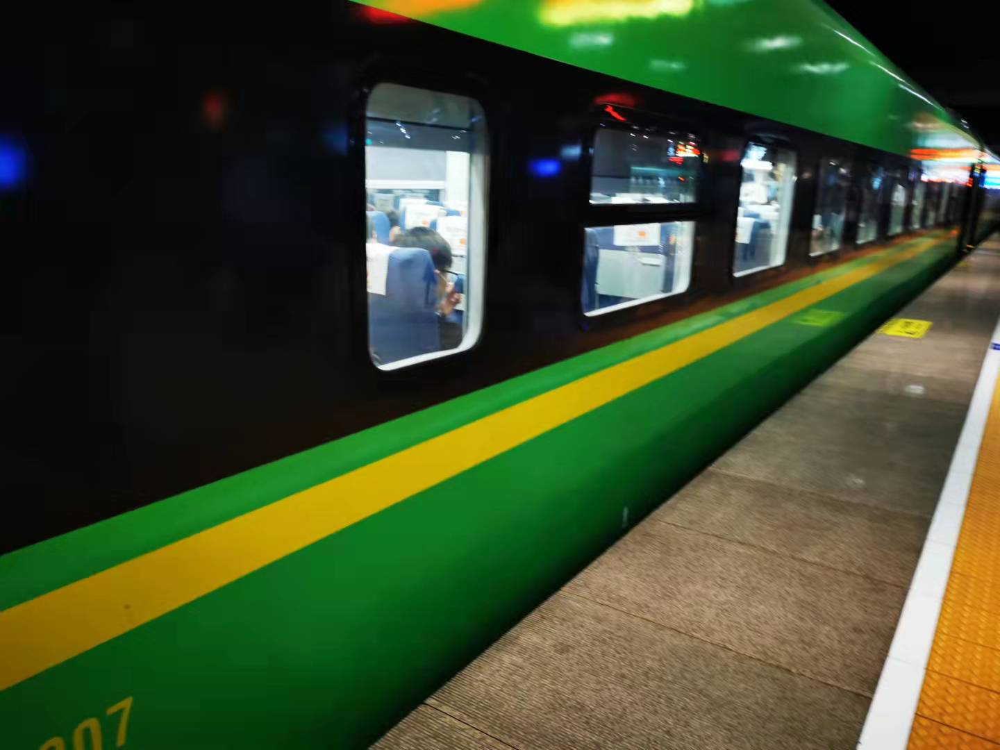
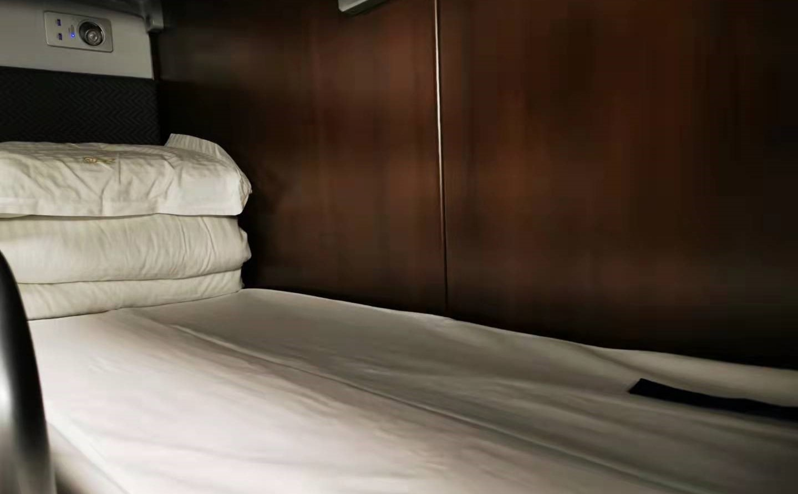
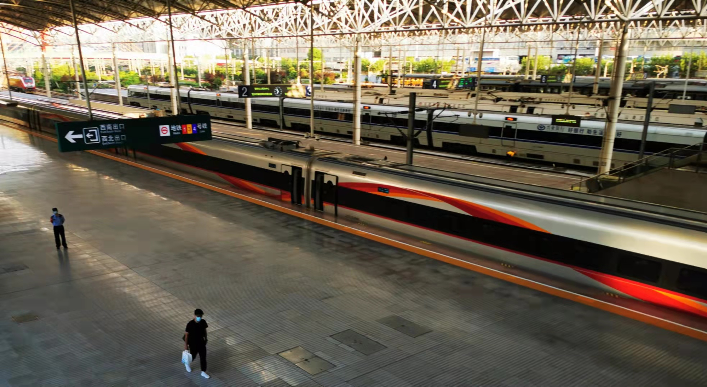

### 从北京一路睡回上海

对有些人来说，今天才是国庆后的第一个工作日，长假过后的星期一总是分外的忙碌和不想干活。不知道大家国庆去了哪些地方游玩，坐的飞机还是火车，路途中有什么有趣的事发生？

我毕业前极少出远门，大学是省内的，坐个大巴就到了。毕业后成了名程序员，这工作自带**“宅”**属性，要不是有时候团建我都不怎么出江浙沪。这两年因为工作变动多了一些外出的机会，我一般会优先选择高铁，只有广州、深圳、成都这类太远的才不得不乘飞机。

即便如此我也从没坐过卧铺（我甚至有点疑惑是应该叫“坐”卧铺，还是“睡”卧铺？），这次9月29日急着去北京参加了个会议，30日中午上海这边还有个另外的安排。我想着最好能当天赶回上海，29日会议结束很晚了，回上海的快速复兴号也没了，所以与其乘飞机还不如体验下京沪高铁的卧铺，一觉醒来正好到上海。

坦率地说，第一次买卧铺票还是有点小紧张的，不洗澡就睡觉对于有强迫症的我来说是很怪异的事。请谅解一个三十多岁还没坐过卧铺的人，即便有点小纠结，但还是很想尝试一次。所以下面我会分享一些在整个乘坐过程中的所见所闻、所思所想：

1、我们买高铁票如果票富余是可以选择座位顺序的（A-F），同一等级的车票价格也不会因为座位顺序而不同。但这二等卧铺的“上中下”位肯定是有差异的（至少有些人喜欢上铺的安静、有些人喜欢下铺的便利），但在买卧铺票的时候没有给我自己选择上下铺，话说这是为啥？还有卧铺的不同铺位票价一样吗？你们坐卧铺的时候希望选哪一层？

2、上车前经过后续车箱的时候，发现还有硬座车箱和只有“上下”两层的卧铺车箱（我猜是一等卧铺票）。我买到的是二等卧中铺，感觉自己被汉堡夹着有点压抑，下次有机会试试一等只有上下层的卧铺。另外我很佩服那些需要坐整整一夜的硬座乘客，以及可能还有些坐票都没抢到的站票乘客，估计只有餐车厢的座位才能稍微拯救下他们。这趟车北京南站出发后要到南京站才停靠，后续分别是苏州站和上海站，这也是我钦佩那些站票乘客的主要原因。

3、卧铺车箱十点熄灯拉窗帘，大部分都很自觉安静了，熬夜刷手机的乘客也有，但好在各自的床头都有小夜灯。小夜灯边上还有两个USB口，陪伴乘客们无聊的夜，对于现在手机不离身的人们来说真的太贴心了。

4、说下我的临时“室友”们，上铺大概率和我一样是第一次乘卧铺，他上车的时候还问我们怎么没有爬上去的楼梯。对面下铺的上海大叔是个业务很繁忙的人，熄灯之前基本上电话是没停过；对面中铺的大哥第一个到，但只是用背包占了个位子后就一直坐在走廊上打游戏，熄灯后直接上床倒头就睡；斜上铺的是6人中唯一的妹子（我好奇这个车票匹配是否考虑男女尽量分开？），妹子除了刚上车时让我帮着塞了下行李箱外全程没啥话，估计是累了，睡了一路。

5、疫情的关系，乘务员要求乘客全程佩戴口罩，对于12小时的车程还是蛮难受的。我半夜起床后还换了个口罩，当然也有很多睡觉的时候把口罩摘了的。另外让我比较难受的是斜下铺的上海大叔，那个鼾声真是连绵不绝，我半夜起身也是拜他所赐。其实火车一直开得还算平稳，行驶过程中那个“哐当、哐当”的声响也很有规律，总得来说我是有睡上一整觉的。但每个人对睡眠环境的要求是有很大差异的，我老婆在这样的列车环境里定然是无法入睡的。有人怕光、有人听不得一点声响、有人习惯自家的床垫硬度、有人只有躺在固定的人边上才睡得安稳.....如果你不得不卧铺出行，最好还是带上眼罩和耳塞，让你入睡的世界稍微安宁一些。

即便这次卧铺之旅也没那么舒适，但总体上我还是能接受的。快下车的时候我突然有个想法：**如果一个地方有网（有必要的生活物资），不用你上班（工资照发），就那中铺里装一个小灯，配个USB充电口，但可能会有一些压抑的小车箱，让你呆上一个星期，你愿意吗？**

