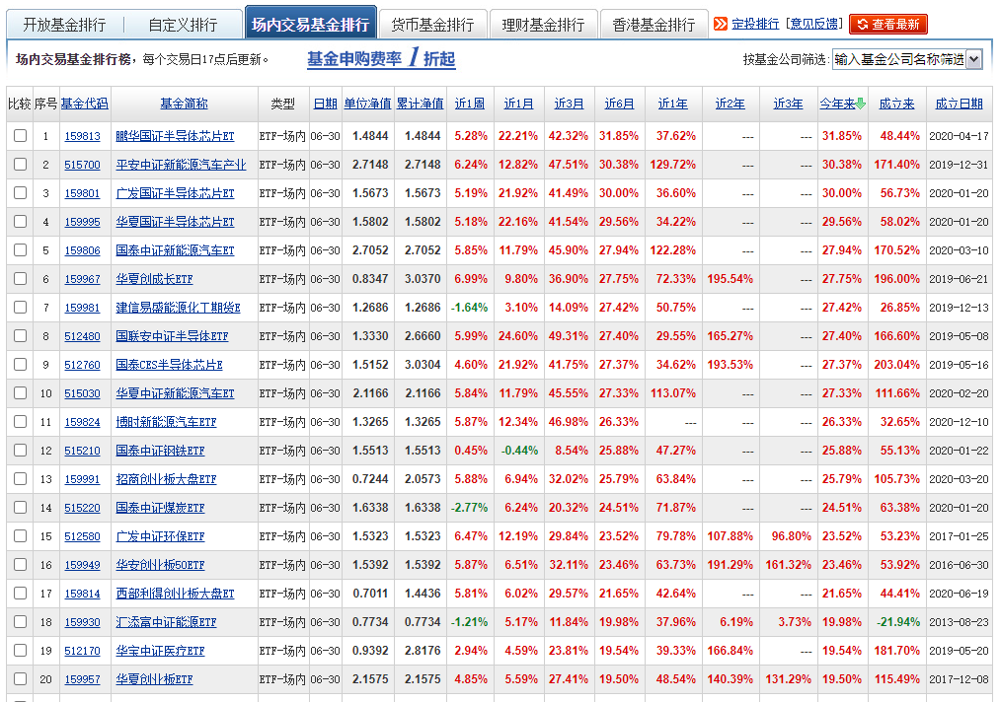

### ETF上半年前20强

2021上半年的交易都结束了，其实回头看还是蛮跌宕起伏的。年初那是锣鼓喧天，春节后又是哀嚎遍野，最近又明显好转起来。话不多说，直接上图（上半年ETF业绩前20名，数据源天天基金网）：

1、第1名是鹏华基金的国证半导体芯片ETF，今年以来收益率为+31.85%，这次前20名里芯片指数好多，分别是：第3名的广发国证半导体芯片ETF（今年上半年 +30.00%）、第4名的华夏国证半导体芯片ETF（今年上半年 +29.56%）、第8名国联安中证半导体ETF（今年上半年 +27.40%）、第9名国泰CES半导体ETF（今年上半年 +27.37%）。

其中鹏华基金、广发基金、华夏基金跟踪的是国证芯片指数（980017），而国联安基金跟踪的是中证全指半导体产品与设备指数（H30184），另外国泰基金跟踪的是中华半导体芯片指数（CESSC.hk）.从排序上看初步可以断定这些半导体芯片指数里国证芯片指数最优秀。

2、前20名里另外一个主力军就是新能源车相关的ETF，共4只分别是：第2名的平安中证新能源汽车产业ETF（今年上半年 +30.38%）、第5名的国泰中证新能源汽车ETF（今年上半年 +27.94%）、第10名的华夏中证新能源汽车ETF（今年上半年 +27.33%）、第11名的博时新能源车ETF（今年上半年 +26.33%）。芯片和新能源车占据了前十名的8个位子，基本上算是独步天下了。

3、创业板系列的ETF近半年也很猛，分别是：第6名的华夏创成长ETF（今年上半年 +27.75%）、第13名的招商创业板大盘ETF（今年上半年 +25.79%）、第16名的华安创业板50ETF（今年上半年 +23.46%）、第17名的西部利得创业版大盘ETF（今年上半年 +21.65%）、第20名的华夏创业板ETF（今年上半年 +19.50%）。

大家有没发现，纯正的创业板指产品反而排最后，各种创业板优化版都表现不错，比如华夏创成长、华安创50、招商和西部利得的创业板大盘。总得来说贡献的大头都在创业板的头部企业里（医药医疗、新能源、芯片等），所以各种精选后的创业板头部指数在当下的市场内肯定会领先于创业板指。这里也多提一句：双创50是我非常非常看好的创业板指的替代品，我觉得应该是当下A股仅次于沪深300的一个优质宽基指数了。

4、接着说下几个特殊的，比如第7名是建信易盛能源化工期货ETF（今年上半年 +27.42%）。这个也是当时一起批的几个期货ETF之一（也是试点，后面就没再批过这类期货ETF ），那批期货ETF还有：华夏的豆粕ETF、大成的有色ETF。

要不是因为6月底半导体和新能源涨得太猛了，这只能源化工ETF会雄踞榜首的。因为周期股也是今年上半年另一个大热门板块，这次前20名入围里周期板块除了建信能源化工ETF，还有第12名的国泰中证钢铁ETF（今年上半年 +25.88%）、第14名的国泰中证煤炭ETF（今年上半年 +24.51%）。

5、最后剩下的还有第15名的广发中证环保ETF（今年上半年 +23.52%），每次看到这个环保我就想到当年它的另外一个难兄难弟（除了当年一样的凄惨行情，还因为都是广发基金出的相关ETF）：中证传媒。今年上半年中证环保怎么说也嗨了一回，可传媒兄弟还在无尽的深渊里挣扎呢！

以及第19名华宝中证医疗ETF（今年上半年 +19.54%），中证医疗ETF今年的表现也是可圈可点，我自己也搞了几次止盈定投，赚点零花钱。虽然华宝的中证医疗ETF是当下市场规模最大、流动性最好的，但后面紧跟着国泰的医疗ETF，还有正在募集的20BP费率的易方达医疗ETF，竞争也是很激烈。

6、前20名里华夏基金和国泰基金每家都上榜了4只产品，后面分别是广发基金2只；华宝基金、鹏华基金、汇添富、西部利得、华安基金、招商基金、博时基金、国联安、建信基金、平安基金分别各1只产品上榜。不可否认华夏基金在ETF领域的绝对领先（规模大、流动性强、品类多），也要表扬下国泰基金在很多行业主题ETF布局上拥有很好的前瞻性。

7、需要说明下的是：相似指数的ETF产品业绩排名在前，很大可能是基金规模相对较小，有更多的打新超额收益加持而已。有超额收益是好事，但是如果流动性太差也一般不考虑，毕竟ETF还是需要更多交易便利的，所以排名也要理性看待。

> 小结

截至6月28日，国内ETF成立的总数量已经多达507只，总管理规模达到1.26万亿元。热门指数对应的ETF竞争愈发激烈（想想前不久9家齐发双创50ETF的场景），ETF的业绩排名不能说明该产品就一定好下去，更多的是可以看看近半年都有哪些板块跑了出来， 可以作为大家观察市场风格的一个参考。7月已经连跌2天了，不知道下半年又会是风水轮流转到哪个板块呢？