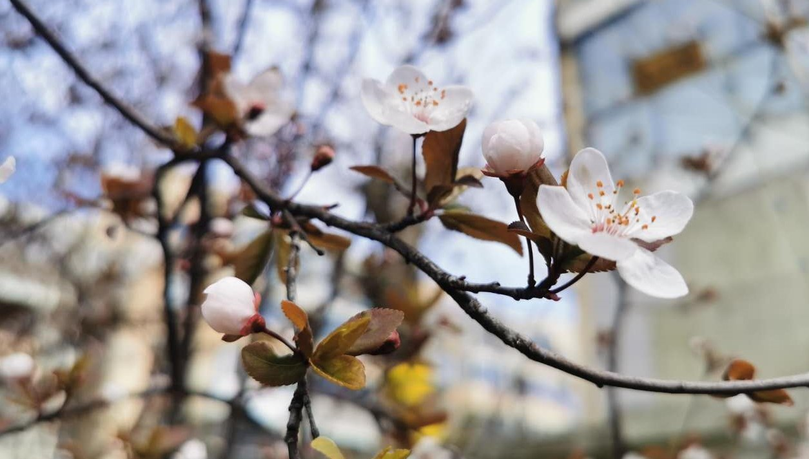
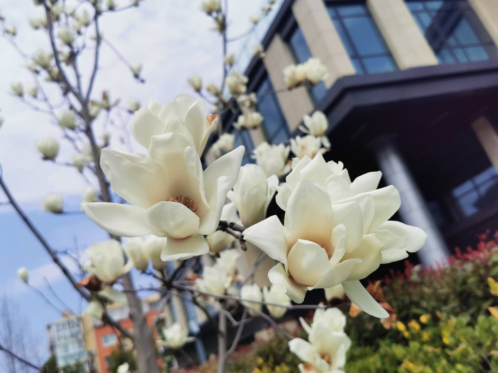
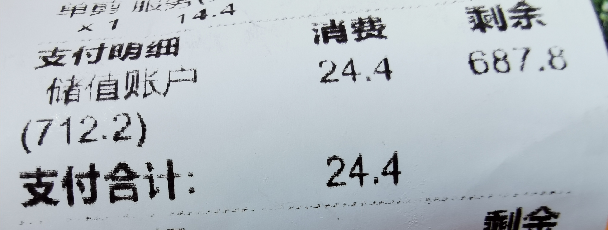
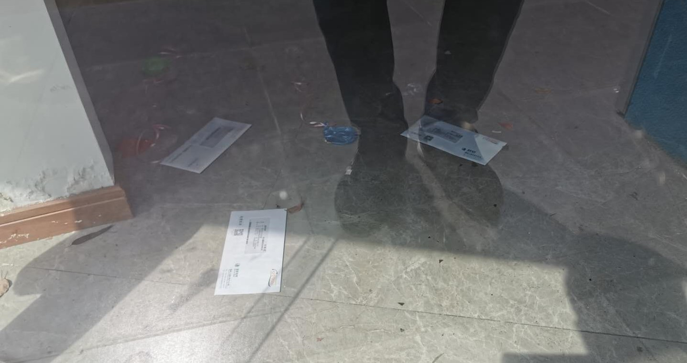
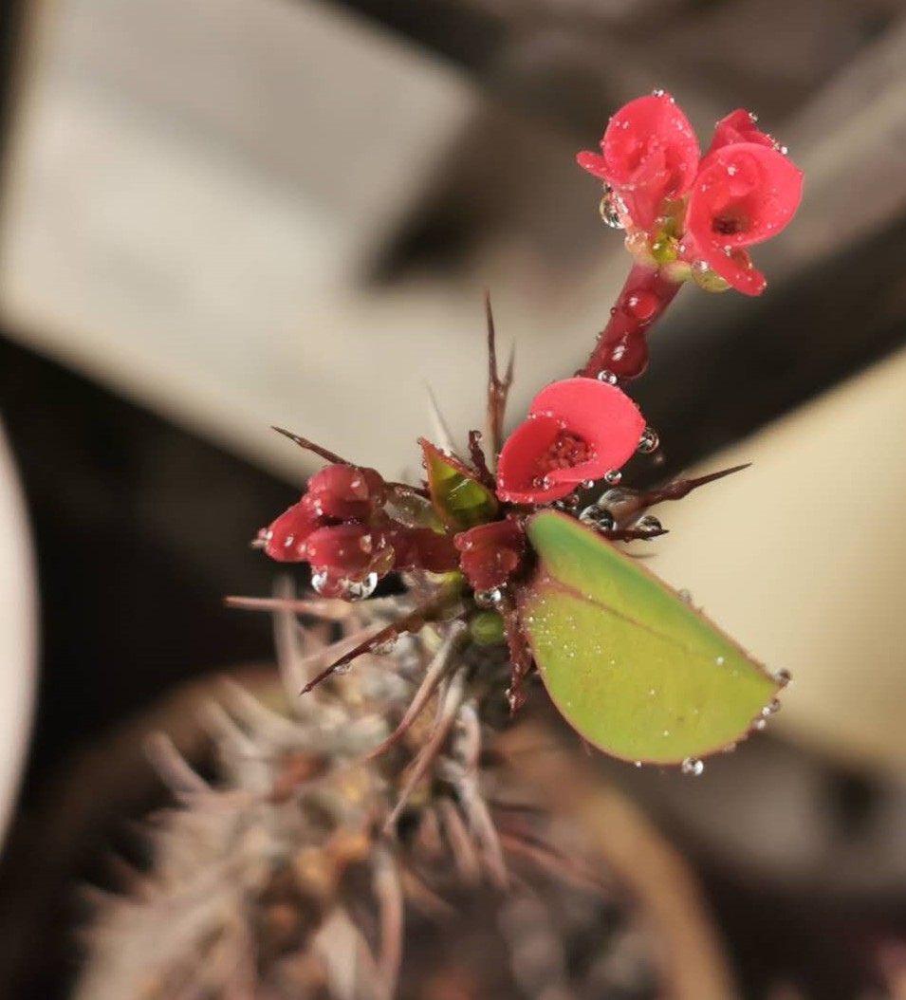

### 三八节，剪个头

昨晚吃饭的时候老妈又催了：你头发都那么长了，怎么还不去剪一下？正在夹菜的老婆也附和道：你真准备留长头发啊？女儿也喊道：对呀，女孩子才留长头发，爸爸你又不是女孩子！

虽然现在上海的疫情整体可控，可我还是觉得能少出去就少出去，特别是理发店这种极可能交叉感染的地方。但是既然家里的三位女性一致嫌弃我那乱糟糟的长头发，那就只能硬着头皮去理发了。我微信问了常去的那家理发店，他们说11点前去的话不需要预约。我起床洗漱后，简单的吃过早饭，戴上口罩就出门了。

春日的暖阳晒在身上确实很容易让人产生疫情已经过去了的错觉，以至于短短的约五分钟步行路程中，我看到好几个人的口罩已经漏出了抠鼻，他们的口罩俨然成了摆设。甚至我还看到一个老大爷居然无口罩‘裸奔’，而且他走起路来极其慵懒，让我第一反应是惊愕，第二反应是远离。

到了理发店，门口用大字贴着‘本店已消毒’，进去后能明显的闻到一股84消毒水的味道，店内一位收银、一位接待、一位学徒兼洗头（平时3位）、两位理发师（平时8位）、一位店长兼发型总监。接待开门把我迎了进去，示意我用免洗洗手液消毒下后填了一张登记表，记录了姓名、籍贯（非沪籍须填写返沪时间）、联系电话、随申码类别、是否为本店会员，这个形式是到位了，但是接待没强制让我出示随申码的颜色类型，只需自行填写即可。

我去的还算早，店内只有一位客户正在理发，所以没等就直接让去洗头了（其实出门前我还想能否不要洗头了，直接喷湿头发后把头发推短即可），这要在平时都的先搞个45分钟的和洗再理发，现如今真的只有一个想法：我只是来剪个头！我观察了下所有员工都是没戴手套的，所以洗头的时候我还是挺担心会不会因为头皮组织而交叉感染？

进入理发程序后发现疫情除了网上说的那么多附加功能外，我觉得还可以增加一项：**让Tony老师寡言**。理发师给我弄好一次性围裙等装扮后问了句：怎么剪？我说：尽量短！可能这个答案他最近已经听得够多了，所以没多想就开始剪了。整个过程好安静，直到剪完洗完吹干的理发师才说了一句寒暄的话：你们开工了没？我说：开工好几周了。他接道：那么早啊，蛮辛苦的。我不再对话只是微笑示意。

剪完结账我以为会临时涨价什么的，没想到会员卡可以使用且没涨价，打完折依然是24.4元，这个让我有点小意外的。要知道就算平时我这种只去剪个头还会选择和洗的人，24.4元大概率是亏钱的，这家店的主要盈利就在于二楼的美容部以及女生的做发型和染发这种。只是现在二楼是空无一人，女生们我想大概率也不会在这个节点来花几个小时做头发（确实我理发过程中进来的全是男顾客，还有一位要求剪得超级短，出门的时候还戴上了帽子），店铺依然勉强支撑着，让我有了点敬佩之意。

其实大家都在谈什么小微企业难以支撑了，我觉得这种小区边的理发店连‘微企业’都算不了，最多算较大的个体户吧。我回去的路上看到永辉的便利店拆了在装修，我不知道是关门了，还是借机再重新布局，这家永辉便利店开了刚过一年。好几家房产中介店是大门紧闭（链家还开着），可以看到水电费账单都通过门缝散在门口内侧，可见这些店铺会很难撑过这次疫情。

回到家里第一件事就是洗个澡，把里里外外的衣物都换了，突然好希望下次可以不再那么忐忑的理发了。吃过午饭站在阳台看着那棵刚喷过水的虎刺梅，想起了家门口的顾村公园今年是彻底废了，满园的樱花已经陆续盛开。今年没有樱花节了，也不会再有堵满的人和车了，**可是这阳台的小花怎么能和满园的樱花比呢？**

