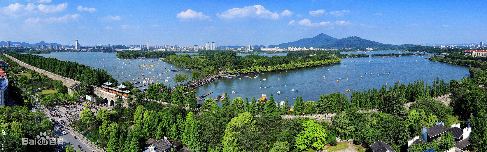
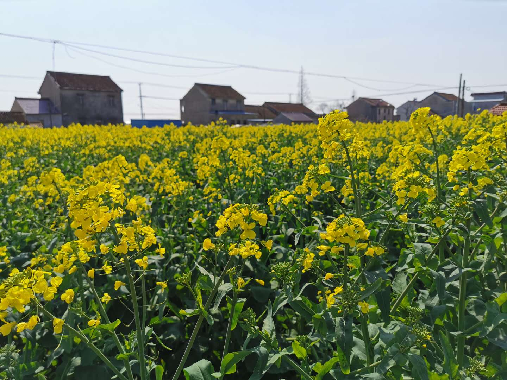

### 疫情之后，有没有一个地方你突然很想去？

虽然我是江苏人，但平日里对南京的感觉不是很好（南京应该算是最不被省内人待见的省会了），即便我在那上了四年大学。但今天上班堵在外环龙吴路时，点开了江苏交通广播网的收音机，听到‘滴滴叭叭早上好’里磊磊娜娜的南京话突然有种久违的亲切感。

我听江苏交通广播网最早是2003年，那时候还在上初中，一个人去县城上学没什么电视机可以看，收音机成了我主要的娱乐方式。可能现在的小朋友无法理解，那个年代连MP3都还没普及（我第一盘磁带好像是阿杜的，花了5元），去网吧打游戏的系统还是winXP，所以那时候听收音机还不是开车人的专属（现在真的好像只有开车人才偶尔听下广播）。

毕业后南京就去过一次，2015年和老婆孩子一起去的，参加老婆同学的婚礼。第二天顺带去了趟我的母校，在图书馆前还让小学妹帮忙拍了个合影。听着这熟悉的南京方言，连堵车的情绪也释放了很多，所以突然想等疫情彻底好了，带着家人再去南京看看，一晃又是5年没去了。

有时候人经历过了灾难后，对很多事情的看法就会有所改变。 比如昨天还说的：【我最近在想，等疫情过去了，汽车销量会不会有个短期报复性反弹？现在不少人已经体会到了，有些东西还是得自己买。还有些一个家庭原本一辆车，现在两个人上班开也不方便，也有再买一辆的可能性。】

又比如：我们总是在身边亲朋好友经历了生老病死（特别是突发性的）后更容易买保险。我的第一份重疾就是在我一个不到40岁就意外死亡的亲戚死后买的（同年我一个发小也突发重病死亡），这也是为什么中老年人最容易购买保险。因为他们经历了太多的生离死别，他们不知道明天和死亡哪个先到来？他们知道子女也有自己的子女需要抚养，子女也有自己的未来生活，总想着不去打扰子女，这也是最容易被卖保险的人所抓住的心理弱点。

说回开心的事情上来。这个暖洋洋的季节，百花争艳，大家在做好防护的前提下，可以带着家人去空旷的户外走一走、看一看， 呼吸下新鲜的空气。**我们应该庆幸：可以再次闻到这芳草的清香，可以再次穿梭于这五色的花径。**人在暖阳下晒一晒就会更乐观积极，说到这又开始想家里的油菜花了，虽然我上周还见过。

**你呢？有没有因为这次事件改变了以往自己什么固执的想法，有没有突然很想去的地方呢？**

