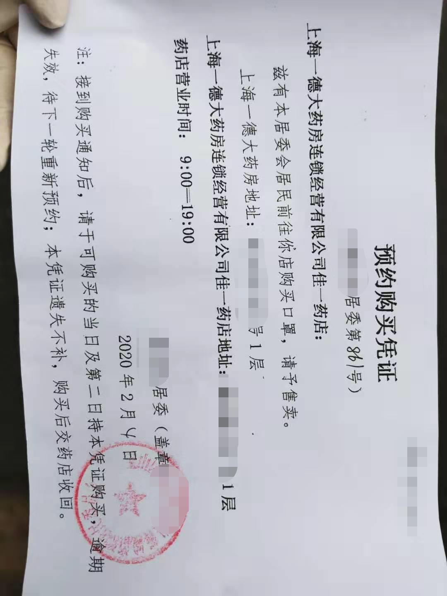
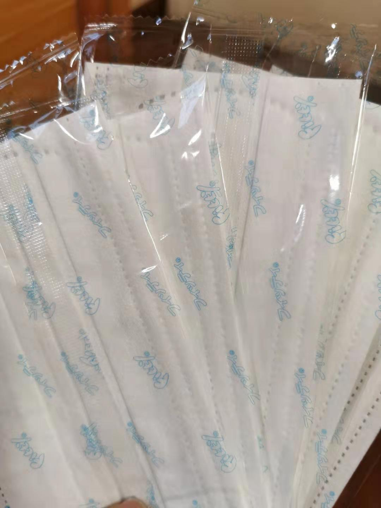
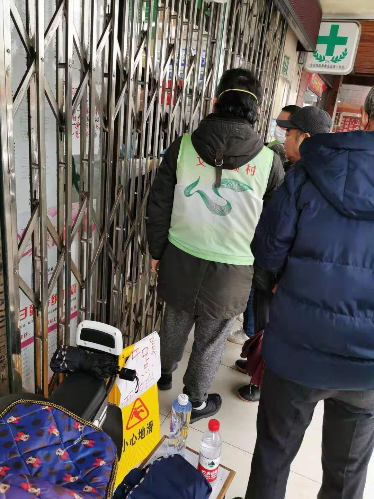
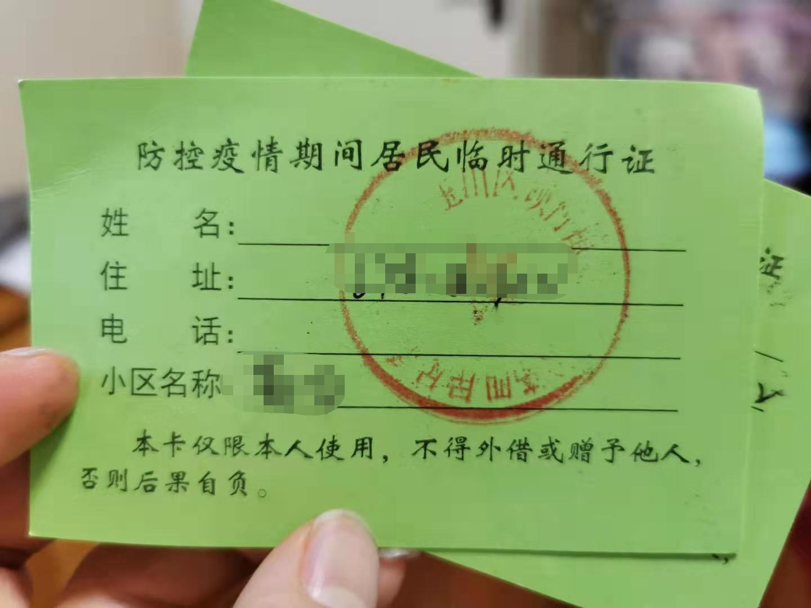
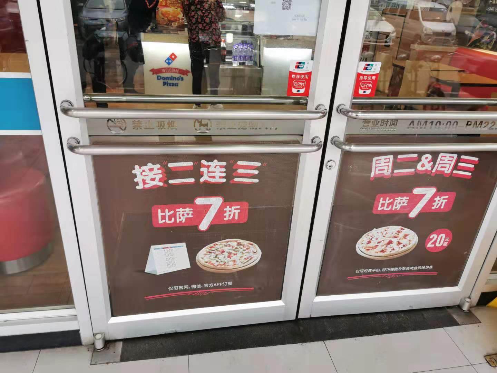
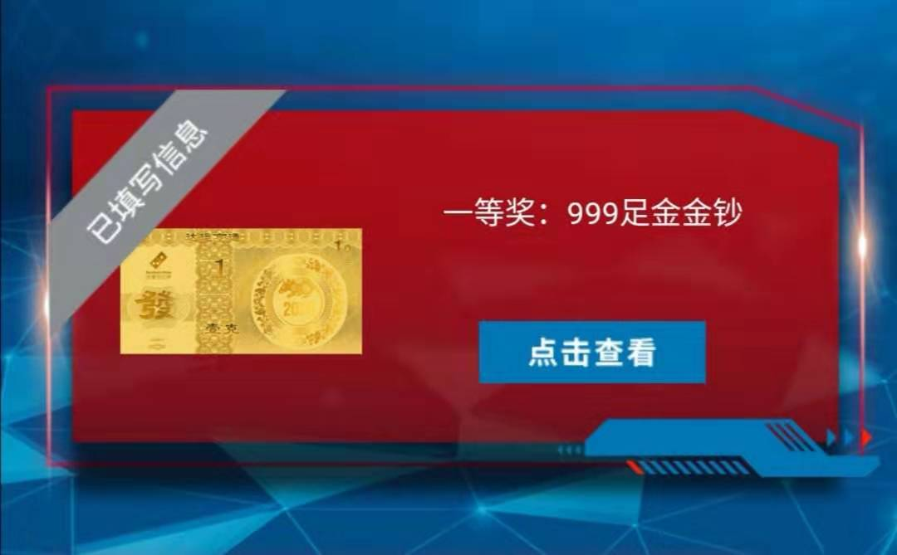

### 买个口罩，还能捡到金子！

我是1月26日就回上海了，本着‘不给社会添堵’的心态，坚守家门半个月未出去。就连小区之前说每家可以预约买口罩我都没舍得出门，因为第一批预约时间是10天，每家只能预约5只口罩，下楼预约消耗一只，十天后去药店买又消耗一只。一圈折腾下来也就多了三个口罩，还白白增加了两次外出风险，所以一直没去居委会预约，好在后来‘社区通’里面可以在线预约了，我也就随手给约了个号。

上海上周口罩紧张到什么程度？我们小区一天只放出80户左右的额度，每家也就5只一次性口罩，但就在前天一次性放出了400户的额度，我可以粗略的理解口罩的紧缺有所缓解了。我就拿着电子号去居委会领纸质的口罩券，然后去隔壁小区门口的指定药店购买口罩，以前总是听长辈说他们那时候的计划经济，凡事要凭票购买。没曾想到都2020年了，还能让我们这代人体验一把‘计划经济’与物资紧缺。

去了才发现这次的口罩涨价了，5个口罩9.5元，但上周小区业主群里说是5个2.3元，为此就我在那排队的一会有好几个老大爷抱怨怎么到最后一天的涨价那么多？口罩的颜色和前几天其他业主发的照片颜色也不一样，口罩突然涨价了，这个和一次性放出400户额度有关吗？

但是我觉得这种预约机制很傻？试问哪家不需要口罩？这有什么好预约的？你直接按户发放即可，线上缴费后直接投递到每家的信箱就行了。1小时让400人去排队，这就是典型的人为制造‘多人聚集’嘛。

半个月来第一次出来透风，现在真的理解‘牢狱之灾’还是不好受啊（何况我还有暖气和WiFi）。出小区都要登记、量体温、领临时出入证，业主可以办理长期出入证（长期证有效期到疫情结束，每家仅2张），业主的车可以办理车辆出入证，原则上11点后小区不得人员进出。

药店隔壁就是披萨店，憋在家里时间太久了，实在忍不住了，这次还顺手注册了会员（在线下单打7折），其实这家我几年前买过一次，当时觉得不会常吃，现在觉得后面我还会来的（真香）。平日我老婆也是不怎么爱吃披萨，但是这次拿回家，一个12寸的披萨不到10分钟就被消灭了（让我脑子里浮现了那个真香的动图）。

女儿更是一口气吃了两块，卷边芝士真的好吃，现烤的也好吃，从未如此喜欢面粉烤过后的麦香，作为一个吃米长大的孩子，我真的第一次觉得面粉可以这么香。嗯，其实就是饿坏了。

扯了半天，回到题目上说的金子吧。因为披萨店搞活动，每单可以抽奖，我抽到个一等奖，奖品是一克的999纯金的金钞。我填好收货地址后，又看了下活动细则，一等奖总共才200个名额，这运气还不错。

今天收到公司通知，说非湖北回来的隔离天数从14天降为7天，看来马上就可以上班了，可以结束这种一家人一天才出去一趟，扔个垃圾顺带去拿个买的菜。社会还是要早日逐步复工的，不然今年GDP真的有点慌！
