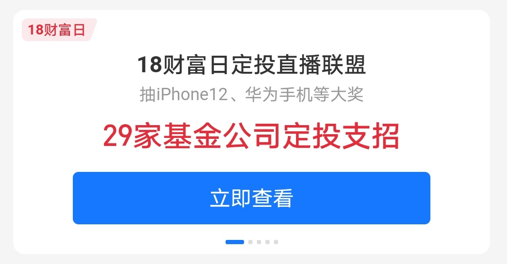

### 源于一块两毛八菜包的一段思考

我最近在某宝上看了很多基金相关的直播，学会了一组新名词：**菜包和肉包**。我的理解是：基金公司在代销平台上直播时经常会给观众们发放各种形式的红包，其中金额较大的一般为菜包（在买他们家指定基金产品、且满足一定购买额度后才能抵扣的红包）；金额较小的一般为肉包（直接发放到支付宝内，可在绝大多数的支付宝支付场景内使用，可以理解为就是现金）。

为什么突然想起这两个有趣的直播“黑话”呢？因为最近支付宝在搞什么**18财富日定投直播联盟**，号称是有29家基金公司一起搞的定投直播活动。在看这些直播的过程中学会了很多，也看到了很多“套路”，不得不让我再次感叹：自古套路得人心。其实我自己有时候也会因为这一两块钱的小红包而买个啥产品，事后想来也是哭笑不得。

而今天的故事就从我一次“懵懂”的贪心说起。从交易记录上看到自己在2021年2月21日的时候领过两个支付宝红包，一个1元菜包、一个0.28元菜包，它们就是本集故事的起源。具体当时什么活动发的小红包我已经不记得了，但是我知道那个活动搞得很热闹的，我也是看到社区里 @憨憨复利人生 的提醒才领的红包。当时我还不知道什么是菜包，反正一看需要买10元天弘沪深300增强C才能抵扣，买了两次10元后才发现不太对劲。因为我在支付宝上买基金有两个奇怪的习惯：①、小金额的娱乐仓一般不在蚂蚁上买，我通常会在东财上买，因为天天基金有子账户功能，那些单只基金3000元内的娱乐仓我都集中堆在一个子账户内；②、支付宝里买的基金我通常是非盈利不卖出的，即使极个别因历史原因亏损的，我后面都是通过定投止盈的方式翻红了，所以我的支付宝历史列表里几乎清一色为红色。

基于这两个“怪异”的习惯，又正好遇到买完这20元基金大盘就跌跌不休，这几十块钱还占据了我支付宝上的一个条目，我又不想亏损状态卖出。强迫症使我略显难受，这该如何是好？实在没办法就祭出了万能法宝：【定投】！

我们看上图就发现，2月21日收盘后参加菜包活动买的，但是我在26日又买了20元、在3月28日买了40元、在3月24日买了80元、最后在4月2日清仓止盈。每次这个基金持仓收益在-5%左右就加一倍仓位依次是20元、40元、80元，最后止盈的时候也只是刚回本，我预估下扣除赎回费能做到总收益为正即可，反正就是解决了我这强迫症。但是这个过程也不短，用时一个多月，还害我每次点开支付宝不得不看到这个几十块的仓位条目，真是强迫症患者的悲哀。这次经历也让我深受教训，我想也应该是最后一次在支付宝使用菜包了。

但我更想说的是：**比赢多少更重要的是你能确保赢**。虽然这应该不是最好的策略，但如果你每个基金都只在盈利的时候卖出，那么你总投资肯定是赚的（当然资金也是有时间成本的）。至于我为什么会用这种翻倍加仓的定投策略呢？因为起始金额不大，我即便是每次亏损5%后加倍买入，在可预见的未来资金总量我不惧，而我的预期就是只要不亏即可清仓，又希望尽快完成这个预期，那这个策略是最稳健且迅速的。

这种情况其实我小学那会和村里的小伙伴们玩骰子猜大小（123为小、456为大）类似：有资金大的小朋友会坐庄，而我一般是押注的那一方。我每次都是从一毛开始下注，且每次只压小这方；如果赢了继续一毛压小；如果输了就压2毛还是小这一方；以此类推直到猜中小后赢钱，继续压一毛继续压小。大家不难发现这个策略近乎稳赢是不是？但是村里的小伙伴也不是傻子，没几天就识破了我的小计量，庄家开始多了一个要求：单次押注上限为2元。当然因为有了这个新规则，我就很少再和这帮“聪明”的小伙伴们玩猜大小了，哈哈。

> 小结

1、不要贪图这些平台方的菜包，有这功夫多看看书，不一定是理财的，闲书也是可以多看看的。

2、有时候买多少比买什么更重要、比赢多少更重要的是你能确保赢。

3、如果这个游戏规则对你已不再友好，请尽快撤离。

4、珍爱生命、远离赌博！

