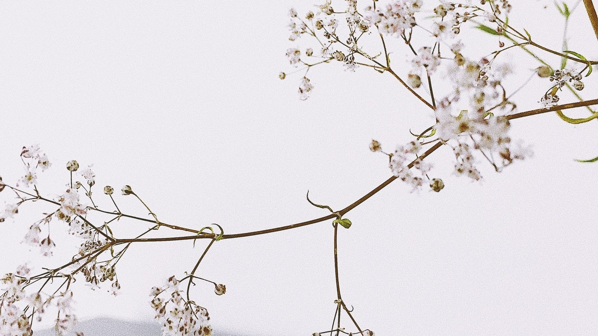
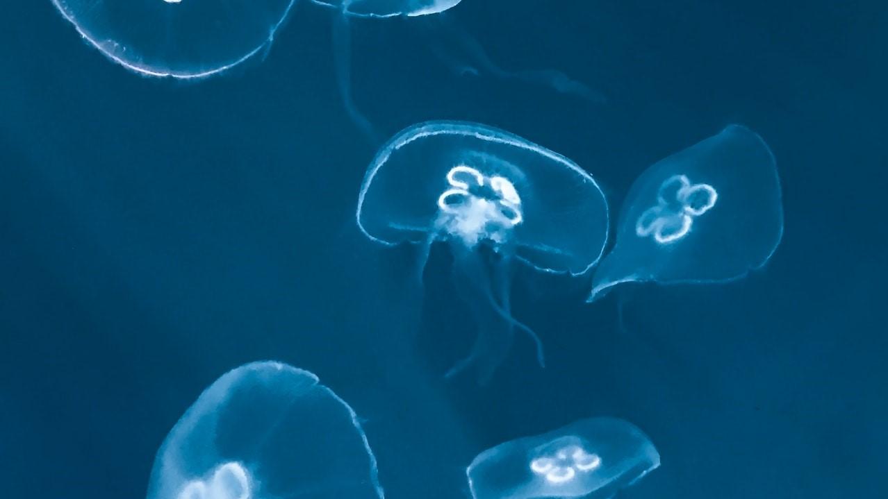
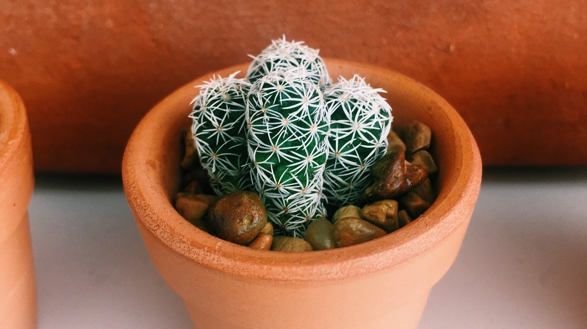

### 和成都小妹妹交流后的几点思考

我发现人真的很容易被身边的正能量所感染。就比如这篇文章我是本没想过要去整理的，但@基金复基金 这位成都小妹妹那天的一句话点醒了我：“其实坚持日更，对你的成长可能更好！” 这句话很真实地揭穿了我为自己的懒所找的一切理由，并使我感到无力反驳。

上周日晚上我和几个老朋友开了个2小时的腾讯视频会议（本来预期就1小时），成都小妹妹作为特邀也和大家做了一些分享。邀请她是因为我之前的直播认识后，发现这位女生还是很热衷于理财的，而且研究思路和写的文章都很有潜力。

如开头说的，我本没想到会后还整理什么资料呀。本来就是一个小范围的交流会，和朋友们聊聊今年在投资上得与失，分享成功的经验，对于失误的操作也讲讲，好让大家引以为戒。但成都小妹妹作为客人反而很早就把会议心得整理成文，那我真的有点惭愧了，所以此刻又翻开了笔记本，敲下了这些文字。因为毕竟是小范围的交流，所以我就挑选一些适合拿出来聊的部分和大家一起分享下，希望大家看后能有些许收获吧。

 

1、面对年初的疫情恐慌，我和成都小妹妹有着截然相反的操作：**我逢低买入、她毅然割肉。** 她虽然很谦虚的说自己这种操作不成熟，但我觉得她减仓的理由是自洽的，没有什么大问题。首先在那种大环境极度恐慌的情况下，我觉得任何操作都是没有错的。现在我们国内疫情已经相当稳定了，大家的生活生产几乎没啥大影响，但是我们把时间往前推移10个月。

春节前夕疫情开始发酵，然后在春节7天长假里全国人民，每天醒来第一件事就是看看最新疫情数据。大家开始各种囤积粮油米面、抢购口罩和体温计等生活用品、防疫物资。这种非金融本身的灾难真的可能就连人都没了，这时候金融资本市场就算有个什么混乱或者崩塌，我觉得也是意料之中的。成都小妹妹现在回头看，说我的操作是对的，但这也只是往回看才得到的结论，要知道其实没人能预见未来的。（因为极端行情谁也不知道什么时候会来，不然怎么叫极端风险呢？没人能在去年元旦的时候想到2020年会是这么狼狈不堪呢，这也凸显了现金流管理的重要性。）

而且我们的操作相反，很大程度取决于我们各自现金流的充裕程度不同。比如我就习惯性的保留足够的现金，因为之前吃过亏，怎么说也是经历过2轮牛市的人(其实每一次牛熊看起来相似，但你细品就会发现差距还不小)。所以年初我就赌中国能撑过去，对， 本质上这就是在赌。因为那种环境下要是真的人没了或者真的社会乱了，那钱就是一堆纸，或者就是银行账户里的几个数字。成都小妹妹割肉是因为她知道后面很可能会没现金的，这就需要她卖出权益类资产来获得现金，继而买一些生活物资，来防止长期居家隔离失业，又没有后续工资来源的极端情况。所以我不认为她做错了，她当时不得不这么做，她最可贵的是通过经历一次这种事件能立马学会反思，并找到了自己需要提升的部分，这是非常好的一个习惯或者说品质。

还有她的补救措施也做的很好，一旦后面发现疫情稳住了，或者说国内没有大的混乱得可能后，就立马补仓了。这个春节后立马割肉的决绝和后续再次回补的勇气，也是很厉害和明智的。对于有些人来说，卖早了可以（最多就少赚点），但割肉后高价追回来是非常难的，所以我说这个姑娘就很有勇气，现在回头看这操作也是对的，迎接她的是后面大半年的上涨行情。

当然我也不否认，我可能比她经历的股市牛熊要多一点，对现金流管理的理解也更深入一点，在面对极端行情的时候，心态会更健康，耐挫力更强吧。但我觉得她在这次疫情下也已经学会了不少，为她鼓个掌吧。

 

2、成都小妹妹那天说道：金融，钱嘛！人这一辈子最好还是要自己搞清楚它是怎么个回事？而不是仅仅听别人说该怎么做。当然愿意听别人说肯定是好的，但我们人生几十年都在和钱打交道，如果不搞清楚背后底层资产是什么，它是怎么帮你赚钱或者让你亏钱的，这个其实还是蛮遗憾的。

这段话让我深以为然，我老婆就是典型的啥都不管，但她依然每天过得很开心。你会发现很多家庭如果有一个人过得无忧无虑像个孩子，那么另一半大多数是操碎了心的那种互补性人格。同样的，这两种生活态度，或者如成都小妹妹说的两种投资态度，我觉得都是OK的，只是我和她一样，觉得**人生很长，钱（财富）这个东西贯穿着我们一生，我真的不想就这样迷迷糊糊的过一生。**

自从做了理财自媒体后，接触到了很多对财富认知不尽相同的小伙伴们。所以当人家问我该怎么做好投资的时候，我都要尽可能的先了解对方，因为投资这个事情真的是千人千面。所以最稳妥的、泛泛地回答就是宽基指数的定投，因为这是在我不够了解你的情况下能给的相对安全性最好的一个方案了。

那天的聊天中也说起，即便我们几个都算投资经验还是可以的人，投资过程中的心态管理依旧是个很难的点。我一直认为可以做好心态管理的人，那么投资就成功了大半，而且我一直希望自己的投资策略一定要让自己感到舒适，至少不能很煎熬和排斥。不然不仅大概率赚不到钱，还会让你在煎熬中蜕一层皮。这种投资心态的管理，是无论小白还是老司机都需要攻克的难点，因为无论你处于怎么样的一个投资境界，你面对诱惑的时候，人性的弱点会无差别的攻占你的心态的。

 

3、成都小妹妹觉得今年自己只有20%左右的收益，还是不太满意。我认为她这个收益已经很不错了，心态要稳。而且这还是在她年初错过底部，又基本没有医药板块配置的前提下的收益率。我们上面也说了，她现在已经会习惯性会配置20%左右的现金流，这部分也会拖累总收益，所以我觉得20%已经很厉害了。

那天聊完后我自己也大致算了下，总收益也没比她高多少，因为我也喜欢留20%~30%的现金。虽然医药和白酒都有配置，包括上半年的芯片行情也都赶上了，但大家看我的公开组合【薪火相传】就知道了，我对于这些有前景但估值偏贵的行业，我就一个策略， 阶段性止盈。目标投这种阶段性止盈的机械操作，让人不容易踏空，且在阶段性止盈后也更能拿得住，对应的代价就是总收益会显得一般般。和那些动不动就今年收益翻倍的大V，我出门遇到都不好意思打招呼，毕竟我是没这个本事的啦。

再说说这个年化收益率，大家可能受今年结构性疯牛的影响，觉得年化20%很平常。但我还是那句话，回到一年前，让你说个数，你可能觉得10%就很好了，甚至不亏就不错了。所以我们总是被短期的市场氛围所影响，形成了一些不理智的认知，也不能怪大家，毕竟散户的记忆只有七秒。

任何时候我们都要有冷静的思考，想想我们这些策略是否具有持续性，今年有了30%的收益，那你的明年还有吗？今年赚钱是因为运气好，还是真的就算操作得当呢？

哎呀，好了。不知不觉又写了那么长，剩下的内容其实还蛮多的，那就后面抽空再整理吧。
