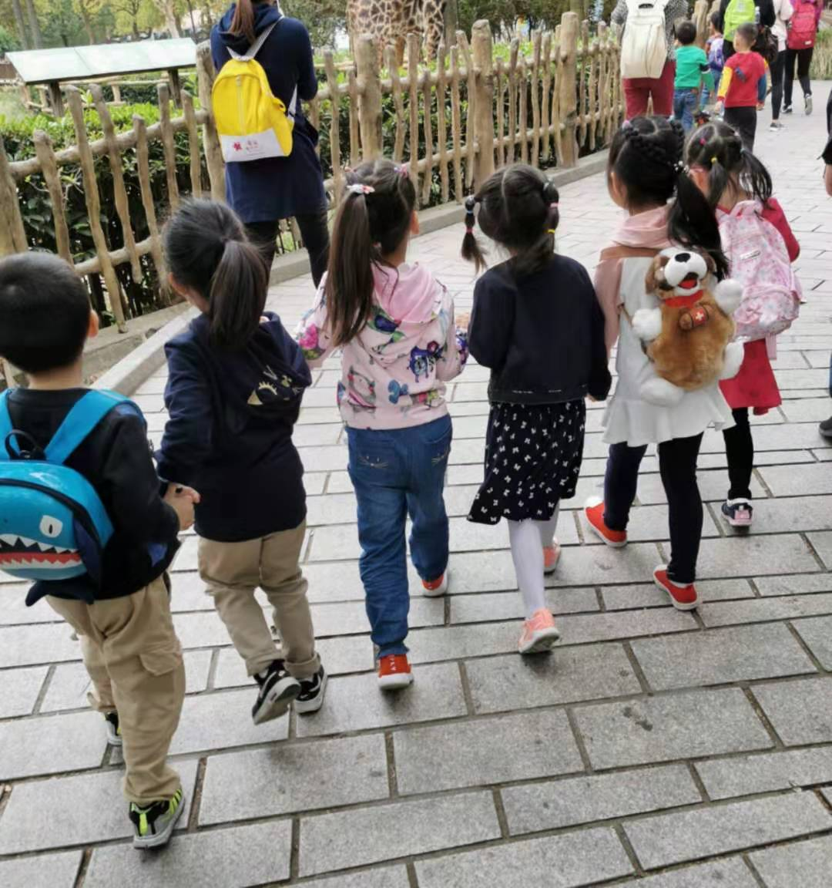

### 理财是为了更好的生活

昨天加完班到家已经近11点了，正好看到我妈在给女儿量体温，38.7°

我妈说女儿傍晚去上英语课的时候还挺好的，洗完澡就一反常态的自己要求睡觉，我放下书包给熟睡中的女儿贴了个退热贴。

老婆这周出差山西，都是我一个人陪女儿睡觉，但她平时不会抱着我睡觉，因为我是家里的‘黑脸’角色。

昨晚我洗好澡后就听女儿粗粗的喘气声，偶尔还会难受的咿咿呀呀一会。我摸着她的手准备睡了，她突然抓紧我的手睁开眼说道：爸爸，你怎么才回来，我今天有点不舒服，很早就睡觉了。

听着她弱弱的声音，我有点不是滋味，我问她：要不要坐起来喝点水。她没回我，眼睛已经微微闭上。我接着说，要不我们吃‘面包超人’的药药吧，是你喜欢的草莓味哦。

她点了下头，但还是没睁眼看我，我随即去厨房倒了点温水，拿上她‘御用’的水杯和勺子。扶正软趴趴的女儿，把药倒在勺子里，沾一点水递到她的嘴边，起初是微微咪一口，两口过后就发觉是自己喜欢的草莓味，嘴边开始有精神了，不停地在索取。

那一刻我脑海里回想起了她还是婴儿时候喝奶粉的样子，这一晃已经是一个中班的大姑娘了。平时很懂事听话，偶尔又很调皮倔强，平时不怎么和我亲近，妈妈这几天不在家，一生病又开始偎依起我来了。没一会2/3包的药吃完了，她也意识恢复了清醒，我让她把剩下的水都喝了。

我用纸巾给她擦了下嘴，然后把杯子和勺子都放回了厨房。我问女儿要不要上个厕所，我怕她喝了那么多水，半夜起床影响睡眠，生病的时候有个高质量的睡眠还是很重要的。但是她摇摇头，自己抱着她的小被子躺下了，我也躺下了我疲惫的身躯，关灯睡觉。

或许刚吃过药，她有点小清醒，让我把天猫精灵打开给她讲故事，听着她最近迷恋的《米小圈上学记》。我在帮她把被子盖盖好的时候，她突然来了一句：爸爸，你怎么眼睛里有血丝啊？我说没事，只是这几天爸爸公司比较忙，中午都没午睡。女儿突然气呼呼说道：那你还不关灯赶紧睡啊，一点都不乖。

听着她模仿大人的语气，我没再说什么，只是笑着把她的小脚放到了被子里面，关灯躺下了。虽然天猫精灵一直在讲米小圈的故事，可我那时一句也没听进去，我在想：其实养个孩子也蛮有趣的，孩子成长的过程也是自己成长的过程，父母和子女的关系几千年来一直是最紧密的也不无道理。

可能是太累了，她刚听了一小会就又睡着了，我关了天猫精灵、关了小夜灯，也睡了。别说最近那么累，就是平时我一旦入睡，就会睡得很沉，摔下床也不一定能醒的那种沉。但是昨晚2点多的时候突然女儿喊醒了我，我也猛的起身抱她去厕所小便，往常这种事都是我老婆比我先醒，而且就算我醒着女儿也不让我抱着去的。

昨晚出奇的没排斥我，可能是她没得选，也可能是她有点虚弱。上完厕所就抱回去又睡了，我不知道为什么今天凌晨4点多我又醒了，女儿也没喊我。此刻我发现我的一根手指被女儿小手紧紧的握着，尝试着拔出来，但是很紧，也就没再动，一看时间还早就又睡了过去。

我们总是聊投资理财，偶尔也需要聊聊家长里短。比如我每周一的定投计划里最后一部分我都会说一些生活的点滴，算是记录下自己的生活，也是在提醒大家：**投资是为了更好的生活，努力工作是为了更好的生活，工作再忙也要挤出时间陪伴家人，父母渐渐老去、子女一晃成人。**

切勿本末倒置！

