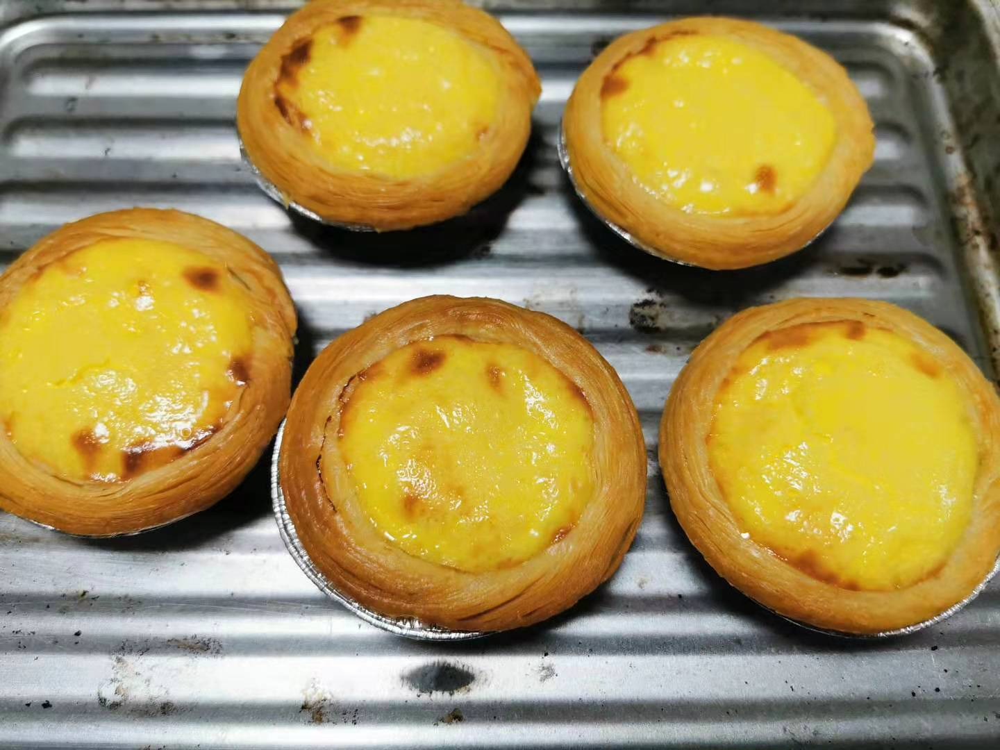

### 老豆得知春节延期后的第1天（01-28）

全国最早公布延迟企业开工的城市是苏州，继而在昨天国家统一延后了春节假期至2月2日，昨天下午上海也发布延期开工公告，时间为不早于2月9日24时。提前回到上海的我在庆幸自己可以多休息几天的同时，也在想着这剩下的十多天日子怎么过？怎么过得不无聊、如何过得充实？所以我准备记录下这段时间的生活，也给在家无聊的小伙伴们一些乐趣或参考。

昨晚睡得早，今天清晨5点多就醒了，看了眼女儿和老婆都还在酣睡，就躺在床上把昨晚更新的《爱情公寓5》的21、22集给补上了。两集看完后困意又上来了，一个回笼觉睡到9点，起来洗漱后自己搞了一个手抓饼吃吃，安井速冻的手抓饼挺方便，作为早餐家里常备。

昨晚就答应给女儿做饼干的，吃过早饭就在‘下厨房’上找了一个黄油饼干的制作教程（不想下载APP的朋友可以直接搜索小程序）。

- 黄油 100g

- 白砂糖 60g

- 鸡蛋 1个

- 低筋面粉 150g

把黄油切小块放在一个碗里，等软化后放入白砂糖搅拌均匀，再加入鸡蛋液使其融合。再放入面粉拌匀成饼干面团，装入保鲜袋整理成条状放入冰箱冷冻一小时。冷冻结束后取出切黄光片一样切开，放入烤箱160度25分钟上下温度，最后就是耐心等待‘叮’的一声出烤箱。

讲真卖相一般，但口感还行，女儿尝过说挺好吃。我发现小孩子遇到这种亲自看着制作出来的食物会格外喜欢，即便我不认为我这个会比超市买的好吃。我家里之前也买过一个九阳的面条机，机器出面条的时候女儿还喜欢过来帮忙剪面条，每次自己家做的面条女儿都会多吃一小碗。

因为早饭吃得晚，又吃了几块饼干，所以中饭只吃了一点。到了下午三四点就有点想吃东西了，又去烤了几个蛋挞，泡了一杯太平猴魁，老婆切了点水果，一家人陪女儿吃着下午茶、看着动画片。吃过后我陪女儿下了两局围棋，后面就交给孩子她妈了。晚上计划自己看看书，给自己也充充电。

其实距离正式上班还要十多天，而且不排除后续会继续延后开工的可能性，所以如何安排好假期也是大家比较关心和困惑的一个问题。当昨天听到延后长假的第一反应就是鲁迅先生的：“我只是把别人喝咖啡的工夫用在了工作上罢了”。不是说要努力工作什么的，只是平时大家都心心念念要放长假，现在终于有了机会了，还是带薪休假，你是否真的能好好利用起来？

- 追一部以前没时间看的剧（即便是无脑肥皂剧）

- 看一本买了很久的书（就算之前翻了好几次都没看完）

- 下厨做一桌拿手的佳肴（用心去做比好不好吃更重要）

- 陪家人打牌闲聊下午茶（陪伴是最长情的告白）

今天就这样吧，我也准备洗洗躺床上看书去了，如果你们有什么好的‘度假’方式也可以和我一起分享。

