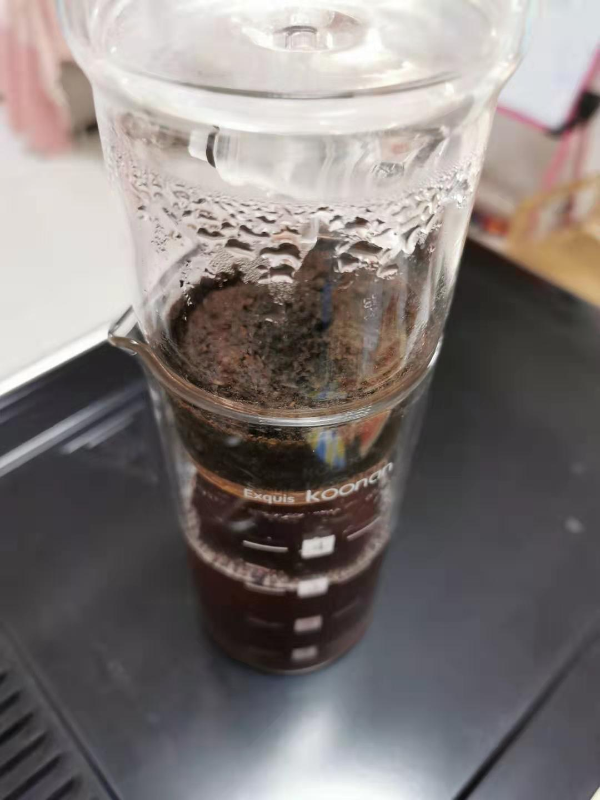

### 老豆得知春节延期后的第2天（01-29）

今天是农历正月初五迎财神的节日，这个节日想忘记都很难。因为你无论身处何地，都会有很多人用半夜的鞭炮声来提醒你，一年一度的迎财神日又来了！

早上起来照例把昨晚新出的《爱情公寓5》23集、24集过一遍，看到一句台词很应景。诸葛大力说：“**近一百年，人类感染病毒变异成丧尸的可能性，还是挺大的！**”

起床后我找了一个新的积木给女儿，然后我们三个就在那边拼积木，女儿主要就是负责捣乱，我和老婆两人拼得眼睛都花了。这个积木我觉得还是很难的，是去年底家门口的龙湖搞周年活动积分兑换的。经过这个事情我也发现其实女儿的耐心还是很不够的，她遇到这种需要消耗很多时间才可能有一点点效果的事情就很没耐心。吃午饭前我们一共完成了9步（图纸总计显示有60步），我把剩下的积木和半成品放回了盒子里面，等后面再接着拼吧。

下午老婆要开一个语音会议，我就陪女儿看了一本新的巧虎书。我不知道我的读者里面有多少是有2~7岁孩子的父母，如果有这个年龄段的家长，我强烈推荐这套成长系列书籍。我第一次听到‘巧虎’也是我刚工作的时候，我的PM是一个宝妈，她和另外一个宝妈老员工中午基本上都在聊育儿经，而巧虎出现的频率挺高。巧虎一个月费用也就125元左右（我觉得价格和课外兴趣班比相当的亲民），订阅后每个月会收到几本书、一张光盘、一套玩具，每月套装都是结合具体年龄月份设定的，寓教于乐，孩子很喜欢，家长也很受益（2岁左右的时候每月还有一本专门给家长看的书，帮助第一次做爸爸妈妈的家长如何应对和理解孩子的成长）。

老婆开完会，我和女儿的书也差不多看完了，老婆接手后我就去泡茶了。昨晚翻出来之前一个同事送的沙巴红茶（香味独特适合泡奶茶），这个属于碎茶。要么装茶包里泡，要么用萃取壶泡（有点做化学实验的感觉），工具如下图：

我把奶茶端到客厅的时候，看到女儿和老婆在做‘老师学生’的游戏。女儿教老婆画画，而今天画的内容就是女儿的点读笔，下图是两张A4纸拼接的。女儿很喜欢这类游戏，有时候还会上数学课或者英语课，平时我们加班多她就会拉着我妈做学生，而我妈普通话有些不是很标准，就经常被女儿吐槽。

---

关于这次疫情我想从一个小的切入点和大家简短的说下：**少吃红肉多吃蔬菜，健康生活阖家安康。**

物种之间越接近，那么越容易进行病毒的传染，所以我们平时应该少食用肉类（家禽、猪牛羊等），特别是哺乳动物的肉，至于未经检疫的野味那就是绝对禁止了。如果能养成多吃蔬菜的好习惯那自然是最好的，非要吃荤的可以优先考虑鱼和虾。

我老婆的奶奶因为一次奇特的境遇，她从56岁后就再也没吃过红肉，主要食用蔬菜，荤菜就是鱼和虾，然而她今年已经91岁了，依然生活可以自理，不怎么需要麻烦7个子女。所以即便极端的长时间不吃红肉也依然身体健康，而我上面说的只是建议大家少吃，偶尔吃点也是可以的，故而就更不用担心什么营养失衡了。

而经常做菜的朋友都知道，烹饪荤菜需要的调味料要远大于蔬菜，大量的油、盐、糖、味精、香料所带来的弊端我想大家都有所耳闻。更容易诱发糖尿病、高血压，过多的调味料会让我们的味蕾早早的退化，**我们这代人会比长辈们更早退化的感官有：视力、听力、味觉。**

---

今天港股开市了，跌幅小于预期，如果后期市场信心进一步恢复，等我们开市的时候应该会很缓和了。好了，今天就这样吧，我也要洗洗准备上床了，越来越严重的‘熬夜病’居然被疫情假期治好了，你说气人不气人。最后如果你们有什么好的‘度假’方式和趣闻也可以和我一起分享。

