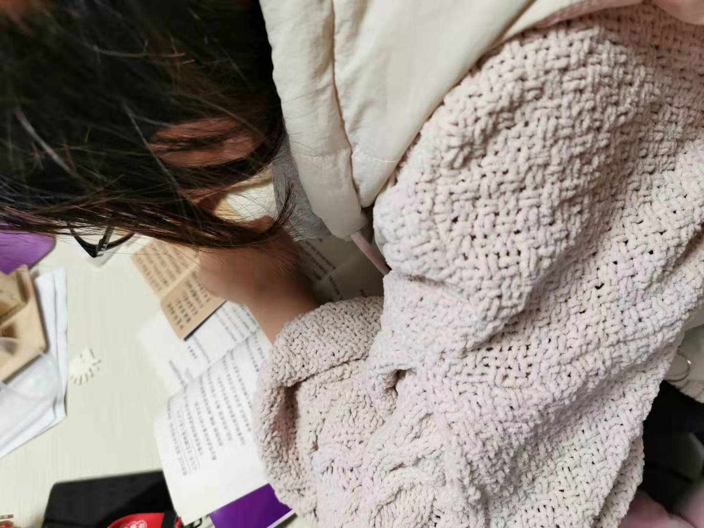
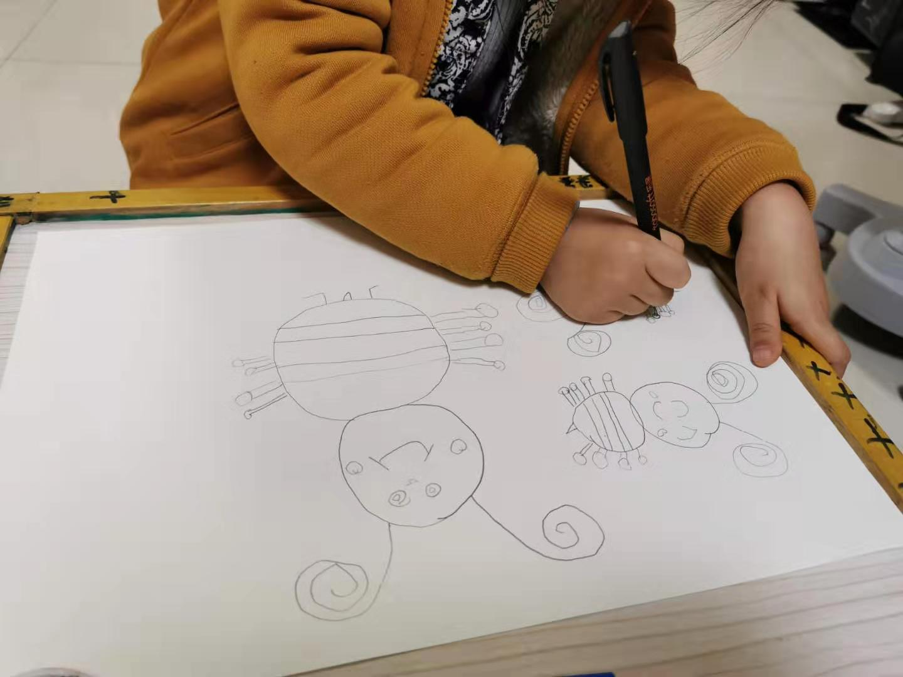
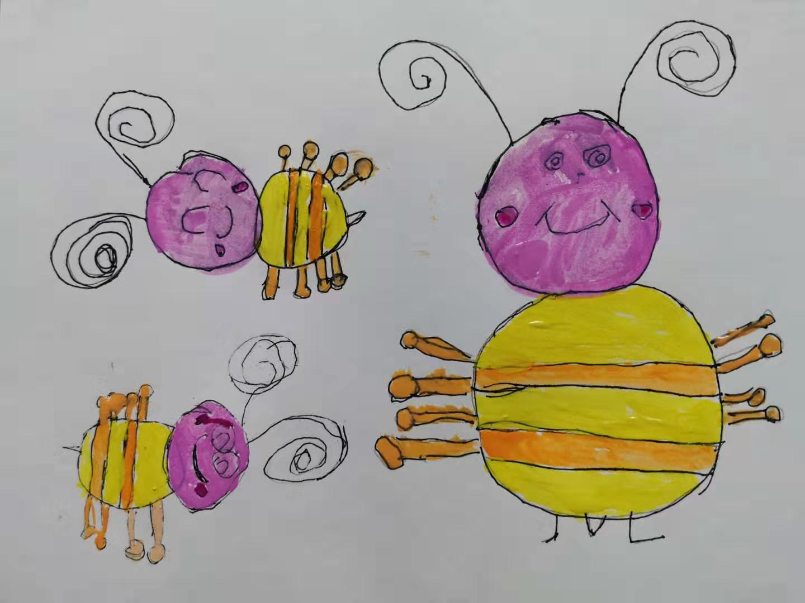
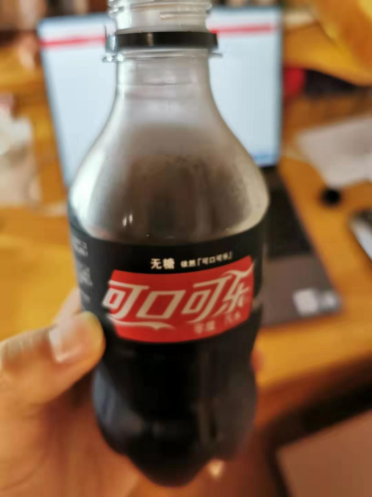
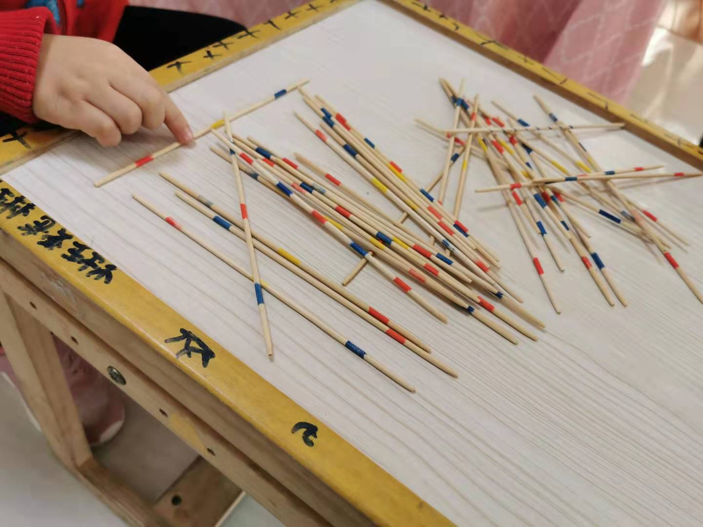
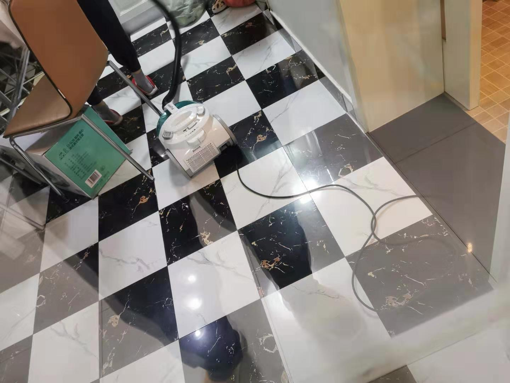
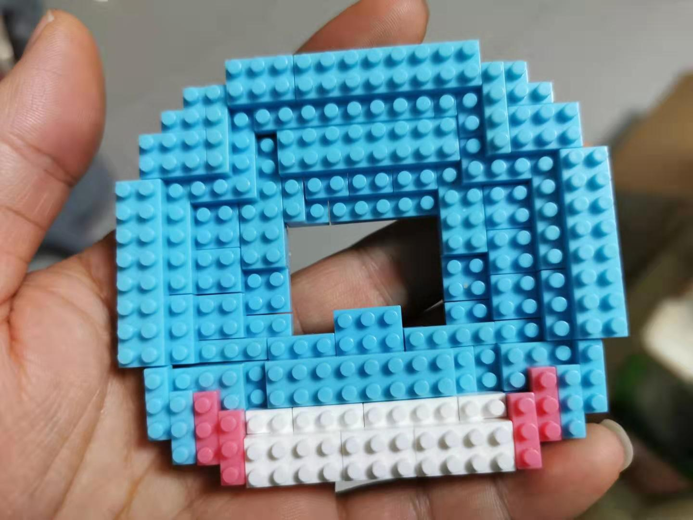

### 老豆得知春节延期后的第3天（01-30）

这种吃了睡，醒了吃的日子已经三天了，已经有人开始觉得无聊了。也可能已经睡饱了，今天全家都起得挺早，老婆在看书写小笔记，女儿在画小蜜蜂。

这两天上海的太阳还算可以，但是小区居委会一直在劝告大家还是安心呆在家里别外出。我只能把阳台的窗关紧，喝着一瓶82年的零度可口可乐，看窗外街道的往来行人极少，冬天晒个暖阳喝个‘宅男神仙水’也不错。

因为今天早饭吃得挺早，所以午饭11点半样子就吃了。吃过后我陪女儿玩挑棍游戏，老婆拿出吸尘器把家里吸了遍。老婆打扫完成后和女儿在卧室做瑜伽，我就继续拼那个积木，今天拼到了第17步。

傍晚我抽空把《囧妈》看了，结尾处徐峥的那段独白信我觉得蛮好。徐峥最后和妈妈坦白了离婚的事实，并听从了前妻的建议给妈妈一个大大的拥抱，发现原来这也没想的那么难。徐峥这次与妈妈6天的俄罗斯之行，是他毕业后跟妈妈相处最久的一次，以往母子间总是那么多争吵，即便出发点都是对彼此的爱，只不过这份爱是希望对方活成自己想要的样子。最终徐峥体会到：**爱不是控制和索取，爱是接纳和尊重**。

我们这代人和父母多少有类似的情况，即便我父母每天都在身边，但一年到头也不会讲太多话。看过电影我自己也有所触动，同时也建议大家借着这次疫情延长假期的机会多在家里陪陪父母，或许这也是你们毕业后第一次与父母待那么久。尤其是平日里远别家乡在北上广等大城市漂泊的打工者们，趁着这几天村里的网络不是很好，放下手机多陪陪父母、陪陪子女，他们在慢慢变老、他们又成长得如此迅速。

最后再说下今天网上开始弥漫着一股希望早日开工的气息，这些人主要是担心小微企业、个体户，特别是盼着春节消费等行情的相关企业和人。原来准备过年大赚一笔，现在不但没钱可赚了，还原料积压、损耗。有一些湖北的朋友无法顺利返城还担心企业会辞退、丢了饭碗；还有一些月光族或背负高额月供的朋友眼看就要在家吃土了。

虽然我自己还是会继续宅在家里，至少会等疫情平稳了再上班，但我认同**部分行业、部分区域，可有选择的开工**。除了上面说的这些因素，我觉得还有一个比较重要的点：我们是世界工厂，若真停工一个月带来的国际影响是不可估量的，当然最终伤害最大的还是我们中国人。

