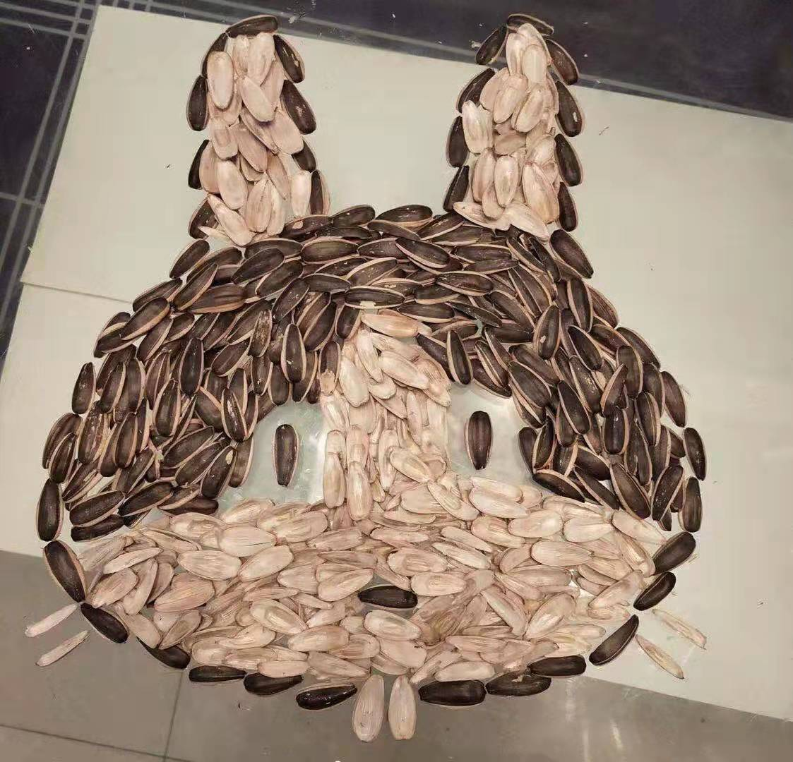
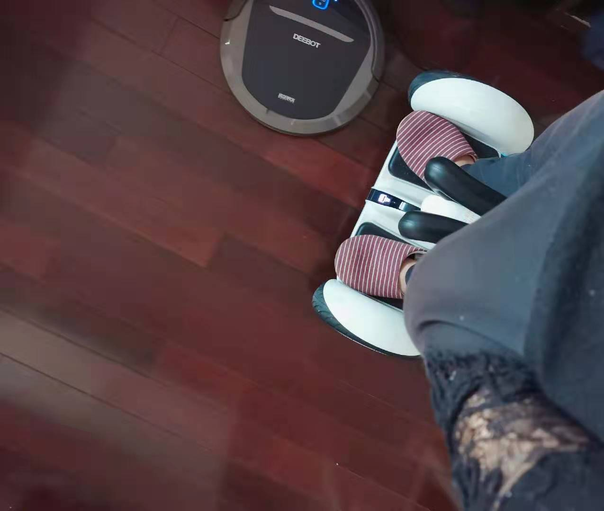
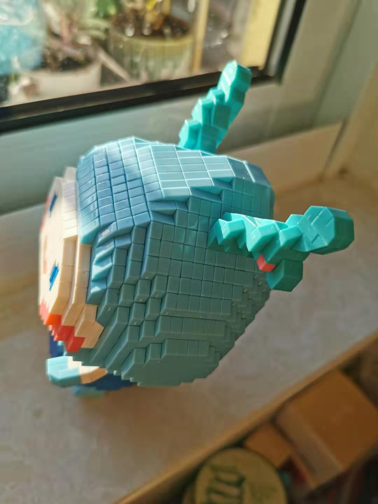
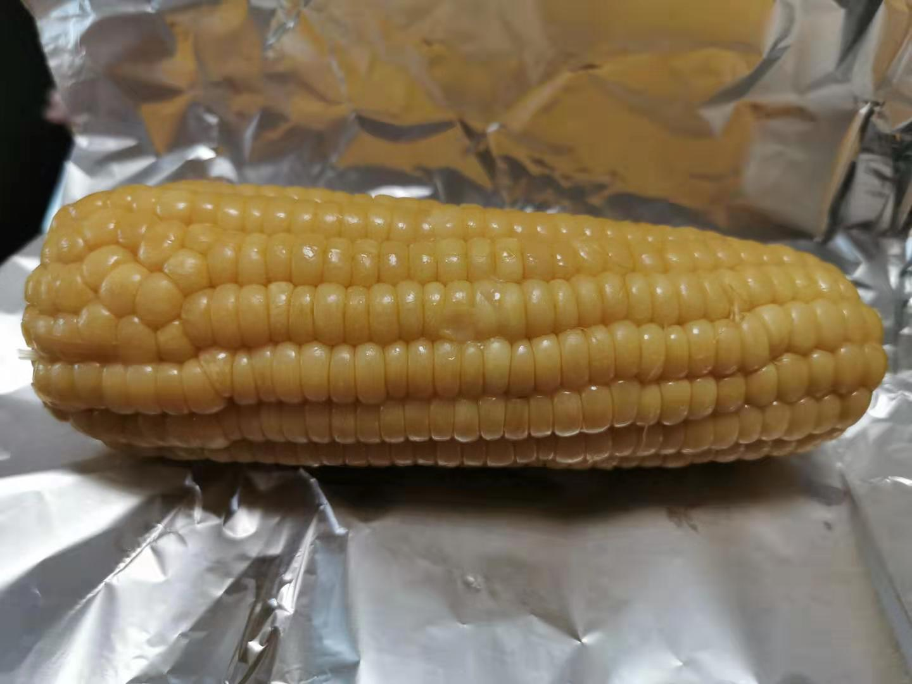

### 老豆得知春节延期后的第4天（01-31）

日子一天一天过，大家已经开始在家闲得玩出花来了。用瓜子摆个造型什么的已经算过时了，雪球某人气女大V在家骑着平衡车监督扫地机器人扫地。

今天上午在家被老婆催着把储物柜整理了下，下午趁女儿午睡没人捣乱了，我赶紧一鼓作气把积木给拼好了，我眼睛已废。

女儿醒来突然说：“爸爸，我要吃烤玉米”。好吧，好在冰柜里还有玉米，反正闲着也是闲着就给她烤一根吧。在等烤玉米的间隙陪女儿在客厅打了会羽毛球，她好几次都打到了吸顶灯，我说你对等有什么意见啊？怎么老是打到它呀。后来我有连续两次都打到她头顶，她立马说：“爸爸，你对我的脑袋有什么意见吗？怎么老是打它呀？” 我和老婆都笑得弯下了腰。

--- 

今天多留一点时间聊聊大家可能关心的事情吧。这两天热度比较大的事情有那么几件：黄冈某主任一问三不知被免职、WHO发布新型冠状病毒感染肺炎疫情为国际关注的突发公共卫生事件、湖北某会再次被推到了风口浪尖...但今天要重点讲的不是这些事情，我就讲一些方便发布的东西吧：【恐慌】情绪。

谈‘恐慌’这种情绪，就从这次最紧缺的口罩谈起。现在口罩确实比较紧缺，最近大家都在想方设法的囤积口罩，谁曾想到口罩成了年货。原以为过年涨价最厉害的是猪肉，最终一场疫情拯救了猪肉价格，也拯救了那个故宫奔驰女。

现在口罩工厂正在夜以继日的增加产能，但还是不够大家抢，就算过几周每家都屯了上百个口罩后，大家还是继续屯的，因为‘恐慌’的情绪已经弥漫开了。而且我大胆预测下未来1~2年大家都会没事在家备几个，因为一朝被蛇咬十年怕井绳。

这就是恐慌的两个特点：一个是短期会扩张蔓延这种恐慌、另一个是会有恐慌的延续记忆。要消除大家囤积口罩这种行为必须具备两个条件：口罩的产能远超实际需求（至少十倍以上）、疫情得到了真实有效的控制。

‘恐慌’这种情绪在经济运行过程也很常见，比如‘银行挤兑’。一旦银行有破产的可能，那么这个银行柜台肯定排满长队等着取款，而任何一个正常银行都是无法应对恶性挤兑的（因为钱只有贷款出去银行才有息差可赚），这也是为什么国家之前推出存款保险，单一客户单一银行最多可保底50万，表面上是救百姓，实际上更多的是防止恶心挤兑保护银行自身。普通百姓的储蓄金额虽然不大，但能引发强烈的社会恐慌情绪，这种恐慌的蔓延会加剧挤兑的情况，大部分人存款是小于50万的，散户不来凑热闹，那么极端情况下的银行也就保住了。

最后关于口罩短期不足问题，我建议大家尽量少出门，这不仅是对自己负责，也可以减少口罩的消耗。而且对于口罩不足的家庭，可以用酒精喷洒用过的口罩并用保鲜袋包裹后单独保存，实在没办法的时候可以使用二次消毒的口罩（但不建议家人交叉使用）。

好了，今天就这样吧，如果你们有什么好的‘度假’方式和趣闻也可以和我一起分享。

