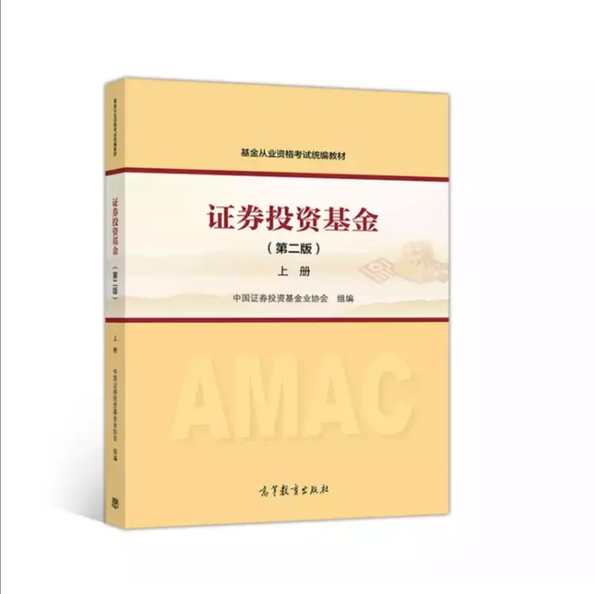
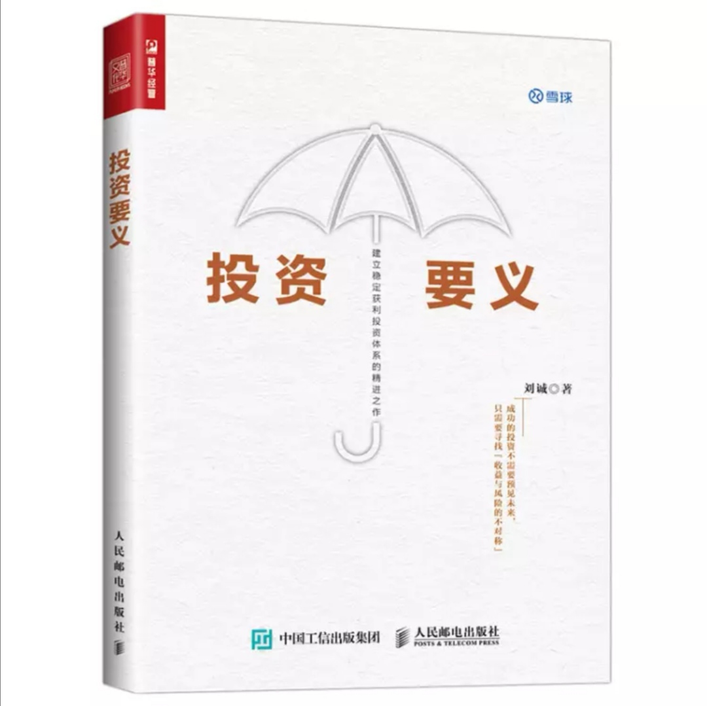
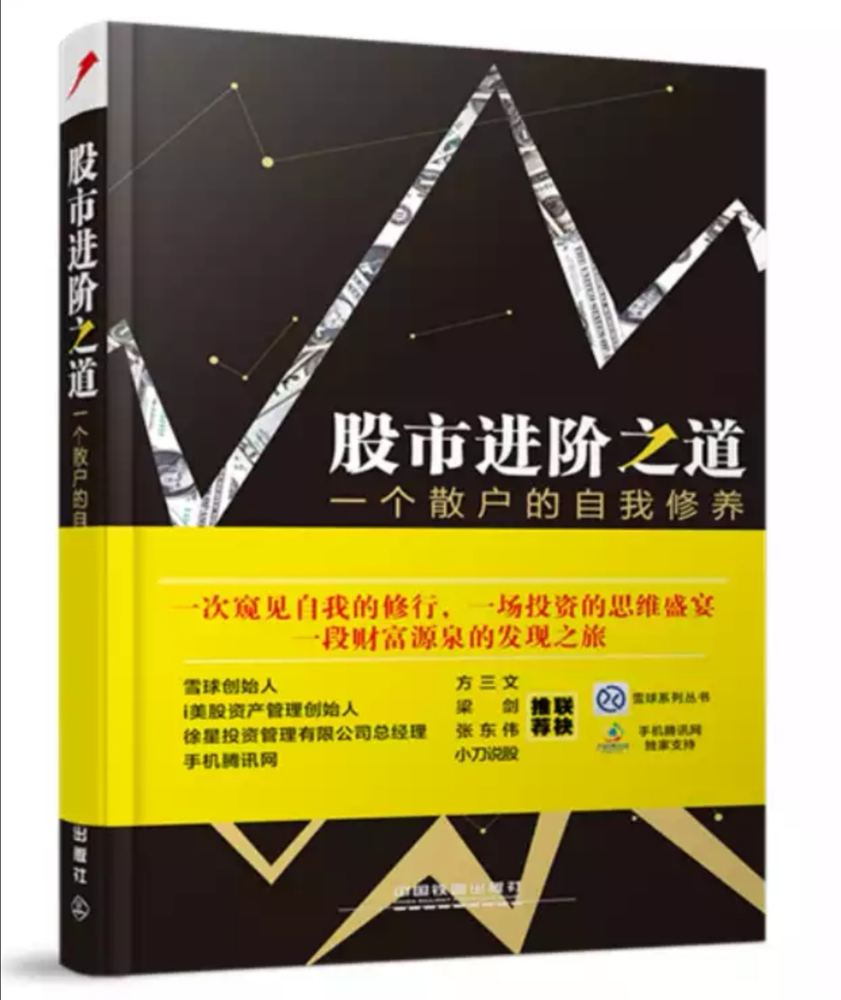

### 老豆得知春节延期后的第5天（02-01）

下周一A股就要开市了，虽然开盘大跌是大概率事件，但我不认为会太夸张，如果真的大盘跌停，我会‘为国护盘’。好在下周起有事情让大家做了，股民基民也就不那么无聊了，所以帮大家消遣的文章也就写到今天为止，正好写满5天。

从最近三天疫情人数的变化看，应该是抑制住了进一步的蔓延，不然人数的增长比现在要更加可怕，后续就是近期回城返工后的日常管理和民众情绪上的平复。所以大家也冷静的对待各种新闻报道，昨晚这种抢双黄连口服液事情就别再做了，不是很理智。

如果大家还是觉得无聊，可以如我第一天说的，借这个机会看看书、看看电影和电视剧，我今天就着重推荐给大家三本书和一个综艺：《证券投资基金》（上册、下册）、《投资要义》、《股市进阶之道》、《脱口秀大会》（第一季、第二季）。

##### 《证券投资基金》

这本书是基金从业考试的教材，由中国证券投资基金业协会组编，高等教育出版社出版。我当时买的是2015年的版本，现在最新的是2017年的第二版，但这不影响初学者们作为正统的入门学习资料，当然新买的还是买最新的第二版哈。如果你对基金还是一知半解，那么这套书是非常好的国内的入门教材，也因为是正规官方考试教材，所以很多点讲得挺宽但算不得深，只要你有耐心的看完，我相信对你的基金投资生涯大有裨益。

推荐理由：比国外基金书更懂国内市场，比个人写的入门书更权威（且不会有私人立场和个人观点），初学者可以放心学习。

##### 《投资要义》

这本书刘成著，人民邮电出版社出版。去年下半年可转债再次被大家推上了风口浪尖，但很多人还不懂可转债，只是局限于开个户打打新，而可转债的玩法和奥义远不止这些。现在市面上讲可转债比较有名的书有两本，另外一本是《可转债投资魔法书》，安道全的魔法书已经出第二版了，也不错但对于新手来说可能没耐心看完一本书，而且魔法书篇章冗余部分蛮多的（且行文略显极端）。所以可转债我首推《投资要义》的第五章第二节，本章节较好的讲解了可转债的大部分知识点。当然如果有时间也可以完整的看下这本书，整本书也不算厚，里面很多理念是很让人受益的，我相信会对大家投资理念的形成大有帮助。本书在微信读书可以免费阅读，我本人当年买了kindle的电子版和纸质书以示支持作者，建议大家先去读下电子版，觉得好可以去支持下。

推荐理由：初识可转债的优秀书籍之一，全书读完后可帮助大家形成较好的投资体系，让你体会下作者认为的资产配置。

##### 《股市进阶之道》

这本书李杰著，中国铁道出版社出版。如果国内的投资书只推荐一本，那就是水晶苍蝇拍老师的这本书，全书分三部分：正视投资、发现价值、理解市场。这本书值得大家耐心的看、认真的看、反复的看，看完后绝对会给你对投资认知质的飞跃，而且我建议大家可以关注下水晶苍蝇拍老师的微博，一个很严谨的自媒体。微信读书也有电子版，大家可以免费阅读，我自己买的早所以是纸质书，然后第二遍复读的时候为了上班路上看方便就又买了kindle电子版。

推荐理由：整本书16章看完后我觉得每一章都有不小的收获，且有读第二遍的冲动，如果你想做一个真正的价值投资者，那么这本书是国内少有的优质书籍。

##### 《脱口秀大会》

我从小就喜欢看一些让人欢乐的影视作品，小时候会看上海台的独角戏（和相声很像），后来学会了看相声（那个年代还没郭德纲这种风格的），后来又发现了周星驰这种无厘头的演绎风格（经典的周星驰电影反复看了N遍），这几年又知道了脱口秀这种年轻的‘喜剧’形式。

脱口秀如今的代表就是李诞及其带领的效果文化团队，巧的是我和李诞同龄，所以我觉得自己有时候很能理解他们想要表达的东西。他们用‘吐槽’这种年轻的方式去笑谈一些人或事，然后除了带给大家笑声外，还会给我们一点点思考。（《脱口秀大会》腾讯视频独播）

推荐理由：我认为好的喜剧不应该只有欢笑，《脱口秀大会》值得你看一看，此刻的老百姓也需要一点欢笑声。

开头说了，今天是连载的最后一天了，后面我也想多给自己一点时间去充电下，顺便也把2019年发过的文章都整理下，给自己过去的一年做个回顾。**生活就是这样：时不时回顾下、时不时充电下。**