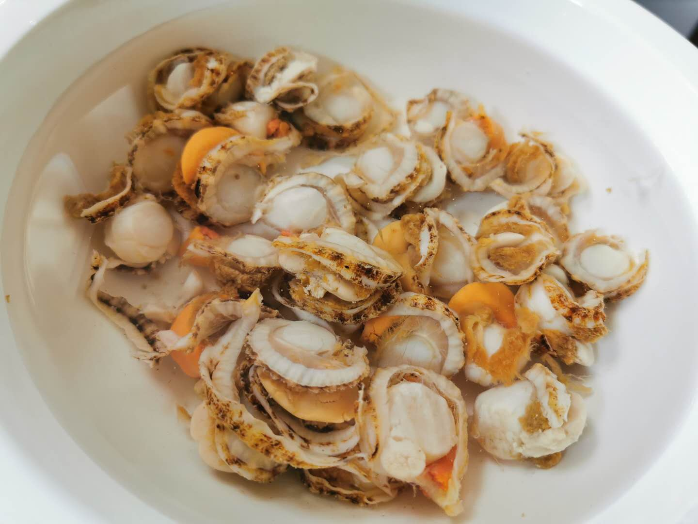

### 双休之外的快乐

现在绝大多数人都已经习惯了做五休二，可在我小的时候是有单双休的，每隔一周的周末只会休息一天。而农村出生的我，见着父辈们外出打工、在家务农几乎都是全年无休的。甚至上学的时候让我觉得农业到工业的生产力提升，很大一部分是因为工厂上班即便刮风下雨都可以，而下地干农活却不行。

因为工作性质的关系，我平时加班还算较多，所以在项目不忙的时候会调休下。今天就是这么一个风和日丽的调休日，即便今日我做的事情和周末差不多，但这种额外的欢愉是加倍的。

明明是工作日，却可以睡到自然醒，今天醒来的时候已经开盘了，好在我不是那种需要时刻盯盘的投资者。抽离于个股投资后，不盯盘让人轻松不已，也更适合上班族。我看了眼大盘没暴跌，就继续回笼觉去了，直到女儿进来闹醒了我。以前他还会问：爸爸，今天是工作日，你怎么没去上班呀？现在她也知道我偶尔会调休，她今天说：你又在家休息啊，快起来吃早饭了。

时间也不早了，我就随便吃了片面包，泡了杯茶。站在阳台上捧着个茶杯，看着窗外的人来人往，5月上海的太阳还算不上毒辣，故也没见有女生撑遮阳伞。正准备进屋的时候，眼的余光看到阳台上的仙人球开花了，要知道昨天还是一个花骨朵。

不知道为何突然想吃炸串，去冰箱翻了下正好有青椒和肉肠，青椒拿出来泡水里，肉肠也拿出来放室温解冻下。薄皮青椒加$XD安井食(SH603345)$ 的肉肠用牙签串好，入油锅炸一下取出，再淋上自制酱汁。可惜女儿不怎么吃辣的，我只能自己多吃一点了，搭配上一口喝了能涨姿势的酸奶，真得很赞。

因为起得晚，今天就没睡午觉。孩子这学期一直在家，但我妈还是给女儿安排的挺充实，今天我在家，那教学任务就自然是我的了

一下午其实也过起来挺快的，给她出了100道算术题，做错了三题，拼音和英语都还不错。可能是我在家，小家伙作业完成的都很迅速，做完后我陪她打了会羽毛球，她还画了幅西瓜，说是等妈妈回来了给她吃。话说这个时节下班回来吃一口微凉的8424西瓜，真的太解暑了。

晚上还是让老人家休息下，我自己下厨做了份爆炒青椒扇贝，由于出锅后太香，吃完才想起来忘了拍照，只留了一张准备食材时候的照片。

老妈咪一口酒，我配一罐青柠味的百事可乐，老婆和女儿倒了半杯果汁，一桌的菜也是给扫的比较干净了。

吃过饭，一看时辰还早，女儿就提议去小区公园溜达下，老妈留下来洗碗，我们三个去散步了。公园的广场舞已经恢复得很好了，来散步溜娃的也是极多，没几个人戴口罩，即便戴着的也就是虚掩一下。确实现在在户外环境中，大家也是愿意摘下口罩的，或者说不得不摘，太热！希望疫情能早日彻底的退去，这东西真的太影响社会经济了。

女儿很快和一群小伙伴玩得风生水起，我们喊她回去都不肯走，老婆说回去吃西瓜了，女儿才挥手和小朋友们说再见。回去的路上，女儿对老婆说：妈妈，我们家的仙人球开花了，可漂亮了。到家后女儿拖着还没换完鞋的老婆直奔阳台，喊着让我把仙人球搬进来给妈妈看。可当我拿进来的那一刻，女儿脸上没了笑容，沮丧着说道：白天还好好地呀，怎么那么快就凋谢了。

其实我是知道仙人球的花期很短，只是路上怕扫了孩子兴。我看女儿还挺难过的，就拿出上午拍的照片，对她说：没事，上午爸爸已经拍下来了，你可以拿照片给妈妈看的。随着我妈喊了一句：吃西瓜了。女儿视乎又忘了刚才一瞬间的难过，只觉得手里的西瓜很甜。

昨晚从书柜上翻出一本当年为凑单买的书《一只特立独行的猪》，多年来一直还是塑封着，今天就这样吧，我准备趁今天还有点时间，去看会书。

结语：回到文章开头，我们在享受额外休息的时候，这种欢愉是双倍的。我也常说：投资只是生活的一味调料，切勿本末倒置，我们应该多感受下我们的生活和这个世界。