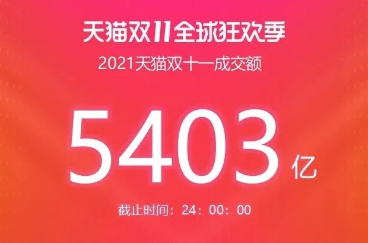

### 你对双11还有感情吗？

朋友们，今年双11你剁手了没？你还会因为双11的到来而激动不？你还会值守掐点的清空购物车吗？

> 以前叫人“小甜甜”

双11这个本来属于光棍的节日硬是在2009年被天猫“造”成了全民购物节，那会我还在上大学。但真的让大家有点感觉的还是2010年才开始，在2011年的时候我觉得已经是双11历史上的一个小高潮了，也让其他的电商平台感受到了“造”一个购物节的重要性，自此造节运动一发不可收拾。

现在的双11真是遍地为套路（预热、领券、满减、预售、买一送三等），反观最初的双11还真像是一个“单纯”的小甜甜。那时候的双11商家们可以借机清清库存，而消费者在不太费劲的前提下也能捞到一些实惠。

如今的购物节真是累死各方：活动的产品经理每年为发优惠券的小游戏而愁白了头；商家们被平台逼着不得不配合演完这出戏，往往是赔本赚吆喝，因为你不参加平台就会把流量引向你的同行；物流公司又因为这人为的瞬时爆单不得不雇佣大量临时工人，成本也随之激增；可怜的消费者不仅要半点蹲点抢单付款，还要应战各种复杂的优惠券套路，完了还不得不等待漫长的物流以及一时“爽”后不知该如何面对的干瘪钱包。

望着这累觉不爱的双11，很多小伙伴直呼：连剁手党氛围组我都懒得当！

> 直播电商让每一天都是双11

电商直播在疫情大背景下直接火遍大江南北，李佳琦和薇娅这些顶流带货主播那更是赚得盆满钵满，连欠债一屁股的老罗也靠着抖音直播现在混得风生水起，甚至罗永浩的【“真”还传】还上了热搜。

电商带货直播给大家带来了新事物、新热闹的同时，也彻底把双11搞成了常态化。如果说以前618、双11、双12、女生节、情人节、元旦圣诞双蛋节等这是每月都有新花样，那么李佳琦们真是做到了天天都是购物节。顶流的带货主播除了可以收取很高的“坑位费”，还能充分挤压供应商的价格，这种全年365天的挤压已经让厂商们没啥空间给双11变个“花”出来了。

> 这样的双11还有必要搞吗？

当双11已经日常化，且双11的价格已经不香了，那么不禁问一句：这样的双11还要继续搞吗？

看似把各方搞得都很疲惫的一个双11也好、618也罢，真的明年就能不搞了？其实近几年年年有人吐槽，但购物节该搞的还是得继续。虽然有些人厌倦了这些套路，但依旧每年都有新人“不信邪”，或者说感觉不买点啥就是吃亏了。看似无奈的现状，但如果你是一棵市场里的老韭菜你就会明白，新韭菜是一茬又一茬，人性本身就是冲动的、不理智的。

对于阿里天猫来说，双11的销售额就是股价的支撑，一旦哪一年数据急速下滑，那么股民自然会用脚投票。看着拼多多靠着百亿补贴硬是在京东和淘宝之间杀出了一条血路，京东至少还有干爹腾讯的引流（当然拼多多的病毒传播式传播也是靠着腾讯这个天量流量池），阿里独自一人在北风中凌乱。阿里没有退路可言，他也不得不“绑着”各大商家继续上演这每一年的“购物狂欢”。

>有点怀念2011年的深秋

我自己已经至少5年不怎么参与双11了，不是说不买，而是不会因为双11而特意屯一堆货物。除了价格已经没有太大优势外，还有复杂的套路让我实在没这心力“淘”东西，最后拥挤的双十一购物体验也不是那么好。

现在碳中和下用电都讲究错峰，我们何必还要人为的造节导致商家库存和物流的压力呢？我虽然无法阻止大家，也没必要阻止大家消费，但如我刚说的，我自己尽量不掺和捣乱。

说到这我又有点怀念2011年的双11，买了一双价廉物美的皮鞋找工作面试时穿，买了个充电宝让我的摩托罗拉MB525手机可以外出无忧。如果购物节真的可以让商家清下库存，让消费者得点实惠，那么未尝不是一件喜事，可惜我们再也回去不了！