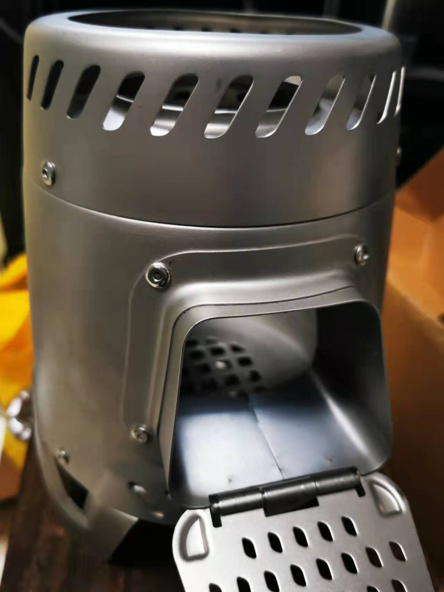
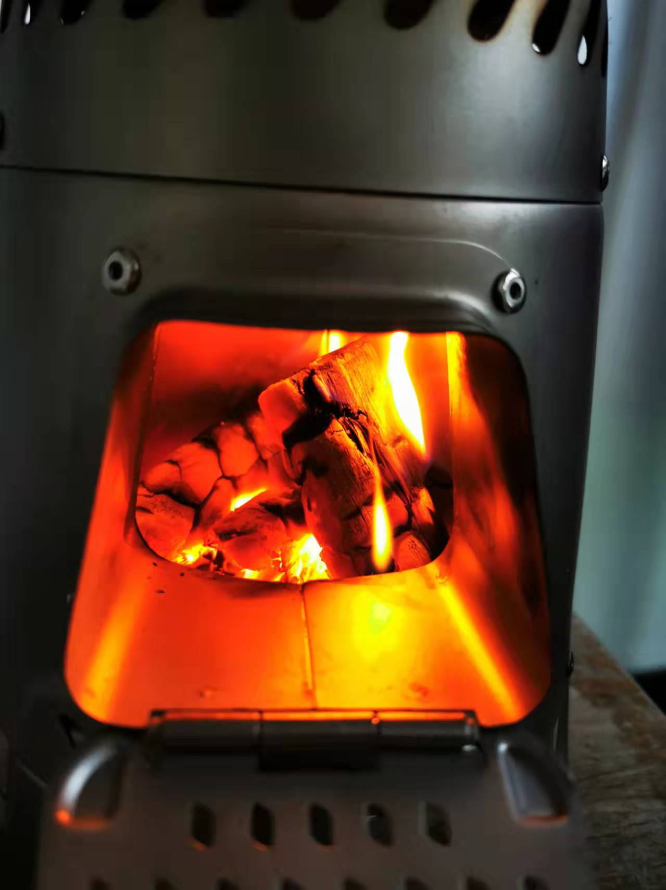
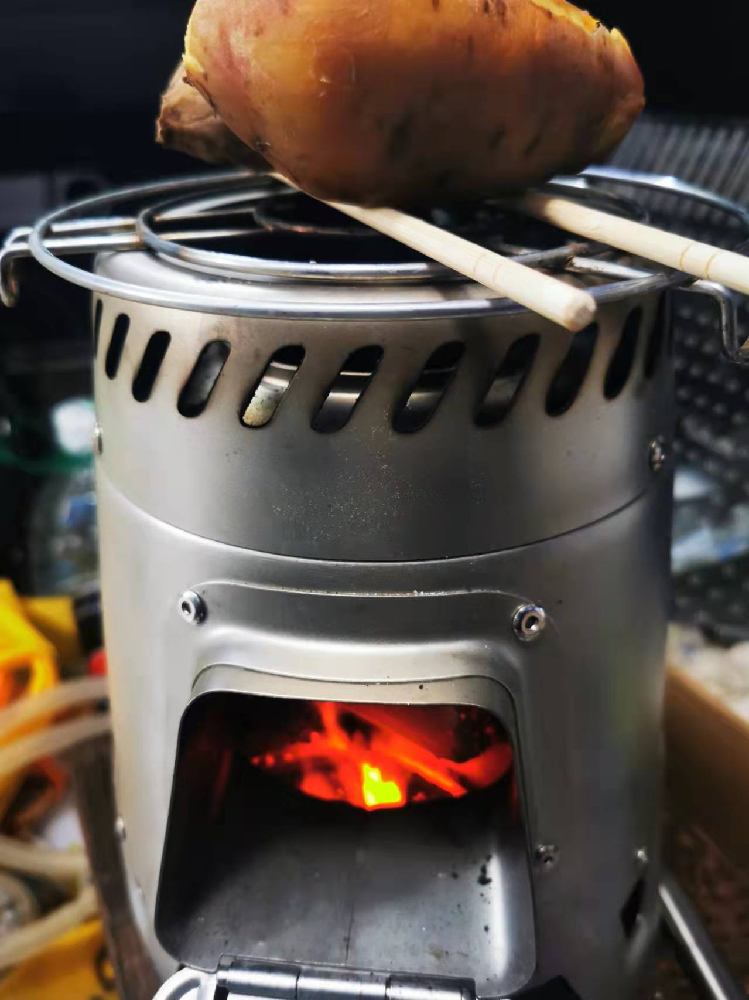

### 冬日炉火

上海的秋天很短大家都知道，但今年直接从夏天瞬间切换到冬天，这就让我有点受不了。瑟瑟的秋风搭配上连日的阴雨，这种湿冷是我极度讨厌的，夏冬两季的“无缝连接”也让家里的大功率电器直接从制冷空调转换到了电油汀。

就在我刚要抱怨这湿冷的阴雨时，抬头看到了老婆前几天买的迪卡侬柴火炉。原本是打算和朋友们秋天野炊用的，此刻的我只想拿它生火取暖。恰巧家里还有国庆那会烧烤多下来的木炭，而老妈在拼多多上买的一箱红薯还剩好几个，你说我有什么理由不烤个红薯呢？

别说城里的孩子，现在连我们老家农村的一些小孩都已经不太认识柴火灶这么个东西了。我小时候农村根本没啥取暖器，特别怕冷的我到了冬天总是超积极地给爷爷奶奶烧火，即便我非常讨厌生火这个环节。

农村柴火灶的主要“燃料”就是自己田地里的一些秸秆，我们那常见的就是大豆和棉花的秸秆，相对易燃的油菜和玉米秸秆常用来做引火的材料。我奶奶打小就很宠我，每次都是引完火才把后灶交给我，还把少有的一些碎木块放我边上（因为秸秆燃烧很快，你得不断的添柴，而木块就耐烧很多，好让我能多偷懒一会）。

冬日烧火除了取暖外，还能顺带烤个红薯。秋天挖出来的红薯直接堆在屋外，经过几次霜冻糖化后会格外的甜，那时候也很少有什么零食，烤红薯这种又甜又热乎的食物自然成了孩子们的最爱。女儿这代显然是不知道红薯还能生吃的，我那会放学到家肚子饿，看到墙角的红薯洗洗削个皮就直接啃了。

那会烤红薯分几种，最简单的就是趁着大人做饭在柴火灶里扔几个，饭菜做好那红薯也就烤好了（缺点就是烤完黑乎乎一层硬壳，掰开里面是可以正常吃的，就是稍微有点浪费）。还有就在周末简易版本，在后屋的空地上挖一个浅坑，然后扔入红薯，盖上一些瓦片，最后就是在这坑上不断的烧火，这个方法的优点是可以一次性烤好多，出来的成品卖相也稍微好一点。最高级的玩法是直接去砖窑厂，找工人问哪些窑洞口是刚熄火的，我们就利用这个窑洞的余温去烤，这样烤完的红薯堪称极品，色香味俱全（我们通常还能在烤红薯的间隙去窑厂里溜达着玩）。

当初老婆买这炉子时我还吐槽说，500元就买这么个小破炉，还不知道一年能用上几回呢？如今坐在炉边烤红薯的我除了被打脸觉得疼外，主要是觉得真香，当然烤好的红薯确实也很香。

透过送柴口看到红彤彤的炭火在燃烧，手靠近炉子的时候那股暖意让人忘记了屋外的湿冷，而你还能“肆无忌惮”的在炉火边喝着冰镇的可口可乐。炉火的那种暖意和空调还不一样，让人不自觉得想睡会（这种炉火边的嗜睡可能是刻在哺乳动物基因里的），而这一刻我突然有点想我奶奶了。

这两天老婆出差，我妈也有事不在，只有我和女儿“相依为命”。接她放学后把刚烤好的红薯递给了女儿，看她如狼似虎地吃着，感觉炉火的温暖貌似也可以传递。

