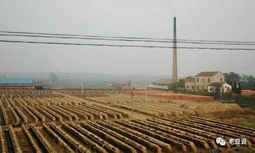
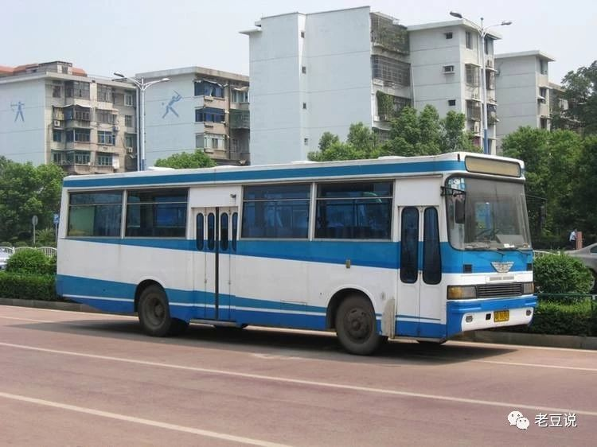
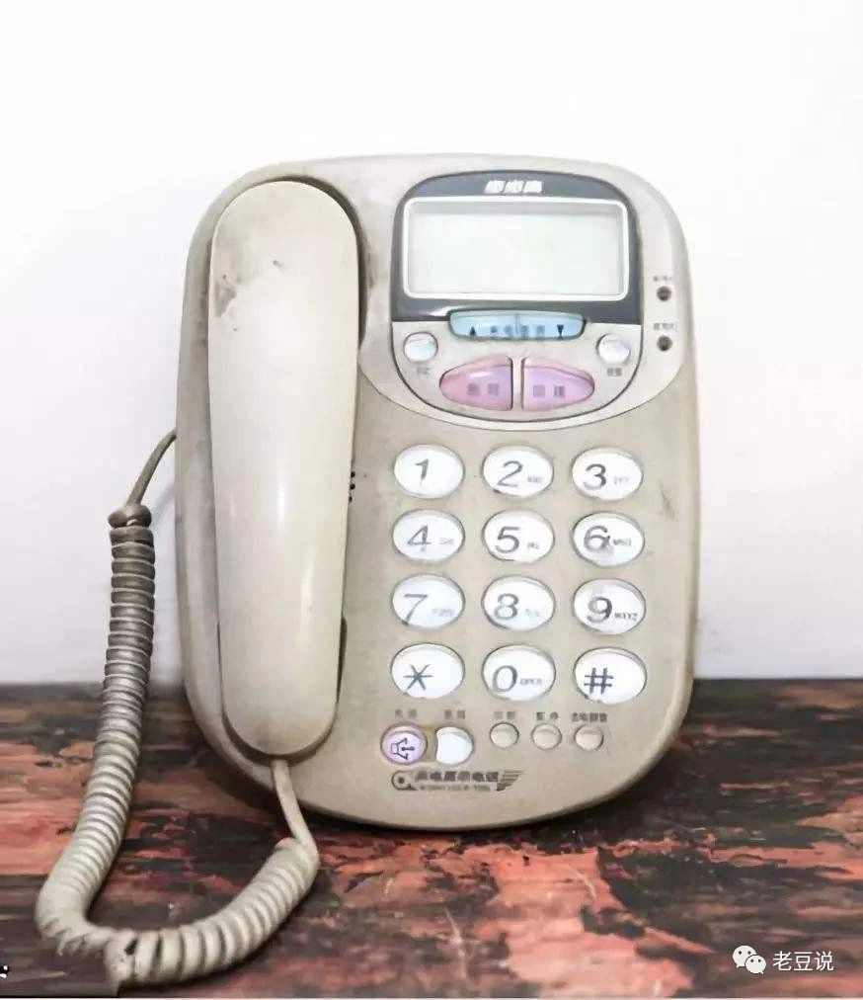
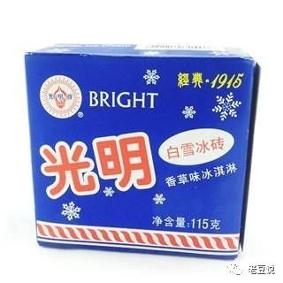
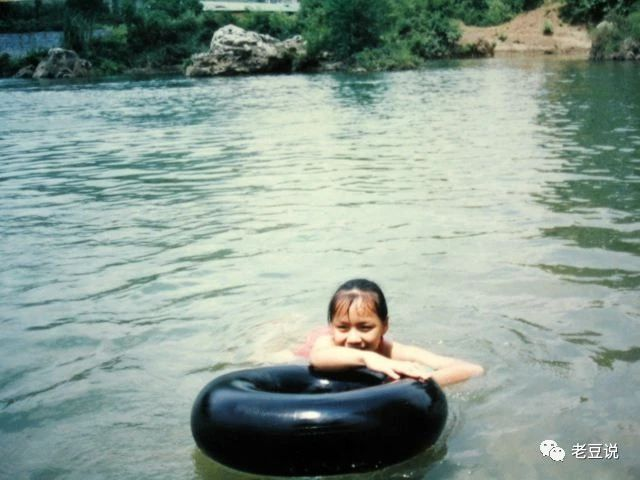
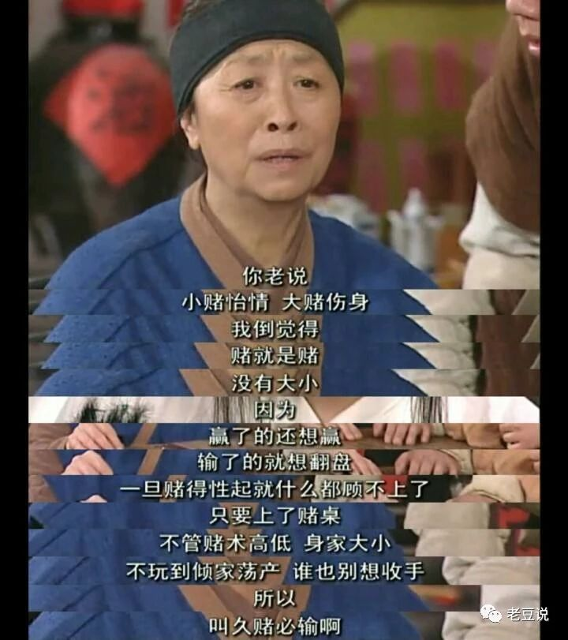
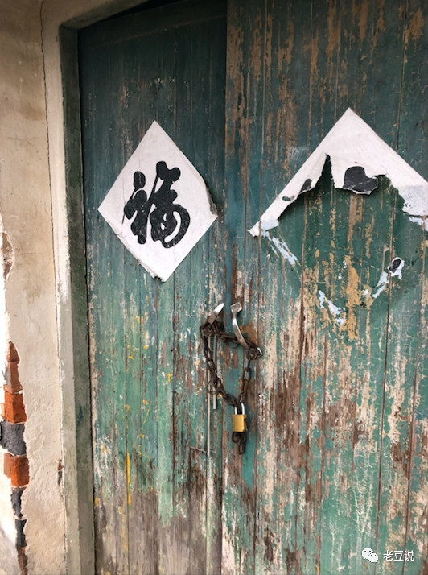

### 富不过三代？！

儿时的玩伴如今都在各地发展，只有过年了才能有机会遇上一面，同村的阿荣就是今天的主角。

除夕前一天我路过他家门前，他在急忙整理些小孩的衣物和玩具。问过才知道他儿子刚得了肺炎在医院挂水，这不正好要过年了嘛，他买了些新衣服和玩具给送到孩子外婆家去。见他急忙得很，我没多停留，给他递了根烟就回家了。

阿荣毕业后没多久就结婚了，小两口在苏州买了新房，开了一家母婴店，日子过的还算殷实。他在村里长辈们眼里是一个孝顺的孩子，脑子灵活，办事得力，父母口中别人家的孩子，然而最近几年他过得很糟糕。。。

前年听说他网络赌博赢了不少钱，母婴店流水也很好，还听他说准备在苏州再买一套房子呢。然而不到半年他就开始输钱了，输的很厉害，家里的积蓄已经不够他输了，母婴店也因为他沉迷于赌博，加上店里也没多少现金了就把店盘给了别人。

我们都以为阿荣会就此收手的时候，不到三个月我一次回家听到说阿荣已经把苏州房子卖了还赌债，婚也离了，老婆带着儿子回娘家了。后来在父母的劝说下阿荣老婆偶尔还带着孩子过来住几晚，那时起阿荣变得寡言起来，我们遇到了也不好问太多怕他难堪。

去年国庆我回去，听到的是阿荣家把县城的两套房子也卖了，卖房子的那天阿荣爷爷向孙子跪下，一把年纪含泪央求这孙子能回头是岸。阿荣的妈妈也不再骄横，外出去大城市给别人去做保姆了；他爸不得不又开始帮别人跑长途拉货了；阿荣老婆再也没有进他家门，最多外婆偶尔带着孩子过来看看爷爷奶奶。

看着阿荣苍老无神的脸，透过他吐出的烟圈我想起了很多往事。。。

阿荣是一个 88 年的小伙子，祖辈上都是手艺人，早些年他爷爷在镇上窑厂里做车间组长，有股份的那种。如今窑厂也都倒闭了，他爷爷也就退休了。要知道在 90 年代窑厂卖砖瓦还是很赚钱的，我们村里的高楼也基本都是 95 ～ 99 年间建起来的。

阿荣的爸和小叔都是 90 年代的老司机，那个时候两兄弟在老爷子的支持下买了一辆面包车，专门跑镇上和县城的线路，赚的那叫个盆满钵满。

阿荣爷爷家装了村里的第一台电话机，也就顺理成章的成里村里的“公用电话”，经常听到阿荣爷爷响亮的嗓音：‘某某家的谁电话，快来接电话！’。

阿荣家的楼房也是村里的第一批楼房，有点地标性建筑的感觉。我家离着近，有些不认识路的远房亲戚过来玩，我们就说：“进了村口第一个三层高楼的隔壁里宅就是”。

阿荣小叔结婚稍微晚点，新娘子也是隔壁村有名的村花，小叔也在 1994 年建好了另外一栋三层楼，村里在 1995 年前楼房也就 7 家（含 2 层楼的），他们家就占了俩，还都是 3 层高楼。

阿荣家的冰箱比我家早买近 10 年，小时候我们要在烈日下走到村头小店买三毛一根的盐水棒冰，他家则是整箱买了囤着吃，且大多还是奶油棒冰。

小时候男孩都会在夏天去河里游泳，但是较宽的河没有游泳圈还是有点危险的。阿荣家因为有车，也就有了很多旧轮胎，他爷爷把旧轮胎的内胆补下就是一个很赞的游泳圈。

你想象下：夏天的一群孩子中，他手里拿着奶油棒冰，家里还有好几个游泳圈可以去游很大的河，简直就是小伙伴里 C 位呀。

后来个体不让跑公交线路了，他爸和小叔分了下钱，一个买了辆大货车去跑长途了，一个买了辆桑塔纳跑出租。2002 年兄弟俩又各自在县城买了两套房子，那时候的房子真心便宜，两兄弟也是真有钱，两个妯娌在村里走路也是横着走的。

眼前的烟圈渐渐消散，一切又回到了此刻，一个好好的大户人家却沦落到如此田地，古人训：远离黄赌毒还是有点道理的。

我们村的男孩们从小就赌博，我记得基本上一年级开始到大学毕业，我们的赌资越来越大，赌博方式也不断多样化。阿荣绝对是属于赌技一流的那种，他脑子活络，胆大心细，赌资雄厚。

可到头来还是输给了电脑，可能他从小在赌上没遇到过这么大的坎，一旦陷进去后就忘了他的对手盘可能根本不是一个真实的人，你无法根据对方的细节判断对方牌的大小虚实，而你的牌在电脑面前是透明的。

网络赌博另外一个可怕之处在于它往往伴随着网络借贷，这个利息高的吓人，但是在不理智的赌徒眼里会忽略这高昂的利息，直到输得底裤朝天才发现已经一无所有。

好在阿荣家里底子殷实，好在他还有那么多房子可以卖了还赌债，可现如今呢？父母那么大年纪不得不出去挣钱，要知道他父母之前在村里就是天天打牌过日子的，爷爷奶奶也是衣食无忧的呀！

这难道传说中的富不过三代？！

本文首发于 20180213，公众号老豆说：[富不过三代?!](https://mp.weixin.qq.com/s?__biz=MzIwMjM5MDc5NA==&mid=2247484115&idx=1&sn=4567bfd9b5ff67374d9b1f038547c3a8&chksm=96de2eb6a1a9a7a07ae958d0a60c6b1dd88261b2d08b4b455b1e48ee60b61908cd1b75ee8d64&token=2017828012&lang=zh_CN#rd)
