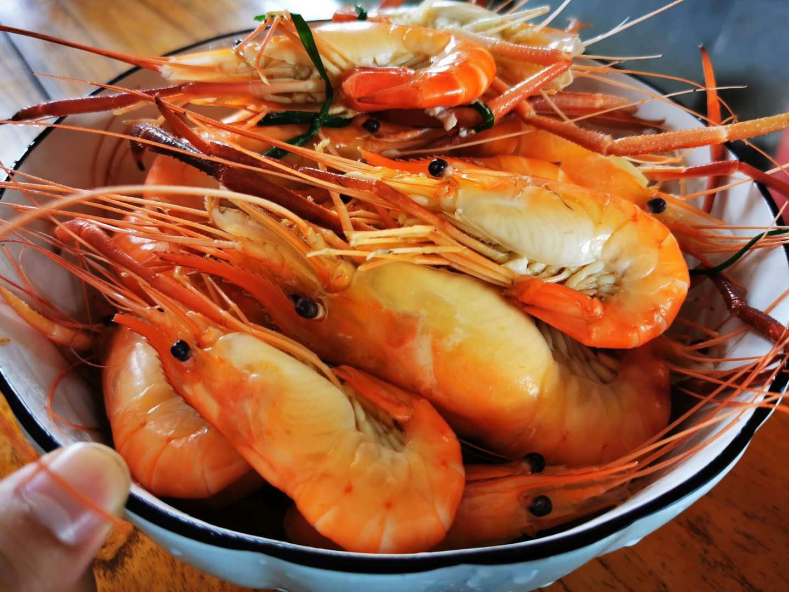

### 2020国庆见闻

> 归乡

今年中秋节和国庆是同一天，所以就有了一个长达8天的假期，这也是疫情缓和后的第一个像样点的长假。也正因为中秋和国庆重叠，很多人就必须要在10月1日当天赶回去吃中饭或者晚饭，毕竟中秋团圆饭还是不少人蛮重视的，而恰巧我老婆就是这样的一个人。所以就有了凌晨5点出发，开了5小时才到家（平日顺利的只要100分钟的车程愣是堵了5个小时），中间有一段导航的语音差点让我崩溃：**前方中间车道因交通事故拥堵，17公里需要2小时15分钟，虽然前方拥堵，但你已在最优路线上！** 好在还有这旭日和鸟鸣能让我稍微平缓一点。

> 网购

今年苏宁准备在双十一之前抢跑（京东往年也会抢跑，但大多是11月1日才开始）。苏宁易购在十月搞大促销活动，super会员每周都能领一张20元无门槛券。

怎么领券：苏宁会员的路径：苏宁APP--我的--super会员 领20元无敌券 速度去！ 那怎么免费领会员资格？买苏宁股票，股东认证后就有能免费领一年会员。

第一周看了圈也不知道买啥，就买一箱伊利股份的牛奶，立减20还是挺实惠的。第二周经人提醒（会员每月只有2张免邮券，而无门槛券有5张），所以后来我选了一个飞科的吹风机，耐用实惠的选择，正好老婆也说老家的那个太旧了，声音也很大，是该换了。

**这里我补充下：**大家可以给老家的父母们定期更换小家电，他们往往选择很低廉的产品或者很旧了也不舍得扔，这都是有安全隐患的。给老人换小家电，觉得飞科这类就是很好的选择，不贵又比较安全，我们自己过年过节回去用着也舒适，这是花小钱让大家都开心的好事。

> 村路

现在村里家家户户几乎都有小轿车了，而我们村里的水泥路还是十八年前铺的，所以**日益增多的家庭汽车数量与村里略显狭窄的道路成了我们农村节假日的首要矛盾**。10月2日正好是农历八月十八，村里办结婚、办满月酒的人家很多，可见中国人对818这种吉利数字是毫无抵抗力的。那天正好我们也要去赴一场家宴，十点半到的那就已经没啥停车的点了（周边邻居家也都停满了）只能停路边，这就使得村里的路只够一辆车勉强通过（很多新手女司机不得不把反光镜收起来）。

近几年节假日我们启东的农村几乎每一条村头水泥路都是这般景象，这就很影响开车的体验了。但也不得不感叹大家的生活水平确实都越来越好了。所以从长三角地区来看，代步车很难有大增长了，更多的是升级中高端车。过节村里堵车这个问题其实市里也注意到了，前年就先从有条件的村开始拓宽水泥路，一些比较窄的桥也进行的重建拓宽。**村与村之间的贫富差距也是不小的，部分村里有大老板的，那路就建得早、建得好，不然全靠市里给拨款那得等好几年。**

说到交通还有个值得谈谈的是：去年开始启东也有火车了，可以通往上海、南京、杭州等大城市，规格应该是动车（就是颜色太绿，我们炒股的人觉得不吉利），我看火车票是D开头的。可惜我上大学的时候没火车，整个大学时期没买过半价学生票成了我的遗憾之一。

我们启东没有火车不是因为不发达，是汽车大巴太发达，可以很便捷的通往周边各大城市。而且地理位置也是太靠东（江苏最早看到日出的地方），边边角角的地方单独拉一条火车轨道确实不够经济。

> 洋河

国庆吃了三场家宴，我们农村以前都是海之蓝、天之蓝，今年吃的没有一家是用洋河的酒。我还特意问了一个做洋河酒销售的亲戚，她说去年开始海之蓝就没以前好卖了，而大家也愿意换别家酒喝喝了。我不知道这是不是和近年来洋河股价低迷有对应关系，作为江苏人我们还是挺偏好洋河这样绵柔的酒的。以前洋河一直标榜自己仅次于贵州茅台和五粮液，现在好像老三的位子很不稳定啊，我看到很多公募基金经理都配置泸州老窖要优先于洋河。

后来返沪的时候，高速两侧的广告牌上也看到了洋河的宣传，今年洋河好像主推梦之蓝M6+这款产品。我自己平时也不喝酒，脑海里对所有白酒的印象都是‘辣’，但作为江苏人还是希望洋河能好起来。

> 返城

国庆8天一晃就过去了，村里的二狗蛋、张翠花、吴铁柱都已经返城，摇身一变杰克、玛丽、汤姆。这次国庆带孩子回老家，幼儿园要求提前报备且假期内的每日健康报告更为严苛，原本已经做好居家自我隔离14天的准备了，临开学老师在群里通知不需要14天居家隔离了，身体无恙的孩子们均可直接上学。

其实我觉得这次国庆长假也是国家对新冠二次返潮的提前演练和压力测试，在假期里我也格外注意每天的疫情播报，数据显示国内本土疫情极其稳定。今年朋友圈最大的变化就是没有了各种海外游的晒图，替代的都是国内各地的景点，很少出去游玩的我很多地名还是第一次听到。

反观海外疫情水深火热，前不久欧洲已经二次疫情，而我们国内旅游真是一片祥和。前几天还看到新闻说日本即将允许我们去日本旅游了，日本眼红了，可惜我们大部分人还是觉得现在待在国内挺香。那天孩子奶奶不在家，我们一家三口没选择去外面吃，而是在女儿的引导下自己擀饺子皮包饺子吃，对！是韭菜鸡蛋馅的，附图就自己做的饺子皮。对于从小吃大米的我们来说，这饺子皮我知道没灵魂，但已经尽力了。

> 吃货图集

- **深夜烧烤：** 村里8点后几乎没有啥灯了，但小镇上9点后依然有烧烤店开门，还是有不少年轻人来吃夜宵的。在我哥的推荐下，我们驱车15分钟才到了这家小鬼烧烤店，老板和老板娘都很年轻，烧烤也比我预想的要好。

- **大虾大蟹：** 这是每逢佳节胖三斤的节奏呀，而且我感觉胆固醇在国庆期间肯定是异常的。几乎顿顿大虾大蟹，这些还都是自己家里吃的，去亲戚家吃家宴的时候就更夸张了，启东反正海鲜一大堆，早一点的羊肉也已经上桌了。

- **秋日丰收：** 秋天我们农村的水果还是比较统一的，启东的话主要是柿子和橘子。这棵柿子树比我年纪还大，长的也已超过2层楼高了，因为太多了根本来不及吃，我们在家吃的都是这类树上长红的，而带到上海的会稍微选择偏硬的。门前的橘子树已经有些泛黄，自己家的橘子会皮略厚、味略酸，但这就是家乡的味道，自己去剪橘子的感觉挺好。

