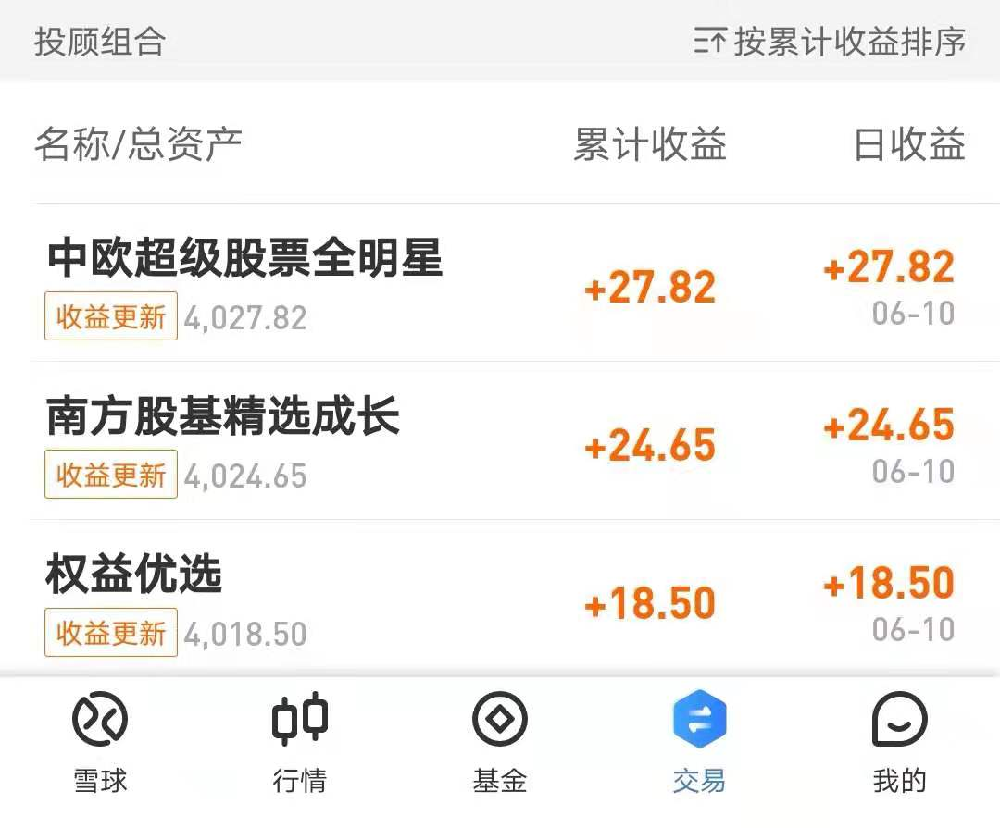

### 豆哥体验馆-基金投顾蛋卷实盘体验报告（1）

首先我还是要再次感谢蛋卷基金组织的活动，很荣幸获得了“金牌投顾体验官”的称号，后面的一段时间内我会持续地给大家做一些基金投顾产品体验的分享，希望大家如果也有买了一些投顾产品，可以多多交流。

虽然我平日里活跃于雪球社区，但买场外基金主要是集中在支付宝（蚂蚁基金）和天天基金（东方财富）上。这就看得出习惯养成后很难改变，也是为什么现在很多中小型基金公司基本放弃了官网直销（0元申购貌似也不太管用），因为第三方基金代销平台的用户体验更好，还能一站式购入绝大多数的基金产品。

同理基金投顾产品虽然各家投顾持牌机构都有努力地推自有渠道，但主流的第三方代销平台也都要布局上架。在这次“金牌投顾体验官”活动前，我最早买入基金投顾的是在支付宝，平日里买入数量最多的平台在天天基金，但我们这回体验报告系列主要还是以蛋卷基金平台为主。

我主要会在**购买体验、投顾陪伴**等方面和大家做一个完整的分享，为什么没有侧重投资收益呢？一个是这三只投顾产品的预定投资周期较长（官方建议1~2年以上），外加配置权益的占比也不尽相同，但如果那个产品业绩落后的离谱，也会单独拎出来吐槽下的。

分享的形式除了定期的体验报告长文外，可能还有一些不定期的短帖，希望有兴趣的朋友可以多多关注  #豆哥体验馆#   这个系列。在简短的说明后就开始我们第一次的报告，本次主要是讲述下买入过程的一些体验：

1、就像在支付宝上买基金一样（不是非得下载阿里系的蚂蚁财富APP），大家其实可以直接在雪球APP上买蛋卷内的基金和投顾产品，毕竟这年头能少装一个APP就少一个嘛。因为我几年前已经注册了蛋卷基金帐号，且绑定了银行卡还有过历史交易，因此如果大家是未开户蛋卷的新人，可自行完成这个准备环节，我印象中整个流程很便利迅速。所以后面我这边的实盘体验均已雪球APP内的蛋卷入口为准，我相信蛋卷基金APP的操作流程和体验应该与之一样且可能更好。  

2、蛋卷上购买基金投顾产品的路径如下：雪球APP底部菜单栏--->点击【基金】---> 选择页面上方【基金】tab --->  点击首行菜单图标【基金投顾】。（详见下图）

3、随后我们会看下如下图的页面，我们可以看到当前在蛋卷基金平台上架的投顾机构分别有：**中欧财富、南方基金、易方达基金**。而且我们发现每家暂时只上架了一款产品，其实在其他平台我发现这三家持牌机构的产品都很丰富，我相信后面也会增加产品数目的。甚至我认为现在这样少一点挺好的， 用户也不至于太纠结选择，以南方基金在天天上的投顾产品列表为例，截止发稿日已经有21款不同投顾产品，投资人选都得选大半天。

4、当前在蛋卷上架的这3款基金投顾产品，都需要投资者风险测评结果在【积极型】之上。因为我的风险测评已经过期了， 就让我重新做题，反正我是考了两次。为啥呢？因为积极型选的答案都要很激进，我第二次答的时候基本上是怎么刺激就怎么选答案。谁能想到买个基金投顾，还得具备积极型风险测评才可（当然这也主要是因为这三款的权益占比都较大，这也是对投资者适当性的规范，投顾持牌机构和蛋卷都做得蛮好，我也表示理解）。

5、这次蛋卷给的体验金是1万元，我三家产品又都想体验下（虽然这三家我在别的平台上早就买了）。有强迫症的我还是决定自己补贴点，每家都买个4000元整吧，做到公平公正、雨露均沾嘛。这里我要顺带吐槽下前辈大佬 @望京博格 ，郑老师你别看他平日里动不动一个汉堡跟车啥的，搞起体验计划居然是每家各买3333元，我就冒昧问下你这省下的一块钱打算干啥？买棒棒糖吃吗？  

6、我是6月9日上午买入的，第一个净值更新日发现3家产品都有盈利，开门红，不错。其实第一次购买过程还有很多细节，由于篇幅问题我就留一些在后续的文章内再和大家分享，最后祝大家端午安康。

