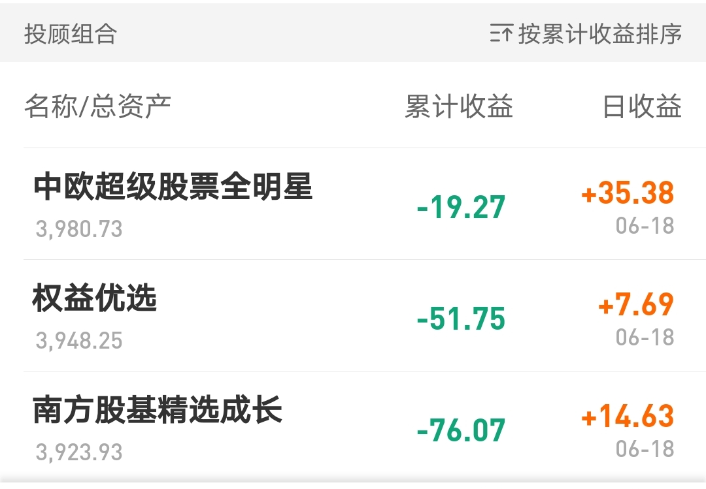
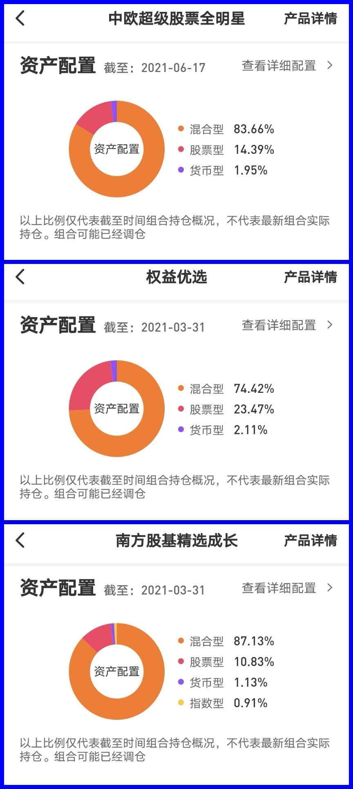
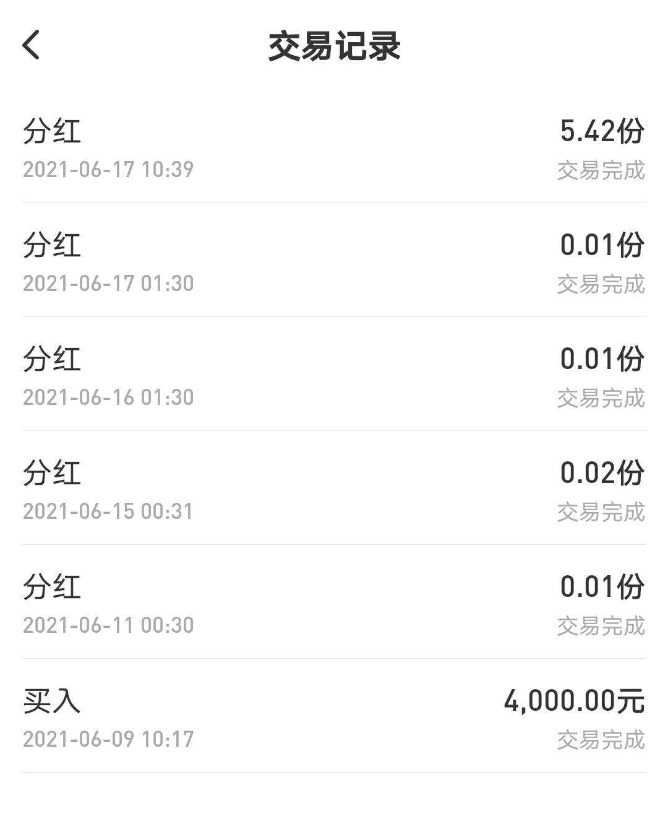
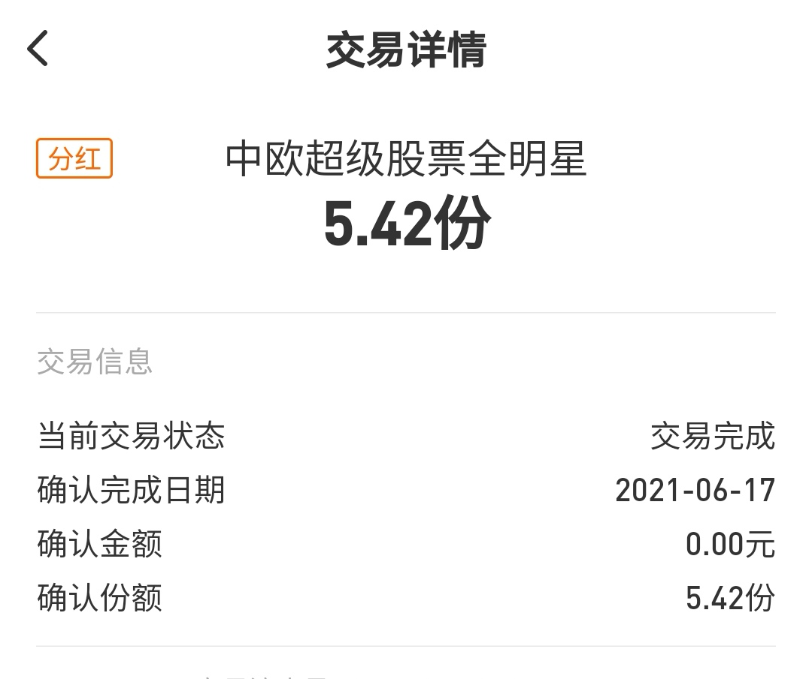
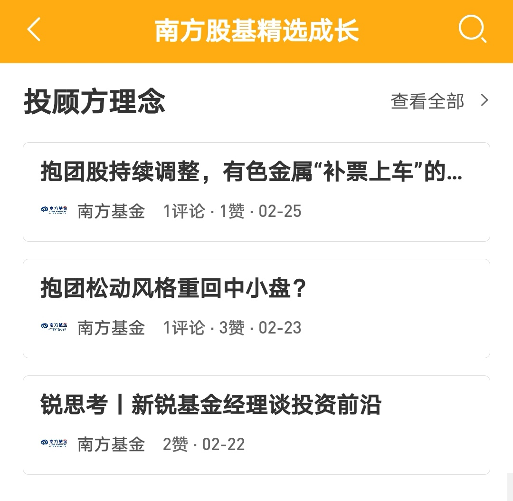

### 豆哥体验馆-基金投顾蛋卷实盘体验报告（2）

我们先看下最新的三个基金投顾产品的业绩表现吧：虽然周五（6月18日）都是正收益，但累计收益均为负值，业绩排序我们看到南方基金是暂时垫底。

如我上次说的，这类基金投顾产品业绩很难有个严谨的比较，但如果权益资产比重差不多且长期处于落后状态的，那肯定是要主动规避这类产品的。所以我这次也把三只产品的持仓类型比例给大家贴下（见下图），可以看到三只产品的货币基金比例都在2.5%以下，是具备一定可比性的，同时仓位比例也表明这三只产品均具有较强的锐度。

然后我本周还要给蛋卷基金一个建议：**交易记录里为什么有那么多的分红记录，且分红金额为零？** @蛋卷基金     @中欧全明星   @南方基金   @易方达投顾  （三只产品均如此，贴图以中欧基金为例）希望蛋卷或者各家投顾产品服务方给与一个解释说明！我相信实际资产是没异常的，但是这种记录展示很怪异（在竞品平台无该情况），有极强的误解的可能。**我建议：对于非持有人操作的记录以及非资金变动的分红不予以展示或折叠隐藏展示。**

还有我发现自己买入三只产品一周多时间后，没有一家是有服务短信或者别的沟通服务关怀的，我看了各家的【投顾方理念】这个模块近期都没更新，历史文章显示该板块应该是投顾的陪伴按摩板块。以南方基金为例，最后一次更新文章是2月25日，这个“按摩”服务的持续性我觉得是有所欠缺的，也希望蛋卷平台方多督促各家持牌机构持续地服务用户。

今天可能讲得稍微严苛了点，但我也是真心希望蛋卷平台联合投顾持牌机构把这类产品做好，希望用户体验可以越来越完善。