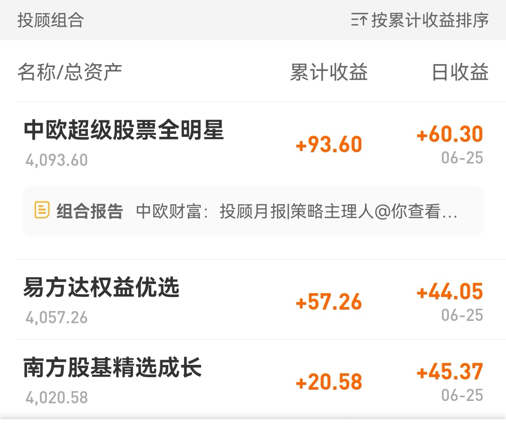
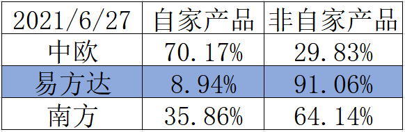

### 豆哥体验馆-基金投顾蛋卷实盘体验报告（3）

老规矩我们先看下三个基金投顾产品最新的业绩表现吧：本周5个交易日两市交易量均破亿，加上上周五那就是连续6个交易日破万亿了（券商也因此在周五雄起了一把），上证指数也再次站上3600点位。具体体现在投顾产品上就是本周均扭亏为盈了，排序上依然是南方基金垫底。真是跌的时候垫底，涨的时候依然涨不过另外两家，唉！南方基金你要加油啊，天天垫底可不是好办法哈。

我们看到易方达基金在投顾产品前新增了“易方达”品牌标识，这个比之前就一个光秃秃的【权益优选】要好很多，有更好的辨识度，是一个好的优化点。

本周也收到了我体验以来的第一次投顾报告，报告是由中欧财富提供，内容链接如下：[《投顾月报|策略主理人@你查看中欧超级股票全明星5月报》 ](https://xueqiu.com/5921017045/186873306)

这份报告内容中规中矩，如果是一个想全权委托投顾的投资人来说，这篇报告读起来是有点生涩的，如果想看的朋友可以着重看下“业绩归隐”和“后市观点”两个板块。

我看到报告中指出，策略业绩贡献前三的都是中欧基金公司自己的产品：中欧行业成长A、中欧丰泓沪港深A、中欧明睿新起点。清一色的中欧自家产品，我就顺手把三个产品的持仓成分大致看了下，发现只有中欧是大面积买入了自家的产品（只有嘉实价值精选9.36%、华安沪港深外延增长9.34%、富国天合稳健混合9.21%），详见下表：

其实这个表格我们就可以看出，易方达基金投顾在“全市场选基”上是做得最好的，在自家产品如此丰富的前提下还能做到91.06%非自家产品入选率，真的是坦荡荡。当然现在业绩上中欧更领先一筹，所以中欧自家产品入选率高达70.17%，我们也只能说中欧基金的产品真牛。

最后插播下本周基金投顾方面的一个新闻：据悉，目前至少有6家券商和6家基金已正式成为新一批获准试点开展基金投顾的公司。其中，基金公司包括：博时基金、兴证全球基金、广发基金、工银瑞信基金、招商基金、交银施罗德基金等多家公募。6家券商分别有兴业证券、招商证券、国信证券、东方证券、中信证券、安信证券等。（本次实际获批机构数大于这些，且最后结论以后续官方公告为准）

自2019年底公募基金投资顾问业务试点正式启动以来，投顾业务伴随投资者基金投资需求的增长和市场环境的助推而日益发展。新一批机构的加入，将会对投顾业务生态的形成和多元化发展，起到积极的助推作用。