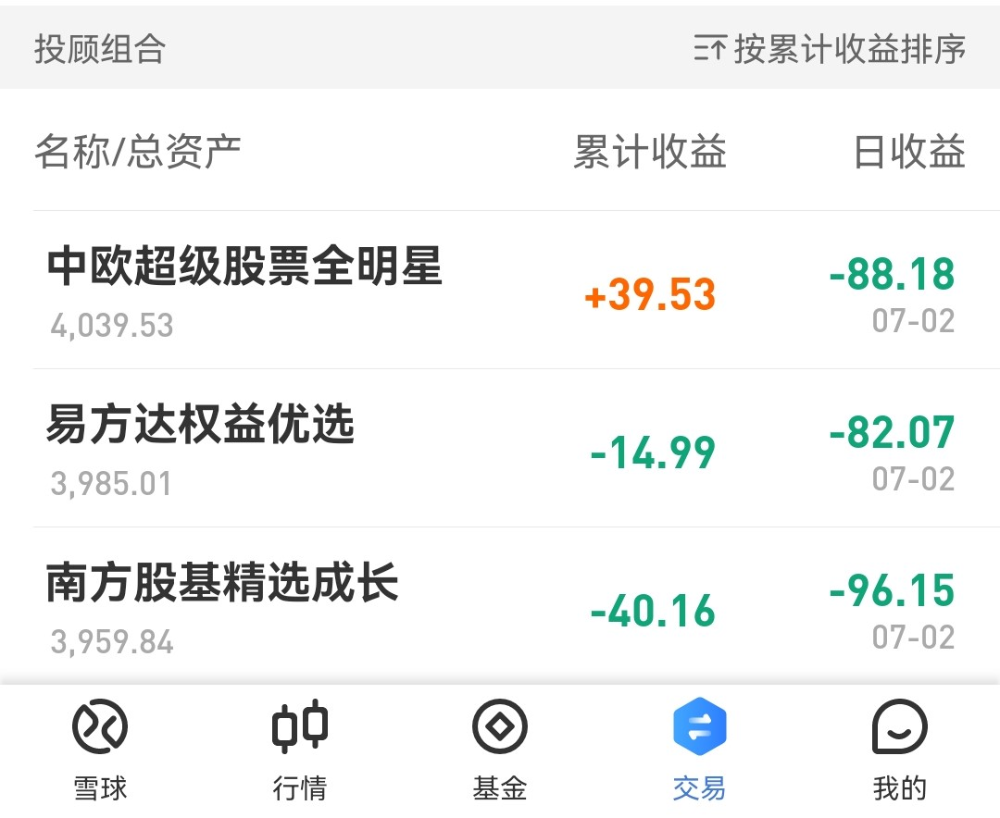
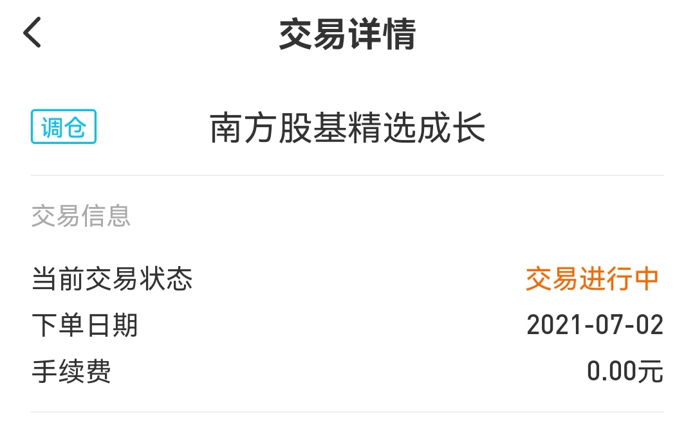
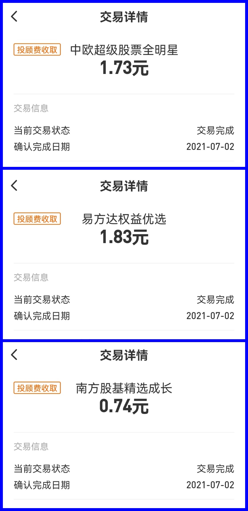

### 豆哥体验馆-基金投顾蛋卷实盘体验报告（4）

照例我们先看下截止上周五（7月2日）的投顾产品战绩：在上周五的暴跌之后有两家产品再次回到了亏损状态，不出意外的南方基金依旧是垫底，感觉这排名顺序很“稳定”啊！

那就顺着南方基金的这款产品往下说，上周南方股基精选成长进行了调仓，但是全程没有任何通知，要不是我习惯性的会在周末看下各只产品交易记录，我都不知道南方这只产品调仓了。这里我给蛋卷 和 南方基金  提个小建议，哪怕在产品展示列表下方出一个提升也行，类似平时发组合报告提醒的那种。我买了那么多投顾产品，观察下来其实调仓都不会很频繁，一年就那么几次的调仓，我觉得还是要给持有人一些明确的说明以及必要的解释。

尤其是南方基金该产品暂时落后的情况下更要给持有人一些体验良好的“投中感受”，我觉得这很有必要。另外比较遗憾的是，我这次故意等到今天才写，就是想等等看它调仓后的仓位变动信息（如果有、但是我没发现的大家也可以告诉我），可截止发稿我依然没在任何地方看到这次调仓后的仓位变化。坦率的说，其他平台这块做的比较贴心，希望蛋卷和相关的投顾基金能优化下。

上周三家产品都进行了“投顾费”的收取，我这边实际被收取的如下：中欧超级股票全明星（1.73元）；易方达权益优选（1.83元）；南方股基精选成长（0.74元）。

这个也正好提醒了我，貌似还没聊过三家的投顾费。顾名思义，投顾费就是投顾持牌机构帮助我们投资理财，我们持有人付给投顾机构的一个服务费。一般是每日计算、按月计提，当然有些产品也是按季度计提服务费的。

我们持有的三家产品的投顾费费率分别是：中欧超级股票全明星（0.75%/年）；易方达权益优选（0.80%/年）；南方股基精选成长（0.50%/年）。

从我目前的持仓收益来看，服务费性价比最高的就是中欧超级股票全明星。费率虽然最便宜的是南方股基精选成长，但如果你一直长期处于亏损状态，那么也毫无性价比可言，毕竟主动管理的产品利润远比费率重要得多。当然我还是希望南方基金能加油的，祝早日扭亏为盈！

