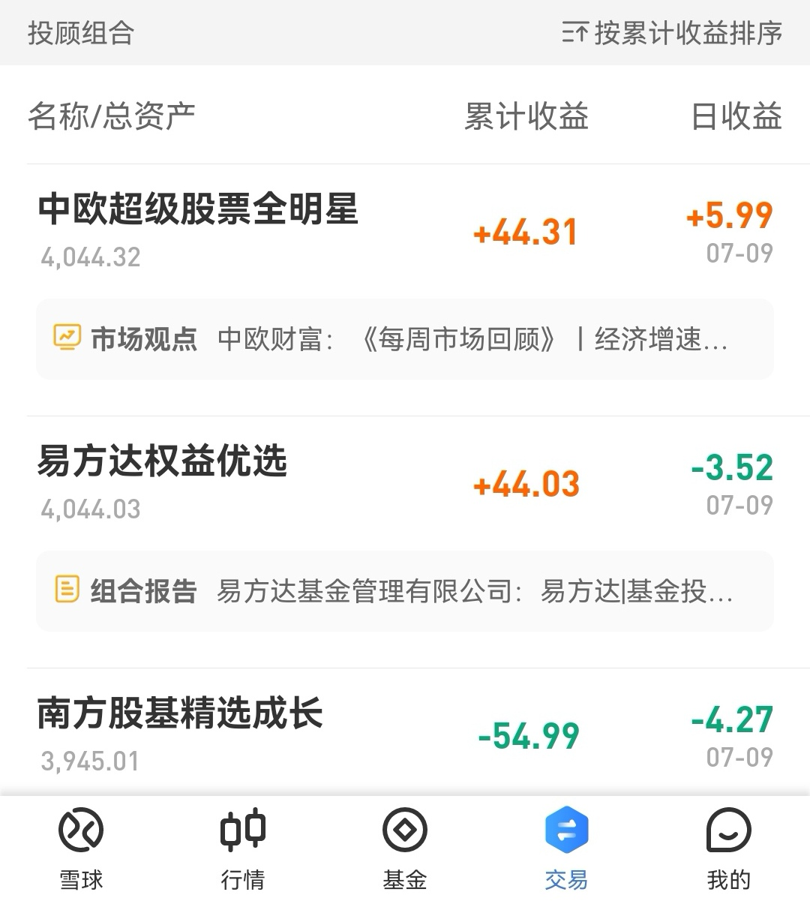
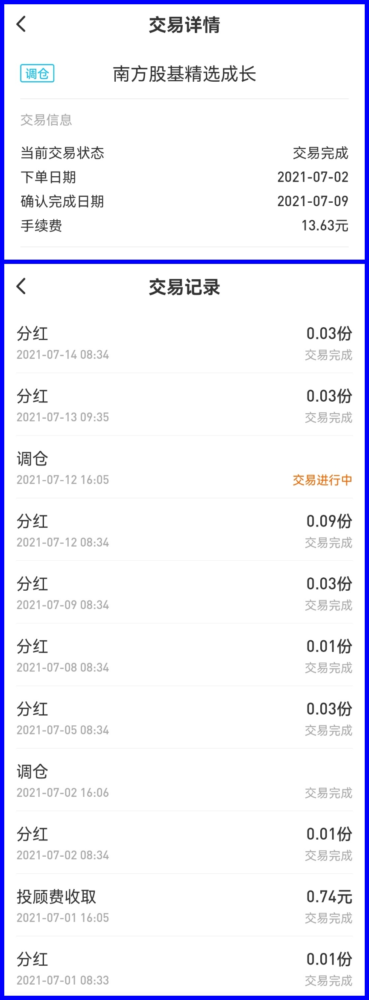
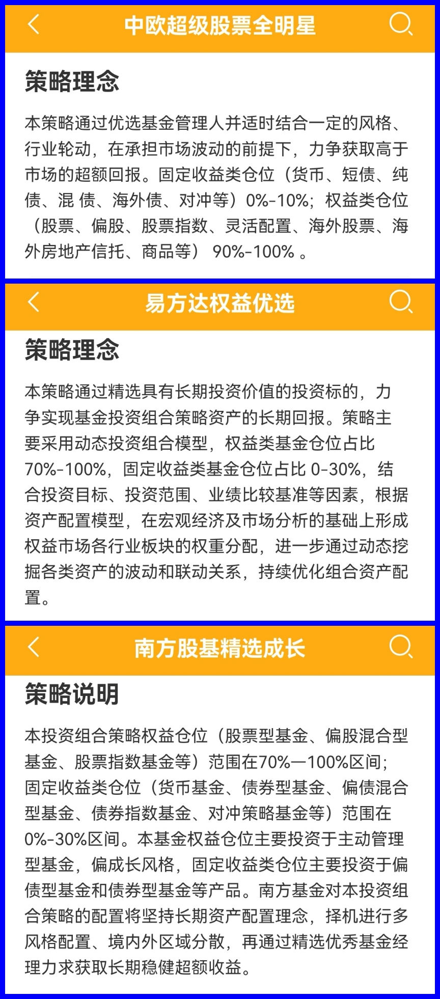

### 豆哥体验馆-基金投顾蛋卷实盘体验报告（5）

照例我们先看下截止上周五（7月9日）的投顾产品战绩：经过不懈的努力，稳健的易方达终于要追赶上了中欧，而再次垫底的南方基金真的业绩太拉跨了。南方基金的这款投顾产品不仅是每次垫底而且被前两名甩得十万八千里，我也不知道该怎么“表扬”这位成绩稳定的同学了。

投顾报告方面本周易方达和中欧基金有发布，两份报告我都看了一眼，主要还是对过去一周的一些市场信息汇总和。这类报告之前也提过，对于比较关注市场的朋友可能用处不大，但平时工作较忙没时间盯盘复盘的朋友，周末可以稍微看一看。

同样南方基金是没有类似的周报的，这个我只能说挺无奈。**但南方基金有着近乎周报频率的调仓操作，这个我是有点惊讶的。**上周刚说到南方基金的这只产品在7月2日调仓了一次，可这才几天就又在7月12日再次调仓。

更让我有些不舒适的是7月2日的调仓操作在7月9日才确认完毕，且手续费高达13.63元图片。你产品**业绩次次垫底**，投顾后期服务连模板化的**周报都没一份**，确认调仓又是如此低效，而手续费和投顾费确实接连收了不少，关键**调仓内容完全黑盒**，持有人都不知道前后变动了哪些基金，这些真的实在有点说不过去哈！

怎么说呢？虽然我是获得了这个蛋卷基金投顾体验师称号，也都买了三家的产品。但没有对比就没有伤害，我也不想总是指摘这些产品有待提升的方面，我希望蛋卷平台（多借鉴下友商）和持牌机构能多投入点精力把服务体验做好，毕竟是额外收了投顾费的，你们说呢？

最后文末附上前面没聊过的三个产品的“策略理念”：

