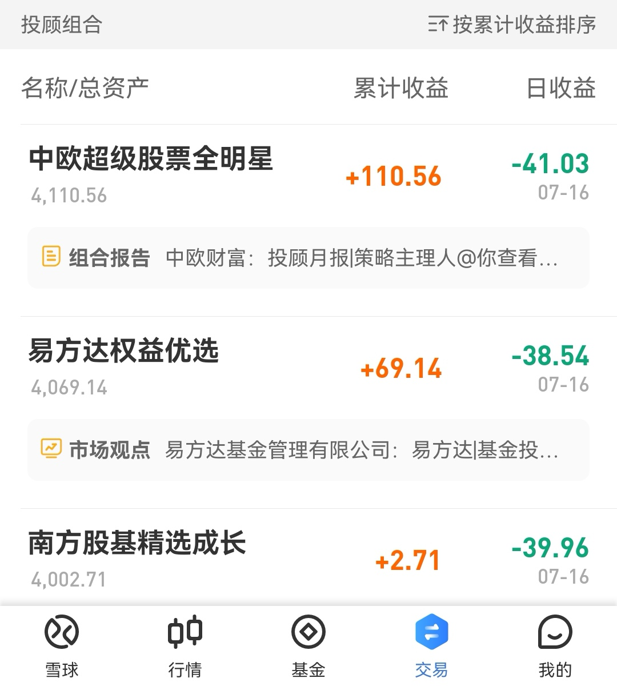
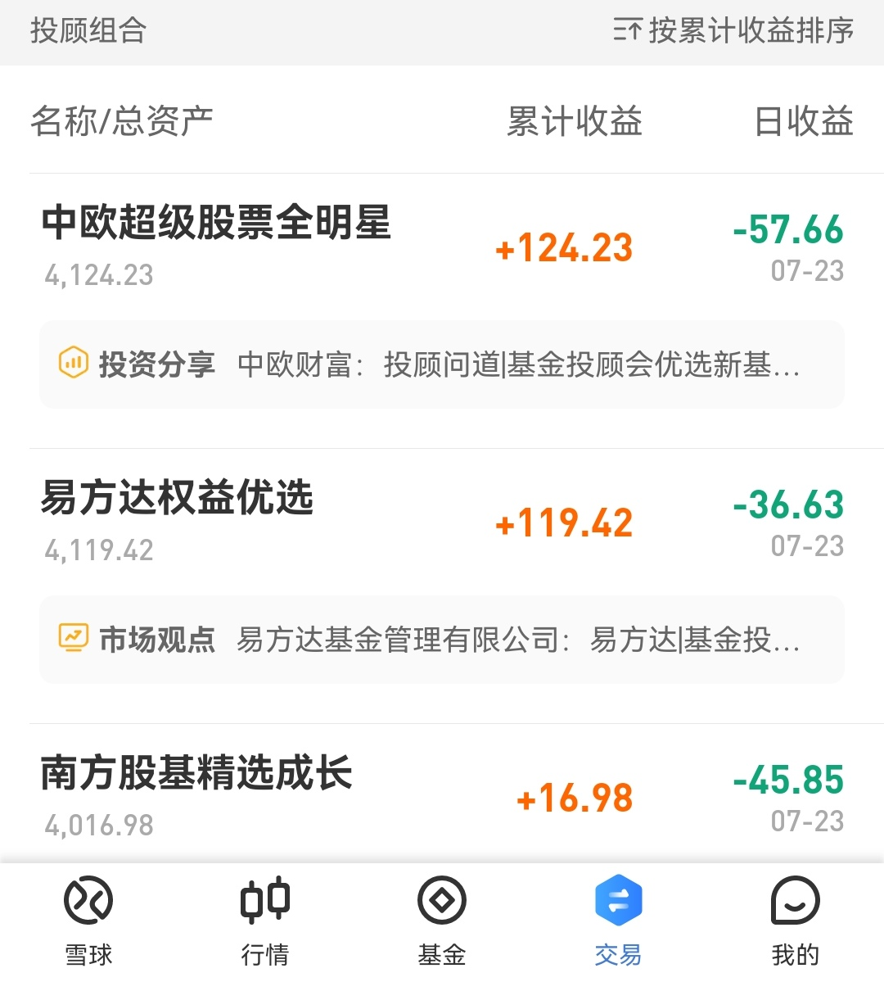
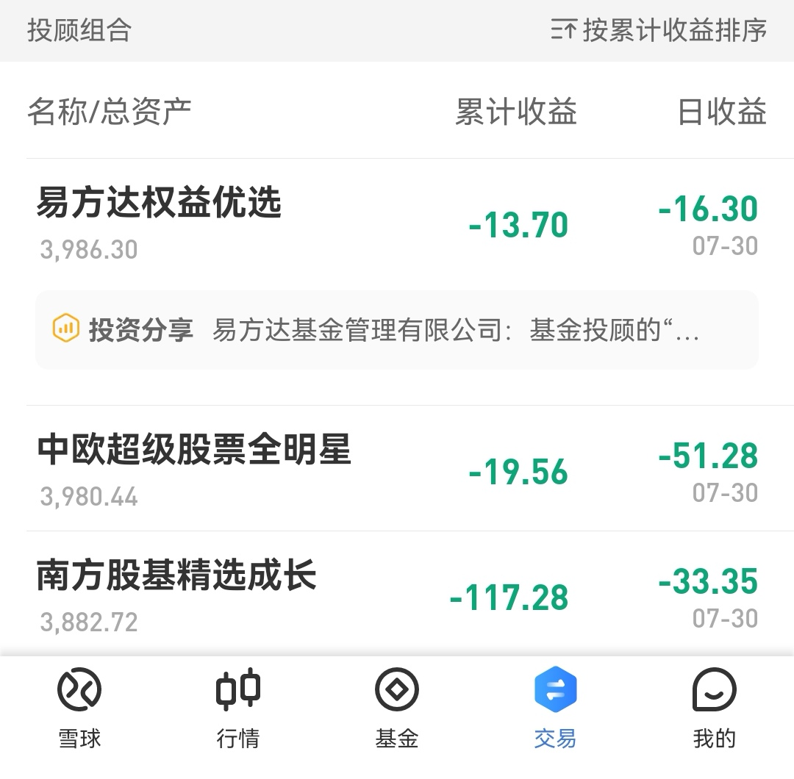

### 豆哥体验馆-基金投顾蛋卷实盘体验报告（6）

实盘报告中间停了2周多，因为感觉可以写的前面都陆续有提到了，但毕竟月底了，每周一次的业绩排名图还是要贴下的。比较可惜的是因为大盘暴跌，三只基金投顾产品都进入了亏损状态，平常心看待吧。

后面如果没有特别的内容需要写，我们就3~4周集中晒一次每周业绩哈[笑]（因为业绩排序太稳定了：**一直领先的中欧基金、稳扎稳打的易方达基金、永远最差的南方基金**）

另外值得说下的是，我今天看到 @易方达投顾   发文《基金投顾的“能” 与“不能”》 ，这个我是觉得可以把里面的要点和大家做个分享（愿基金投顾行业的发展如文章中所写的那样越做越好）：

**不能1：基金投顾不能“包赚不赔”**

**能：基金投顾为客户优选产品、优化成本、提供行为指导，以期提高客户投资体验**

**不能2：基金投顾不能保证比单只基金更赚钱**

**能：科学配置一篮子基金**

**不能3：基金投顾不能保证每次操作都“踩对”时点**

**能：均衡配置账户资产**

