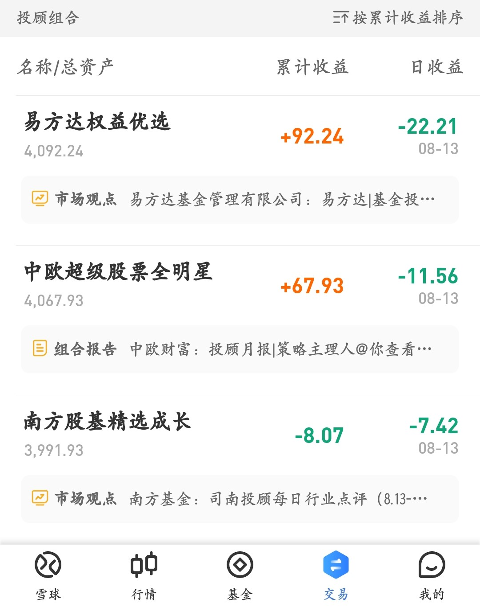

### 豆哥体验馆-基金投顾蛋卷实盘体验报告（7）

又要到月底了，我们来回顾下最近几周这三只投顾产品的业绩吧（每周业绩情况见文末图集）。

受市场整体回调的影响，三只产品都有一定程度的回撤，但在8月13日这周开始易方达的权益优选开始反超了中欧超级股票全明星，并且保持着这个排序。至于南方基金的这个产品嘛，我前面也提过多次了，已经彻底失望了，万年垫底说的就是它。

其实仔细的朋友也会发现，中欧的这个产品相对更激进一些， 所以在近期的回撤大势下也暴露出了盈亏同源。反观易方达的这款权益优选就更中规中矩一点，整体的稳健性更强。

另外需要说下的是中欧的全明星在8月18日调仓了，这是我买了这个产品后的第一次调仓（年内第二次），我自己的调仓手续费花去了6.26元。中欧为了这次调仓还特别做了一场直播，感兴趣的朋友可以去 @中欧全明星   下方找到直播来看下（多平台同步可看）。我觉得这种形式还是蛮不错的，对于买基金投顾的“懒人”而言，视频直播这种沟通方式还是比较易接受的。

最后表扬下南方基金的 @司南投顾   ，在大家的强烈“呼吁”下终于开通了投顾投后服务的官方账号，暂且不说内容如何，我是肉眼可见的发帖还蛮频繁（主要是每日行业点评和周报组合复盘）。虽然迟了点，但能改进就是值得表扬下，同时作为持有人还是希望你们能把业绩做上去，这个才是我们投资人的核心利益。

