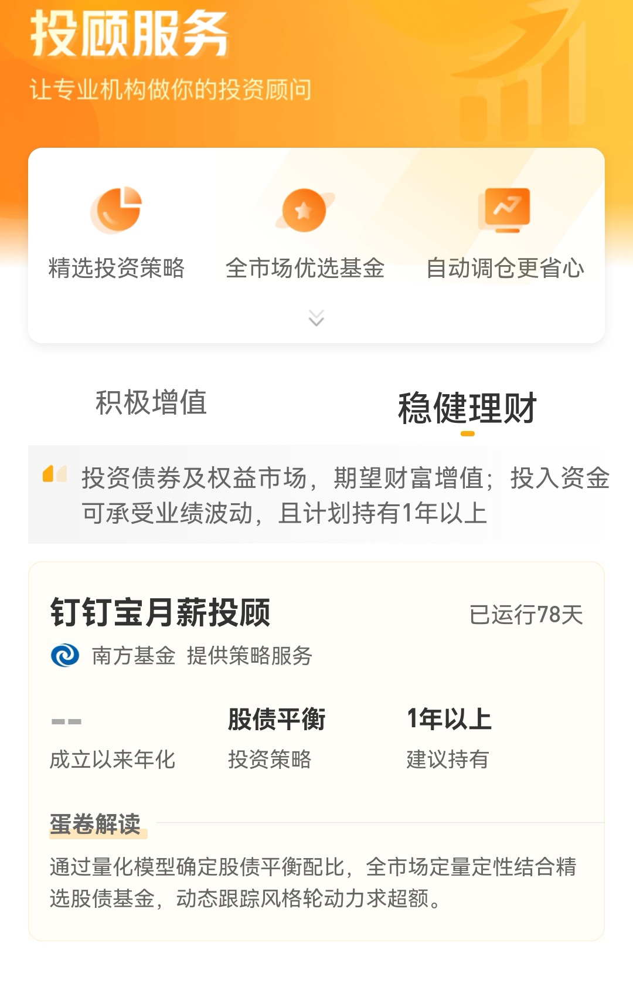
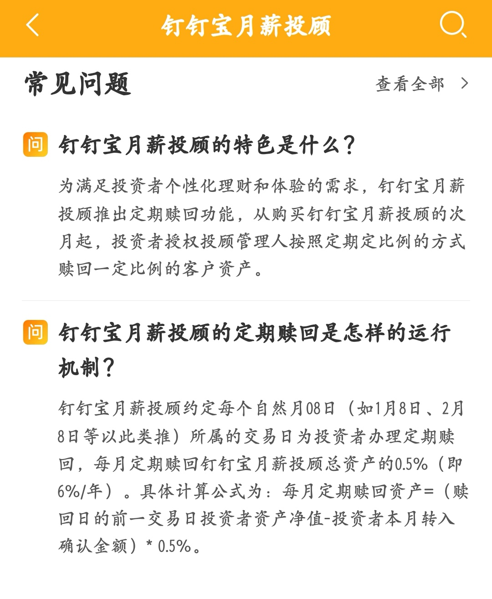
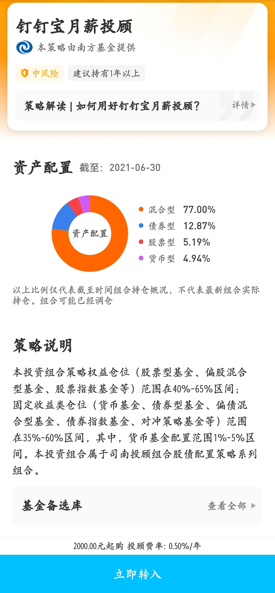
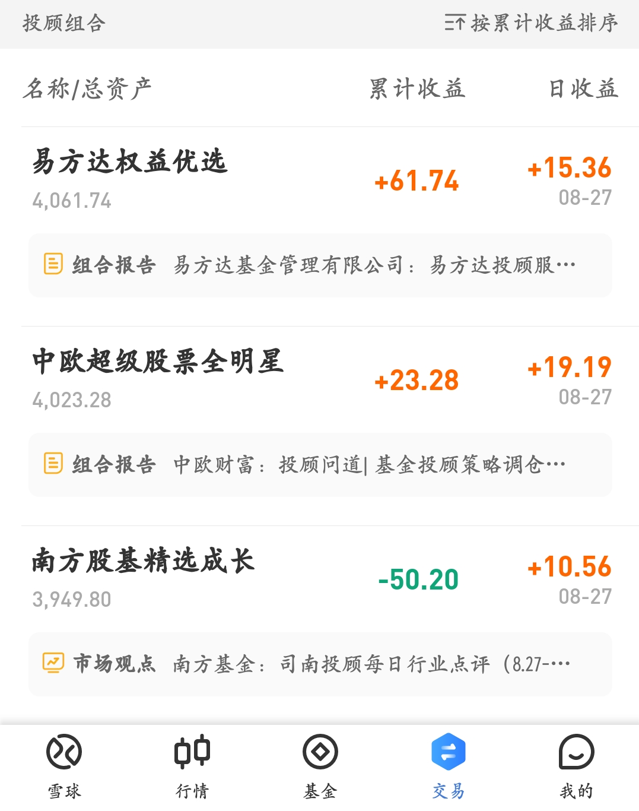
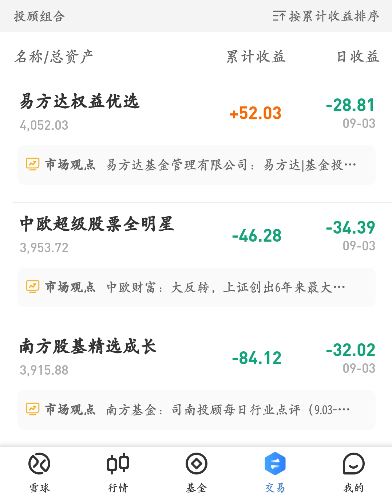
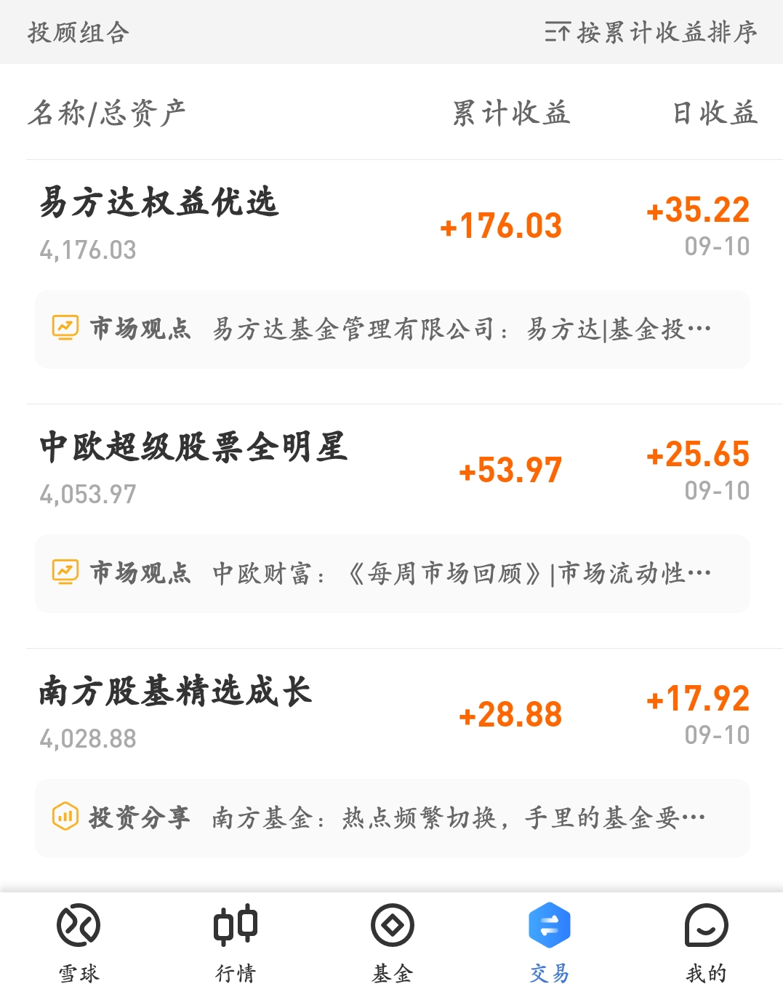

### 豆哥体验馆-基金投顾蛋卷实盘体验报告（8）

又三周过去了，体验的三只基金投顾产品收益排名又出现了一些变化，我们一起来看看吧（三周业绩附图见文末）。随着大盘的整体上涨，三只产品都开始盈利，而且易方达 @易方达投顾   第一名的优势在加固，中欧已经开始出现了疲软的情况。甚至在昨天（9月13日收盘后），南方基金超过了中欧基金，真是让我有点意外，万年老三居然追上来了，再次恭喜 @司南投顾  。

另外我们发现9月初的时候，蛋卷投顾服务里多了一个大类【稳健理财】（我们现在体验的三款产品都是【积极增值】类），当前该大类只有南方基金投顾一款产品（详见下图）：

这个南方钉钉宝月薪投顾是个啥玩意的呢？不知道大家有没买过 $交银定期支付双息平衡(F519732)$  ，和这个基金有点类似。每月固定赎回总资产的0.5%（一年约6%），给人一种按月领取养老金的感觉，本身这个模式我是认可的，但是基于之前南方投顾的业绩，我还是有点小疑虑。官方的产品简介、资产配比详见下图：

