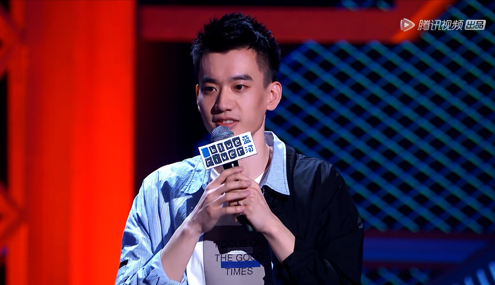

### 女儿做到了我和我妈均未完成的事情

看了最新一期的《脱口秀大会》，其中庞博讲的段子（劝父亲戒烟）让我有了些许感触。有时候写一些生活的帖子会带上我女儿豆豆，偶尔还会有我的老婆，但未曾谈起过我的老父亲。

父子之间的情感总是很奇异，我不知道别的男生是怎么样的，反正我是很少和我爸沟通。小时候有啥事都会先和我妈说，长大了连与我妈都不是很想交流，一是沟通困难，二是沟通了往往对解决问题也没啥实质帮助。久而久之与父母间只剩下了生活必须的沟通，所以有时候看着女儿我问老婆：以后女儿长大了也会不会不太愿意和我这糟老头子讲话？

我爸是一个30多年的老烟民，没我的时候他就已经开始抽烟了，我是很讨厌抽烟这件事以及那难闻对的烟味。我和我妈规劝了多年最终都无果，最后却在2年前因为我女儿，他成功戒烟了，现在过年回老家亲戚们都惊呼我爸居然戒烟了。

我爸戒烟成功主要是因为我女儿（她完成了我和我妈均未完成的事情），老头很自觉在我家从来不室内抽烟。为了避开孙女但偶尔还想抽烟，所以他是家里倒垃圾最积极的一个，下楼倒垃圾成了他唯一可以抽根烟的时机，可是倒垃圾回来的他一身烟味，我女儿死活不让一身烟味的他抱的那一刻他视乎有了更坚定的决心。当然也有一些辅助的原因：

1、上海很严格地执行了室内禁烟

2、智能手机分散了我爸很大的时间和注意力

3、我爷爷这个老烟枪的肺病复发了

与讨厌抽烟和那股烟味让我一样执念的，还有我一直认为戒烟是不可能的事情。上一个我认识的戒烟成功的人，是我当年实习的时候带我的一个博士，他也是因为一些特殊的环境和经历才机缘巧合的戒烟成功的。戒烟成功的人我都觉得很厉害，无论什么原因，我都是钦佩的。

回到开头提到的庞博的段子，听后让我不再那么厌恨抽烟的人，虽然还是不喜欢那股烟味，但多了一份理解。嗯，我以前对吸烟就是一种恨，是完全抵触，完全负面的一种印象，但是随着年龄的增长和经历更丰富的生活，我也渐渐多了一丝理解。

在我父辈他们那个年代，没有那么多娱乐活动，生活的压力却很大（我认为比我们这一代人压力更大）。一个人往往承载着一个家庭、一个家族的担子，没有再前一代人的铺垫、更没有退路，若非要说退路就是回农村继续种地。

我爸对我说过，他们年轻的时候在工地上干活，一天忙到晚只有三两工友聚一起抽一根烟才是‘正经合理’的休息时间。他们那个年代没有休息日，甚至都没有人会真正自己主动去休息，因为大家都是有活就干、有钱就挣。其实我知道即便30年过去了，很多工地上的工人依然日复一日的工作着，对他们而言没有双休日的概念。

我们工作累了会刷会抖音、打局游戏、追个热剧，那父辈们在那个年代呢？抽烟或许真的是仅有的且‘有效’的解压方式了。甚至我觉得若在30年前那种场景下，即便是我也可能会选择抽烟。就像同事们中午吃过饭聚在一起开一局王者荣耀，你不玩就变得很格格不入，似乎是很奇怪的一种存在（很可惜我确实也不会玩王者荣耀，看来我注定是一个很无趣的人）。

我觉得人随着经历的丰富和年岁的增长，会对很多事物多了一份包容（也可能是对自己某种形式的妥协），我也不知道自己何时开始愿意用理解的方式去看待人和事。我曾想，理工科出身的人是不是都这样：**尽可能的寻找一条公式或者一套理论去解释一个现象。**我刚毕业的时候入股市也试图找一些‘一劳永逸’或者相对长久的投资策略，总奢望能一招吃遍天下，现实告诉我没那么简单。因为即便真的存在这样一个策略，那么大家就会趋之若鹜，很快这个策略也就失效了，甚至变成了一个坑。

讲了那么多，有点杂乱。总的意思是我觉得我们所处的环境是不断变化的，我们的心境也是不断变化的，那么我们为何要奢求投资的世界是如此简单和线性的呢？因此我们要**不断学习，不断去适应这个市场的变化，寻找一些风险和收益不对等的机会，然后有针对性的做多或做空，赚取我们能力圈内的那点钱。**
