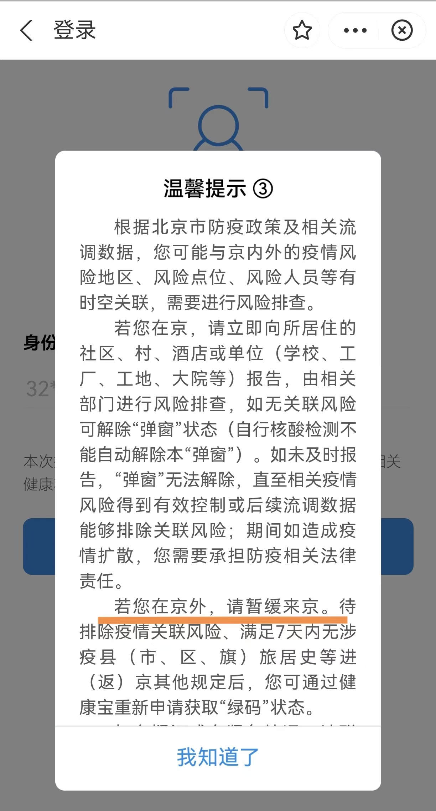

### 这应该是上海有史以来最艰难的开学季了

上海本周终于不再是“烧烤”模式了，但我这两天的心情依然是“燥热”的。人生在世我们总是会遇到一些表示理解但又很不爽的事情，比如无比“艰难”的开学季准备，又比如人在家中坐健康码弹窗从天上来….

先说开学季的准备，一周前学校班主任就在钉钉上通知大家各种填表、各种打印离线随身码、电子学生证、家长告知书，这还不包括每天日常的一堆健康信息（含同住人）提交。但话说回来，什么开学前三天两检、开学后每日一检核酸我们家长都忍了，只要能让“神兽”顺利到校上课就成。开学前唯一的好消息是“疫测达”的同住人额外健康报告不需要每天早上7：30前报了，有异常后再报（当然学校原先的健康每日报告还是要做的）。

更让人不适的是我这种生活规律、两点一线的人，远在上海都要被北京健康码弹窗一次！昨天我不是有点不舒服就早睡了嘛（再次劝诫大家真的要少熬夜），本来今天要去趟市区见见一些老朋友的，哪知道6点醒来一看微信人家半夜一点多发我说因为上海突发疫情临时取消了，早上再一问她们已经在回去的机场高速上了。

人家知道我明天要去北京，就顺口提醒我先看看健康码有没弹窗，免得到了北京也没办法入住酒店（后面和两地防疫办联系后，其实上海我这种绿码是不限制出行的，而北京么…）。今年我还第一次准备出上海，哪知道北京就是霸气，弹窗的理由就是我们宝山区昨天有一个病例，可这人离我们家远的不要不要，一个直辖市的区就一位病例，你就让全区人民弹窗，我服了！

后来与活动方联系后，找了一些解除弹窗的办法，但一来是麻烦、再一个是需要两次第二日，最后权衡下还是不进京了（把定好的高铁和酒店都退了），这年头打工人想糊口饭也真是不容易。

