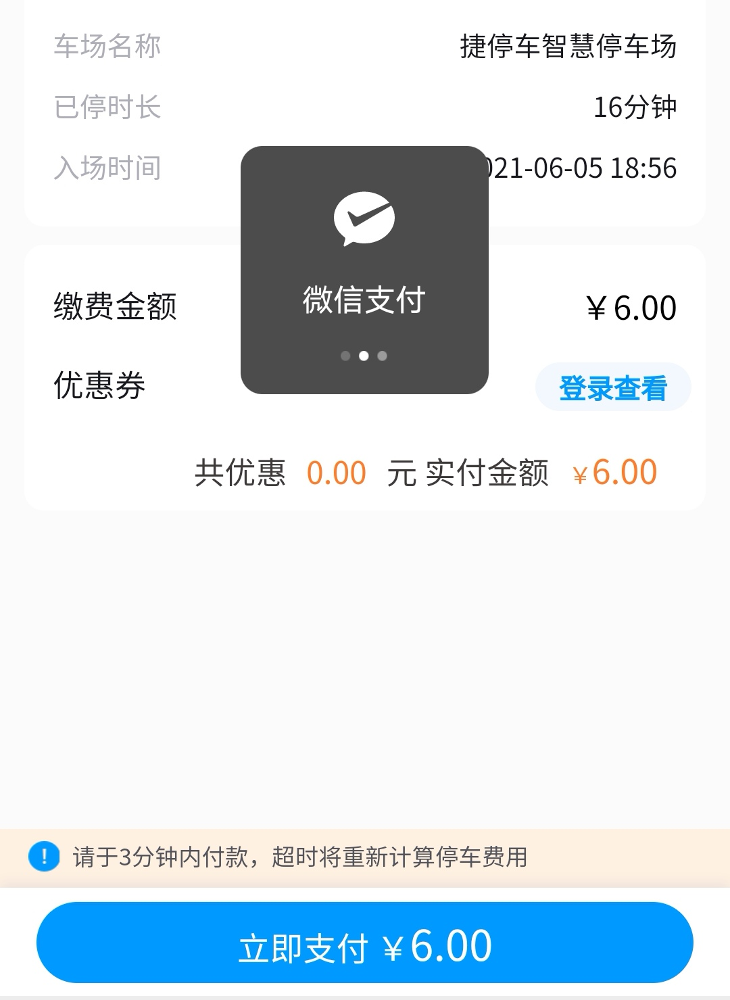

### 停车差一分钟就是多一个小时

我们常说，投资其实是一个极其考验心性的事。如果你能做到波澜不惊，不会因为市场的波动而情绪悲亢、进而影响操作，那么你的胜率基本上就超过了80%投资人。

说个我经历的事，昨晚送孩子去游泳后，老婆让我出去再接个人。我知道这个场地15分钟是免停车费的，然后一路小跑取了车就准备开出去。可临近收费口的时候，前面一个人在缓慢倒车还占了道路，好不容易等她停好后，我开到闸机那显示：**【停车16分钟，请支付6元】**

看着闸机屏幕上的付款码，我的内心至少在那一瞬间是炸裂的。因为多一分钟就要收我一小时的钱，关键我前面还是快跑着去取车的，都怪前面那个女司机倒车太慢。我看后面还有车等着，也怕麻烦再下车去前台扫停车券，就自己付款赶着接人去了。（这里程序员职业病犯了， 给这个停车收费页面提个bug：我点支付已经开始跳转微信支付了，下方的蓝色支付按钮应该置灰且不可再点击）

事情就是这么个情况，但是去接人的路上我又想到了几个问题，与大家做一点简单的分享：

1、如果恰好是15分钟我是不是会很庆幸？或者有时候停车1小时14分钟也给你算1小时，大家会不会都觉得占了小便宜？这种精准卡位的小喜悦我是理解的、是人性使然，但在投资中我们还是要尽量克制点，毕竟赚钱的事极大概率是逆人性的事。

2、为了方便停车场的管理，设定减免时长和停车计费规定是很有必要的（有明确的规则在先，大家停车的管理才能高效）。我们不该因为这多一分钟而恼怒，也不要因为恰好减免而庆幸，能做到不悲不喜就是很高的境界了。

3、发现我在心态管理上还有所欠缺，在那一瞬间我是有本能感到“委屈”下的，后面没再纠结是因为6元于我而言没那么敏感。如果是600元呢？我问自己还能那么淡定地扫码吗？会不会愤愤地下车与停车场收费员理论一下呢？这也是我想说的：**真的不悲不喜，不是你对这个东西脱敏，而是要真的做到淡然。**

4、如果做不到内心的平静，那么退而求其次的办法就是：让自己足够强大，强大到对绝大多数的事都能做到‘脱敏’。举个例子，如果马化腾掉了100万极大概率是不会太在意的，因为这点金额对他而言是相对无感的；但是对于一个普通的农民而言，这很可能就是他一辈子的财富总额，换谁都很难接受这一夜清空的灾难。

> 小结

生活需要偶有涟漪，投资应该平静如镜。

