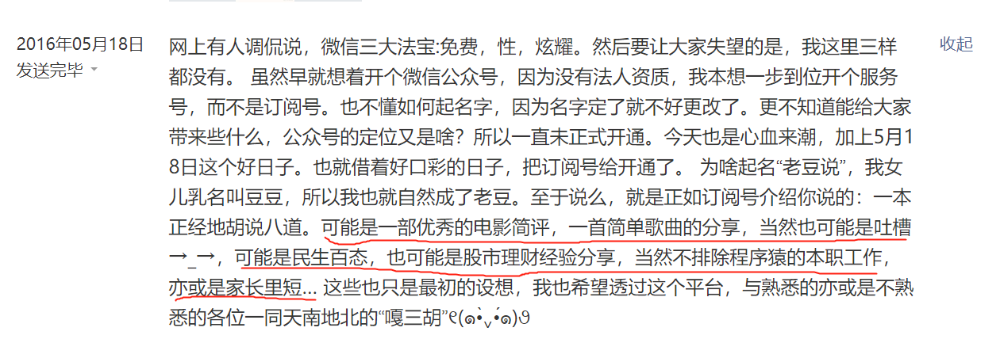

### 取悦自己-0430-序

酝酿了很久，准备开一个新的系列，最终取题为《取悦自己》，为什么定这个名字呢？

李诞、王建国、庞博是我很喜欢的三位脱口秀编剧兼演员，或许是我与他们年龄相近的缘故，他们用戏谑、荒诞、喜剧的方式讲诉着一些让我很有共鸣的观点。2019年下半年的《脱口秀大会第二季》第10集王建国表演最后一段的时候，他抛出了一个让他困惑的点：做脱口秀到底是该取悦自己还是取悦观众？

这一集肯定不是王建国说得最搞笑的一集，但让我深以为然，以至于我来回看了不下十遍。王建国说：如果是取悦自己，那观众凭啥来看你？同样如果只是取悦观众，那我又为何而来？**李诞给的建议是：通过取悦观众来取悦自己！**李诞这个看似圆滑的回答，是大部分有执念的人无法做到的，因为大多时候我们无法做到既取悦自己又取悦观众。

为什么大部分人很难同时做到这两点呢？王建国的解释是：我的笑点和观众有很大的区别，我认为可乐的事情观众不一定买账。但大多时候为了生存我不得不去迎合观众，讲一些在观众笑点内的段子，因为要对得起广告商，对得起买票来看的观众们。比如李诞常吐槽王建国的谐音梗太破了，让人太难受了，但我们也看得出王建国是乐在其中的。这些返璞归真的赤子之心以及有些偏黑色的幽默能让王建国自己感到快乐，也就是上面说的取悦自己。

所以王建国给的解决方案是：观众花钱买票的场次就认认真真逗大家笑，让花了钱的观众有所乐，也算是报答粉丝们对自己的喜爱。但哪天想讲一些主要是取悦自己的东西时，就免费或者象征性的收一点场地费。

回到我自己这边，其实在2016年5月18日创建公众号的时候我就一直想着写点能让自己愉悦的东西：【可能是一部优秀的电影简评，一首简单歌曲的分享，当然也可能是吐槽→_→，可能是民生百态，也可能是股市理财经验分享，当然不排除程序猿的本职工作，亦或是家长里短… 】

但现实就是如此：没人会来听你扯蛋。以至于中断了一年多，直到2017年的10月我才重新想试着换一个方向，即理财投资的分享。一个毫无背景的素人要搞好自媒体，这个有多艰难只有经历过的人才能体会，每周至少一篇坚持了一年多，后来去了雪球才稍微有所好转，略有好转后我当初列的那么多‘初心’这几年我都多少有过尝试。

说好转其实也就比公众号稍微好一点，莫名其妙的有了几个粉丝，机缘巧合的参加了几次基金活动，然后又认识了几个自媒体朋友，大家也愿意带带我，就这样稀里糊涂的成了雪球十八线小V。为了持续的获得流量与关注就不得不顺应着读者的兴趣以及当下的热点走，写的东西我不知道是否取悦了读者，至少对我自身的愉悦感几乎没什么提升。

我其实就想搞一个系列是为自己而写，记录自己的所见所闻、所思所想。有人说那你大可写日记好了，反正也能自娱自乐，想怎么写，写任何都行。但我觉得公开写出来，一是有利于我逼着自己写得更严谨、更深入，二是我不否认多少还是有点‘贪图’这种网络的互动反馈，三是如果日后侥幸还因此有点收入那自是极好的。所以本系列不做内容范围的限制，也不设定字数的要求，文章不带任何商业倾向，就是图个自己爽快。

我近几年主要是指数基金的投资，打理指数基金大多时候的很多细节是不需要太关注的，所以这就会比个股轻松的多，这也就让有些投资者感觉指数基金很无趣、枯燥。正好这个系列能给大家带来一些思考，也欢迎大家多多与我探讨，毕竟投资理财只是生活的一小部分，我们还有更多美好而有趣的事物需要去了解。

正如王建国最后说的：到底是取悦观众还是取悦自己？这可能是我一生的修业！当然前提是我还能继续在这行混下去。