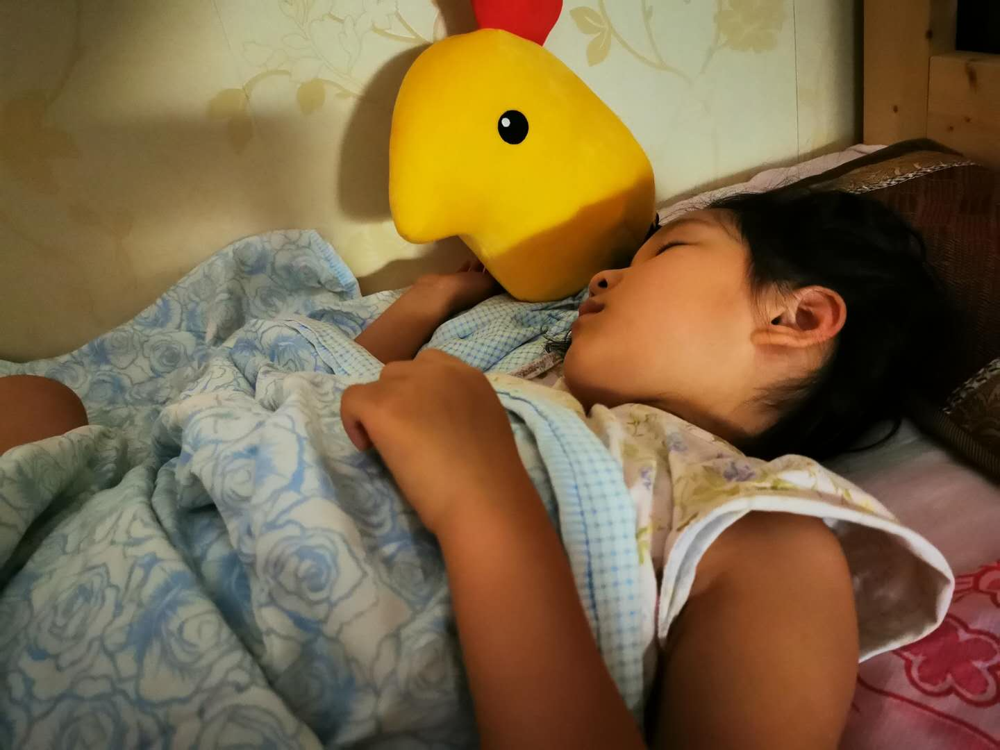

### 冤枉了我最爱的人

对，我最爱的人不是我老婆，而是女儿！

在开始讲诉冤枉女儿这件事前先简要说下我们家里的一个情况，以便于后面的情节描述。

在女儿上幼儿园的前一周我买了个磁吸小白板挂在她的房间，配套的还有一堆磁性大拇指贴。为了规范孩子的日常表现，只要她不犯错误就可以每天获得两个大拇指磁贴，但若有不佳的表现会扣除1~2个大拇指磁贴。随着年龄的增长我们对她提的要求也有所变化，比如最早的是不尿裤子、早晚自己刷牙、遇到邻居长辈也得有礼貌、10点后必须睡觉等，现在大班了更多的是学习上的，比如每天要赢三局围棋、对应的课外兴趣班的作业完成情况或者对应课堂上的表现等（英语、绘画、舞蹈、科学实验...）。而这些大拇指就等于我们对她发行的【家庭货币】，可以兑换她喜欢的零食、玩具、书本、外出游玩的机会等。好在至今为止我们这套“家庭体系”运行还算平稳，下面我们就进入正题吧。

前天晚上我给她换了一本书，在拿柜子里侧书的时候我可能把外面的玩具也拿了出来，关键我把玩具就随手放在了桌上忘了放回去。然后昨天白天我妈就看到了，以为是我换给女儿的，就给孩子玩了（虽然她只是打开了下，没怎么玩）。

我昨晚到家看到了这一幕，我说你怎么没经过爸爸的同意就自己去拿这个东西呢，对不对？我们平时怎么要求你的你忘了？看到玩具都拆开了，我说那这样就提前换给你吧，但平时只要6个大拇指，今天要8个大拇指换。知道为啥这次需要多两个大拇指不？因为这是对你擅自去拿玩具的惩罚！

她听了我的批评显然心情不是很好，委屈的去房间里找妈妈了，我当时也没太在意她的心情变化，更多的还是为女儿的不听话而感到愤愤。

我去厨房找了点水果吃，然后想起来我下班的路上给老婆打电话，老婆直接给我挂了。我端着葡萄给她们娘俩送过去，然后问老婆怎么刚挂我电话啊？她说没有啊，刚手机在女儿手里。然后老婆就问孩子：你刚干嘛挂爸爸电话啊？她说刚是有个电话，但上面是不认识的名字，我就挂了呀！（我事后才想起我用的是副卡打了这个电话，而老婆手机没明确备注我的副卡信息。）

可能是短时间内叠加了两次的被冤枉，女儿突然不说话，卷起被子假装要睡觉了。老婆见状上前安抚几句，女儿瞬间就哇的哭了起来，眼泪止不住的流淌下来。反正我平日里做惯了黑脸，哄孩子的事就交给我老婆，我就溜出了主卧。

我拿了衣服准备去洗澡，我洗澡前又去我妈那了解情况。我说孩子怎么拿到的玩具？不是放的地方还蛮高的呀，她爬椅子了吗？我妈说：什么呀，是你昨晚自己放桌子上的，我以为你给孩子的，就让她玩了呀。听后我先是一愣，然后拿着衣服就去洗澡了，洗澡的时候我在反思自己的言行，洗好后我把多扣的两个大拇指给补上了。去房间后看到女儿已经不再哭泣了，我温柔的对孩子说：是爸爸错怪你了，多扣的大拇指也还给你了，以后如果爸爸妈妈冤枉了你，你可以和我们说。

大哭过后的孩子往往更容易入睡，而我这个做错了事的大人却久久不能入眠。这件事让我意识到，我还是很‘家长主意’的，没有更多的去了解事件的全部，也没有给孩子解释的机会。孩子现在都大班了，其实可以算个大小孩了，有了更多、更丰富的情绪表达。还有就是之前小时候说她几句她一会就忘了，现在她可能第二天还记得这个委屈。我自己小时候也很讨厌被大人冤枉，或者说我是非常非常讨厌大人的这种行径的，而我不知不觉的就成了我最讨厌的样子。

好在我们和上一代人相比，有了更多的教育积累，那我们就应该更早的发现这些问题并处理好与子女的关系。养育孩子的过程也是父母们自我成长的过程，我觉得有必要去规避类似的事情再次发生，至少在批评孩子之前尽可能的去了解下事件的全貌。**孩子都在成长，我们为何还只是原地踏步呢？**

有时候加班到家已经很晚了，看着孩子躺在那，听着她的呼吸声，瞬间觉得做父母的再苦再累也是值得的。孩子有时候也很调皮，有时候让你有很无奈甚至抓狂，但更多的是欢声笑语，这可能也是家庭给我们最大的财富吧。

当然我说这些不是为了骗大家去养女儿哈，更多的是想记录下自己的生活，毕竟我总是倡导【投资不该是生活的全部】。现在越来越多的年轻人选择晚婚晚育，甚至有些人会选择丁克，我觉得也是挺好的。我们看一个东西要全面的去看待，其实人生本就是这样的，很多东西就是兼具苦恼与快乐，两者是并存的、交替的。你没有哭，哪来快乐呢？你没有吃过苦，怎么知道嘴里含着糖的那一刻是甜蜜的、快乐的，或许这就是人生的奥义吧。

最后我想起了朴树那句歌词：这是一个多美丽而又遗憾的世界。

