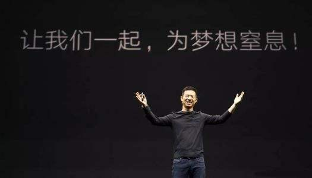

### 取悦自己-0621-给你5块钱，2小时内能赚多少？

女儿的书越来越多，使得我近几年只能买电子书为主，现在家里书柜一大半都是孩子的书。本着“再苦不能苦孩子”，月初的时候老婆提议清理下书架，把不用的或者已经买了电子版的都处理掉，该‘多抓鱼’二手回收的就回收了、该当废纸卖的就卖掉、该运回老家保存的打包好等端午带回去。

分类整理了一圈后，实在觉得没什么用的书就捆起来当废纸卖了，准备带回去的书也已经装到了一个纸箱内，准备网上回收掉的书也预约了顺丰取件。在整理的过程中，我自己的书比较熟就简单翻一下，看看有没夹着什么书签、纸条之类，而老婆的书不多，所以我都认真的翻看了下。今天要说的事就是其中一本书的一个章节，我觉得挺有意思就来和大家分享下，书的扉页上是老婆当年的字迹：**2012.3 ， 购于京东** 。

作者Tina是斯坦福大学的一名教授。Tina给她的学生布置了一个作业：如果你只有5美元和两小时，你如何赚尽可能多的钱？

她会给每组的学生们发一个信封，信封里面只有五美金。在没打开这个信封前，随便大家怎么去筹划，可一旦打开这个信封后，那么在剩下的2小时内，就得用这5美元尽可能赚更多的钱。然后老师说，下周每个小组用3分钟的时间，把作业成果展示给所有同学看。

听到作业后，随即就有几个人提议去拉斯维加斯或者买彩票，当然这些很快就被组员们给否决了，因为大家知道这些方案不靠谱，赚大钱的概率极低还可能伴随着巨大风险。最常见的方案就是用5元钱买点启动材料，然后给人洗洗车、卖卖柠檬水啥的，但令我惊讶的是：**赚钱最多的几个组根本就没怎么用这5美元！**

他们没有让这5美元禁锢了自己的思维，而是用更开阔的眼光去看待问题。这就使得最成功的几组同学其实面对了一道更难的题：**在一无所有的情况下如何赚更多的钱？**一无所有还能赚钱，这不就是我们中国人常说的白手起家嘛！那我们就看看这些学生是怎么完成这作业的？

有一组学生发现大学城每到周六晚上，热门的餐厅门口往往会排着长长的队，想吃一顿饭挺难，所以他们的思路就是打算从那些想吃饭又不愿花时间排队的人身上赚钱。他们分工：有些人分头去热门餐厅订座位，有些人在队伍中寻找那些不愿等又肯出钱的潜在客户，最多的时候一单可以赚到20美元。

后来他们发现女生去推销座位更容易成功，可能是女生能让客户觉得更自在吧。所以他们及时调整策略：男生负责跑腿订座，女生负责向排队的人们推销座位。同时他们还发现有些餐厅会给排队的顾客发传呼机，轮到该顾客的时候他们的传呼机就会用震动来提醒顾客就餐，这类餐厅的帮排队生意最好做。因为当你把正在震动或即将震动的传呼机交到客户手里的时候，他们会觉得花钱买来的服务更具体化。而且这类店铺还有一个额外的好处：客户付款后用自己的传呼机换来了正在震动的传呼机，以便节省时间，但学生们换到的那台传呼机还能卖给更晚到的客户，再赚一笔。

另外一组在大学生宿舍门口，就搭个篷子给同学们的自行车免费检测胎压，如果胎压不足需要打气的话，就收1美元。一开始他们还觉得这个是不是收费贵了？毕竟如果去附近的加油站，大家是可以免费充气的，但是做了几笔后就发现其实同学们都很感谢他们。尽管这个服务没什么难度，但这服务无疑是有价值的，是实实在在的帮到了大家，大家就不用跑那么远，也能在测压后按需打气。这个小组另一个厉害的点在于：规定的时间刚过去一半，他们就由原来的固定收费改成了自愿付款。结果收入不但没减少，营业额还显著提升，因为顾客们更愿意为这项有可能免费的服务多一些报酬。（我想说斯坦福的学生真有钱！）

上面两组的同学有一个共同点，就是在执行计划的过程中还不断观察和思考，然后迅速地调整策略以获得更优的结果。世界顶尖学府学生的观察能力、思考能力、执行能力确实都很让我钦佩，但下面这组同学的操作让我真的眼前一亮。

最后要说的这组同学，你可以说他们似乎什么都没准备，但最终成了赚得最多的一个组。他们拿到信封后，重新审视了课题，发现手上可以利用的最有价值的资源不是这5美元，也不是这可有可无的2小时，而是用来展示作业成果的那三分钟。他们决定将这3分钟出售给一家想在学校里招聘学生的公司，他们为这家公司制作了一个3分钟的广告短片，利用作业成果展示的机会放给全专业的同学们看。这一聪明的做法给他们带来了650美元的收入，轻松拿下第一名的成绩，他们获胜在于能跳出题目的禁锢，重新审视了手上的资源并充分利用它。

冠军组的这个方案是不是超乎了大家的想象？而我们回过头来再看那些计划洗车、卖柠檬水的小组获利均低于平均值。所以我觉得：**能摆脱问题表象的禁锢，用更广阔的视角去观察问题，揭开了这层蒙眼布，眼前的世界就会大不一样，到处充满了机遇。**

另外我想说的是：上面这种教学方式其实也挺好，老师让学生们通过实战激发自己内心的创造力，让组员们高效协同更好地完成任务，这对学生们将来的生活、工作都大有裨益。我们大学的时候偶尔也会有一些课外实践作业，而且每个暑假学校还会发布暑期实践任务，可这些都是形式主义的应付，老师不会认真查、学生也没几个把这当回事，我觉得挺可惜的。我们都知道学校里和现实社会中所适用的规则是大不相同的，如果不在离开学校前学会如何在没有老师指点的情况下应付自如，那么踏入社会后的那种差距会让我们倍感压力。如何优雅的跨越这道鸿沟，成功应对外界的挑战？这是一个发人深省的课题！

本文成于2020年6月21日
