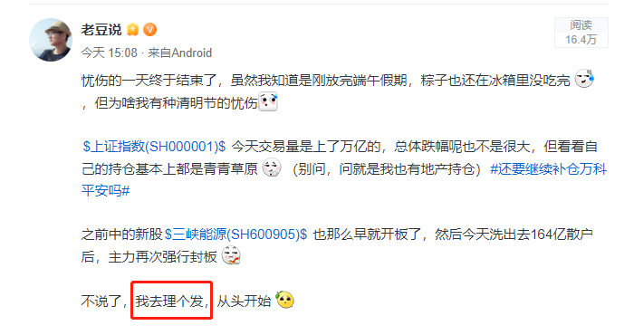
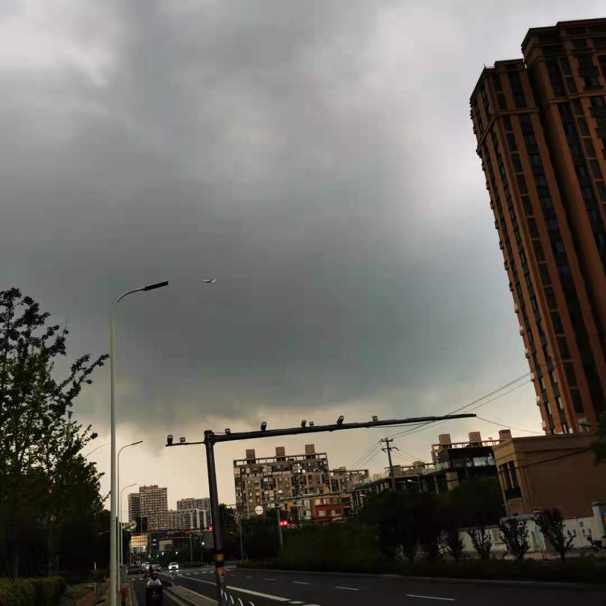
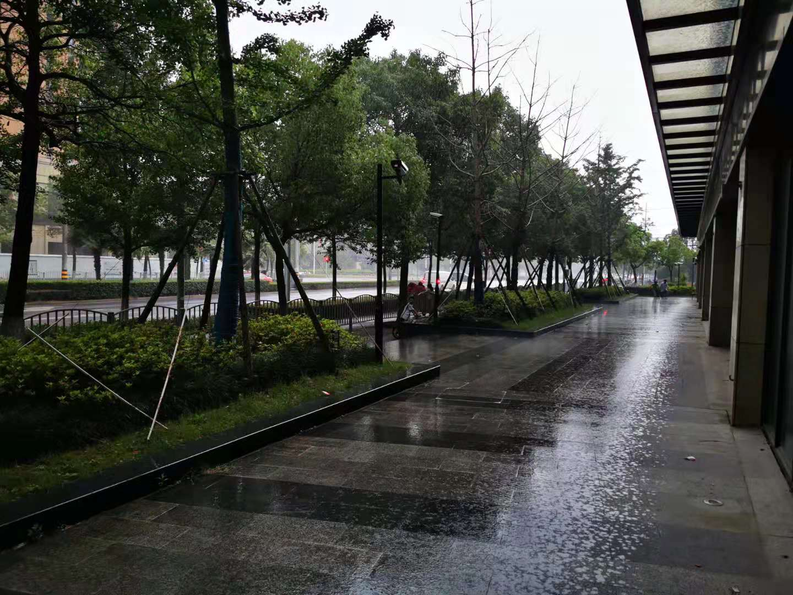
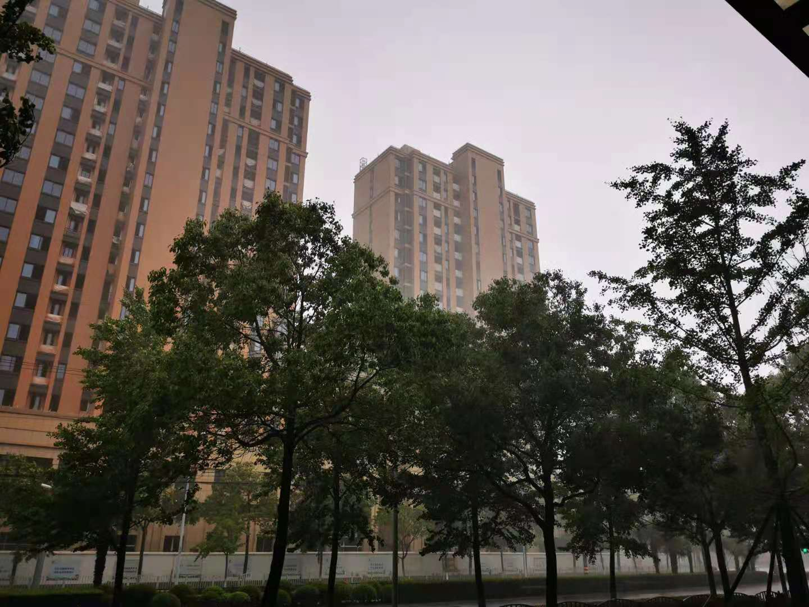
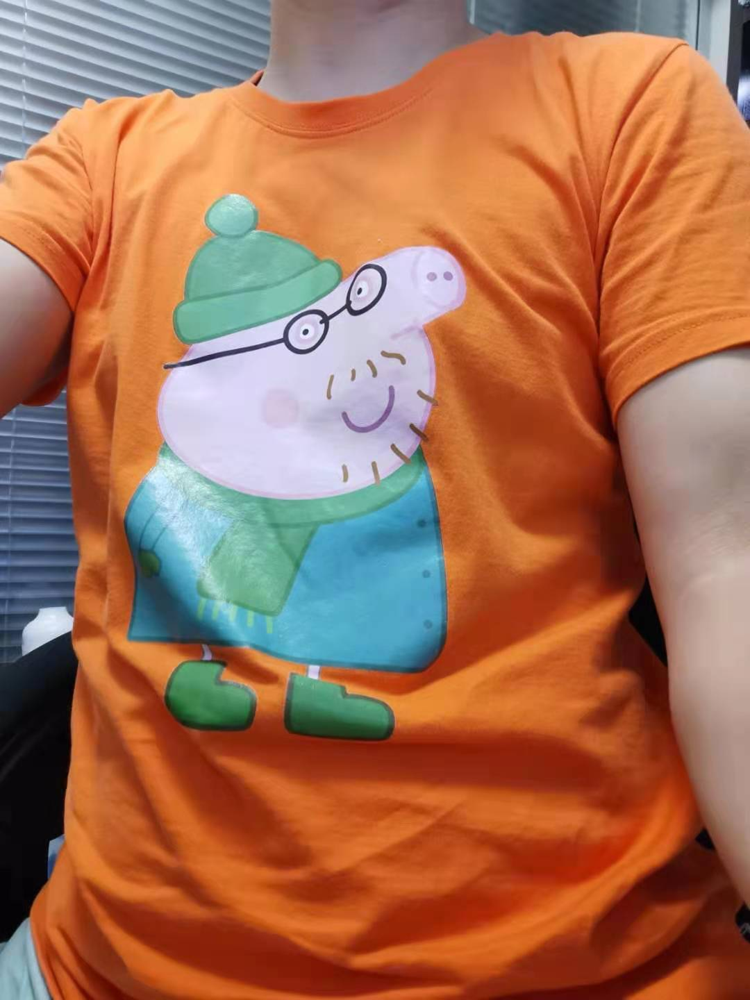
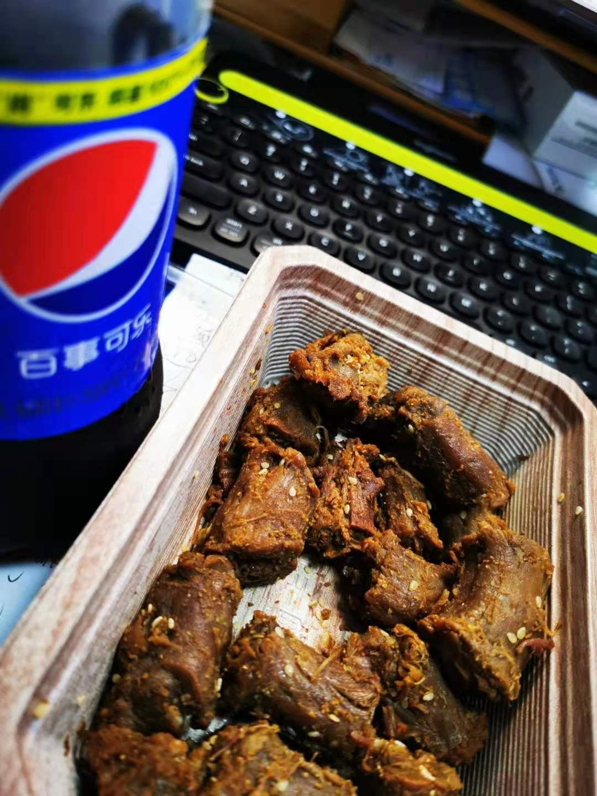

### 记成年后的第一次“落汤鸡”

我没记错的话， 傍晚这场雷阵雨应该是我成年后，第一次因雨成为“落汤鸡”而湿身。

故事还得从三点开始说起，今天虽然两市交易量突破了万亿，但我持仓是大面积的青青草原，别问，问就是我也持有地产。

而之前中的新股三峡能源也早早地开板了，今天洗出去164亿散户后，下午主力再次强行封板，反正多少也有点不舒适。想着去理个发，从头开始，而此时故事才刚开始。

我常去的那家理发店是每周一休店，所以今天周二人会比较多，以至于我和洗完了十几分钟都没来理发师，眼看头发快干了，熟悉的7号理发师才急忙推着他的小箱子过来。7号反正也是照常给我修剪着，我这人也不讲究，一头短发三十余载。

倒是邻座的小妹妹一直在抱怨6号理发师给她剪得不到位，妹子要齐平地修短，但是理发师给剪成了带一点小内卷的，略微带点层次感。最后多次沟通后，还是喊来的总监给亲自修整满意，我当时在想：这个有点像我们程序员和产品经理，我们工程师开发出来的第一版很难让产品经理百分百满意，总是需要不断的“打（jia）磨（ban）”

出了理发店我就去隔壁的留夫鸭买了盒孜然鸭脖（我和老婆都喜欢吃，但她更喜欢麻辣的），然后又去了隔壁的隔壁全家买了两瓶百事可乐（最近搞活动，2瓶6元）。出了全家便利店才发现北面的黑云压了过来，我顿感不妙就快跑了起来，这一跑就把装鸭脖的袋子挤坏了（主要是现在可降解的塑料袋承受不起2瓶可乐）。情急之下我就折回去问留夫鸭的小姐姐又要了个袋子，装好东西后就一只手托着、一只手拎着往家跑。

到了红绿灯我就不得不停下来了，可这云也是越来越逼近了。绿灯一亮我就以迅雷不及掩耳盗铃响叮当之势往家跑，说时迟、那时快，豆大的雨滴就这么扑面而来，我顺势躲进了一个躲避处。心想着这阵雨也应该很快的，哪知五分钟过去了，雨是根本没有停的意思，躲雨的人倒是越来越多。有奶奶带着骑自行车的孙子，有手里拎着菜的阿姨，随着雨越来越大，有个撑伞的小姐姐也进来躲雨了，我心想这快要挤不下了呀

心想这小区门口都到了，身上也有点小湿，一直这样躲着也容易感冒呀。然后就是抱着鸭脖和可乐一个健步冲了出去，那位拿伞的小姐姐说：雨那么大你也走呀？！我是边走边回头道：刚理好发，最多回去再洗一遍。

跑了不出五秒，人就开始无所畏惧了，15秒后鞋底也已经彻底沦陷了。湿身后的我也开始不那么奋力去跑了，一来是怕踩到水坑溅得都是泥水，二来也是反正不能更湿了。其实我还一个要冲回去的原因就是手表电量只有5% 了，而手机也只剩8%的电量了（低电量焦虑症），我在冲回家前给我妈发了个微信，让她准备好衣物和毛巾，我说到家就直接洗澡。（事后我想在理发店吹干有何意义？最后还不是落汤鸡一枚；还有就是贪吃误事，不买这鸭脖和快乐水也不至于赶不回家）

女儿开门后看到湿漉漉的我是一脸嫌弃（还装大人口味说我不懂事），老妈喊我快去冲下热水澡。洗完后穿上我的小猪佩奇（猪爸爸）T恤，撕开我的孜然鸭脖，伴随着一声兹拧开了我的百事可乐，那一刻我是快乐的，甚至短暂的忘记了今天股市给我带来的不愉快。

