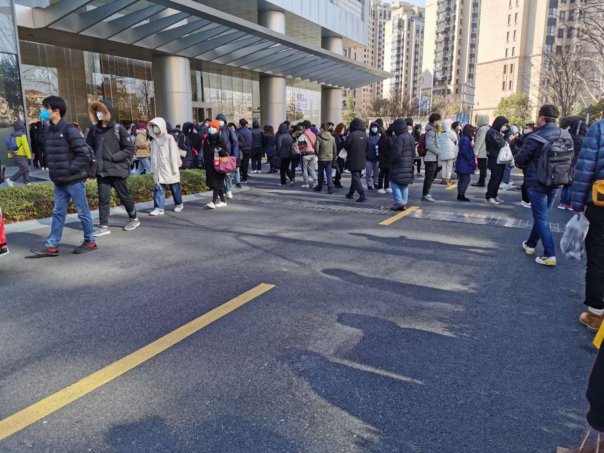
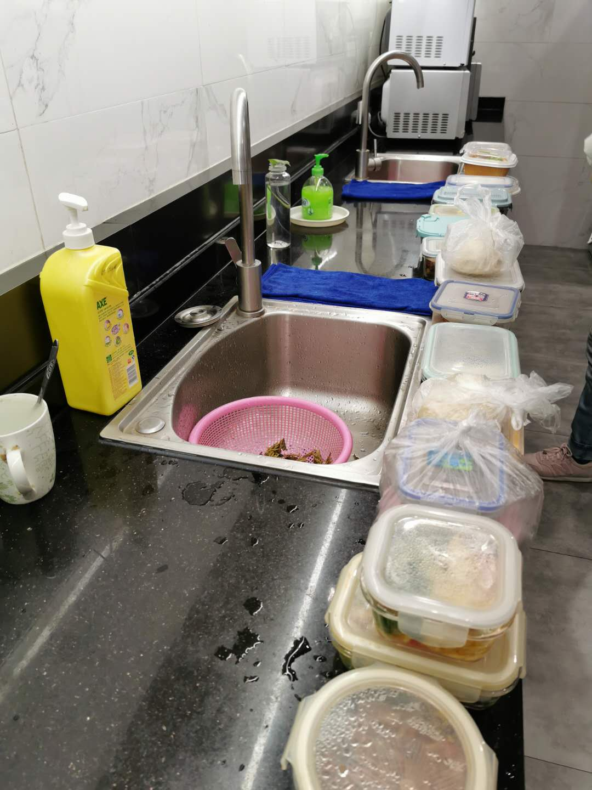
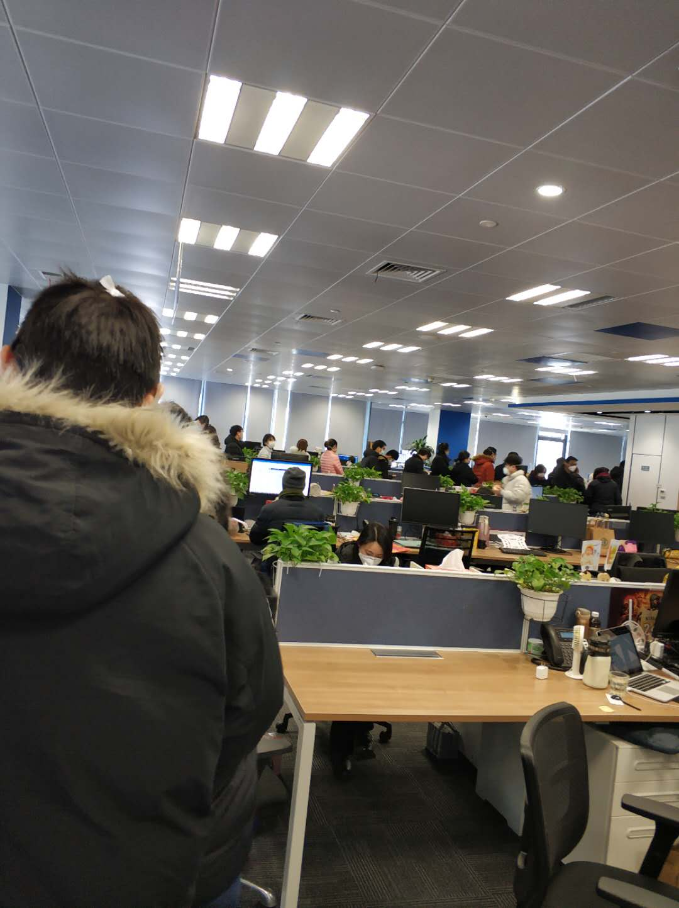
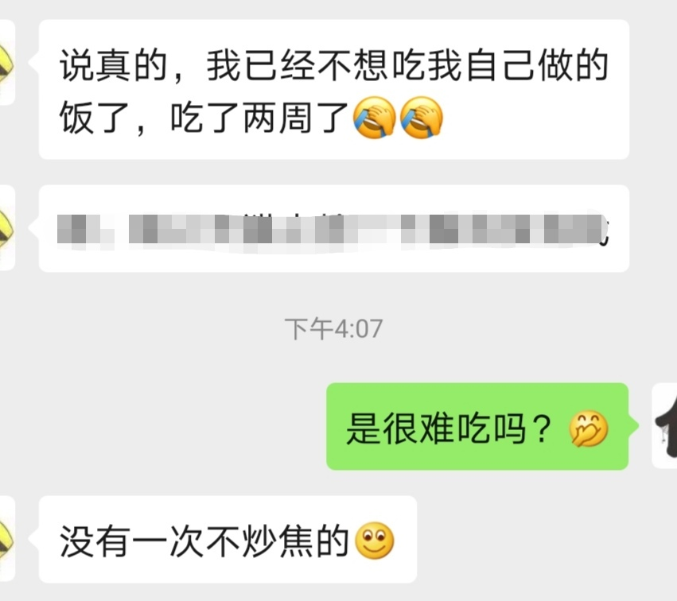
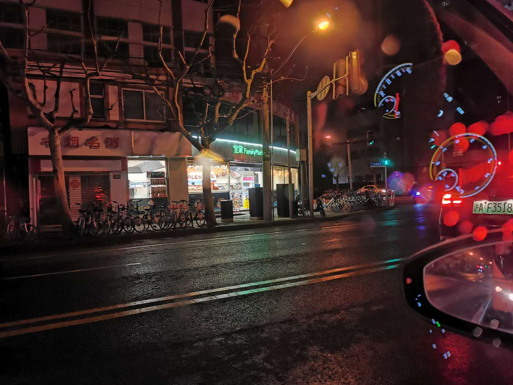
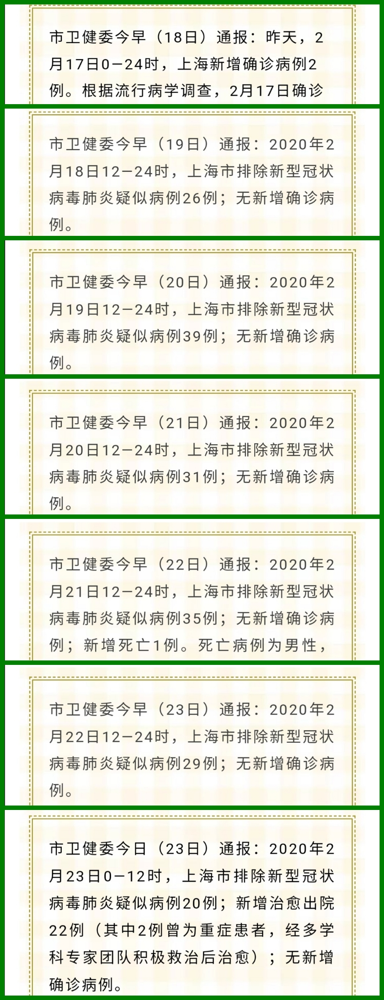
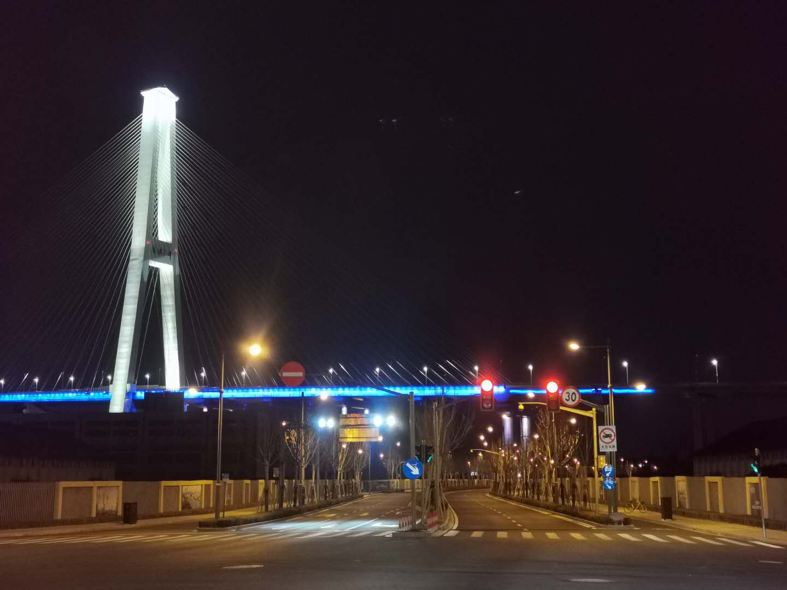

### 复工后的第一周

虽然上周已经有企业零星开始复工了，但大部分公司还是出勤人员不足或鼓励远程办公。本周一迎来了第一波大规模复工潮，‘有幸’我也成为了复工大军的一员。在家待了大半个月都快发霉了，总想着能出去走动下，连去小区门口买个披萨都算‘欢快’的放风。这周真要出去了还真有点小紧张呢，公司通知疫情特殊期间不会开空调，所以穿上了厚厚的羽绒服，带上口罩和手套就出门了。

熟悉我的朋友知道，我平时上下班通勤靠的是挤地铁，之前也写过很多在地铁上发生的故事的文章或帖子。正好老婆的公司要求继续在家办公，外加地铁公共交通还是危险性略高，我就有了难得开车去上班的机会。讲真我还是不太喜欢开车进市区，总觉得车多、人多、路况复杂，但想着为了减少些流动人员的接触，就还是开车去上班吧（后来发现开车还能每天减少2小时戴口罩的时间，这个不错）。

可能还是有蛮多人员在家办公，整个外环车辆都不算很多，也没什么堵车（唯一一次就是周五下班的时候看到外环有3~4辆车追尾，但处理也很及时）。早上走漕宝路后还是有点小堵的，但还是在能接受的范围内，而且晚上下班就一点不堵，如果疫情结束后还能有这种路况，那我可以考虑再买辆也开车上班算了。

周一到公司排队真的吓到我了，周一也就一半的员工到岗，但还是在门口排了1.5小时的队。进门前一个个排队测体温，一群人在风中瑟瑟发抖，进了一楼大厅还是排队，没人都要提交复工签报单，并且确认返沪的一些细节。因为必须戴口罩，所以人脸考勤系统全部关闭，大家又必须登记办理临时实体考勤卡，登记后要求大家分散时间去5楼领新的卡，一切好了后就是再排队领一片暖宝宝和三个KN95口罩。（对于发的口罩和暖宝宝我有个疑问：为什么口罩和暖宝宝这种产品我们国产品牌也做的不太好或市场认可度不高？公司发的暖宝宝为日本小林、口罩为美国3M，我知道它们也在中国生产，而这更使我上面的疑问不解！）

周一整个复工过程真的太难受了，同事们不少人还是有点怨言的。我觉得这种安排也不算很好，有些环节完全可以提前或推后处理，长时间的密集排队导致了人为的人群集聚。当然行政团队也意识到这个问题，当天也向大家解释了，周二就没这个现象了。

我们公司周一复工的人不少，大家也都预料到暂时没太多外卖吃，所以这周带饭的人奇多。好在我以前就是每天带饭的，只是现在带饭的人突然多了起来，搞得每层上四个微波炉根本不够用，我们是12点吃午饭，而11点15分就去热饭的我看到了如上图的一幕，我真是看着瑟瑟发抖，据说周一那天有些同事近下午一点才吃到饭，也侧面看出我们公司平时点外卖的小伙伴得多少啊？！

同时公司怕大家饿着，每天中午都会发泡面，泡面也是日本的好吃（公司发的为日本的日清杯面），你说气人不？（气人是因为如上面的疑问一样，这种看似没啥技术含量的产品，我们在细节上的处理确实不如国外的产品或者规格标准），这周基本没人加班了，这个泡面的经费其实也就是大家平日里加班宵夜的经费。下图为领泡面的同事们，像不像领救济粮？

原本不带饭现在没办法不得不做饭的同事们也快崩溃了。不做，饿死；做，难受死！有的小伙伴如是说：

复工的这一周里，每天下午3~4点行政人员还会来工位上帮每个人再测温一次，每天下班后办公环境还会用消毒液喷洒一次。这个我觉得挺好，也是挺有必要的。

因为这周没什么人加班，我也6点多就下班了，回去经过漕宝路两侧几乎没什么店铺开门，偶见一两家全家便利店开着也是门可罗雀，原本繁华的大上海既然萧条到这个地步，怪不得各地都在想办法尽快有序复工。因为一直这样下去小企业会首先吃不消，工人的就业也是个大问题，从而会影响到整个社会的稳定性。好在国家也对企业推出了一系列减税减负的措施，以前磨磨唧唧，真遇到疫情了，就果断决绝了！细想来也是蛮奇怪的哈！

这周上海的疫情数据明显好转，至少我觉得到了可控的程度。上海除了周一有新增2例确诊外，截止2月23日12时均未有新增确诊病例。但还是呼吁大家不要大意，除了工作等必须外出的事务外，建议大家尽量居家待着，复工的同时防疫工作也非常重要，希望上海乃至于全中国尽快恢复往日的活力。

复工一周后发现偶尔开车下班也是挺好的，一个人听着歌，看着车外的灯光，欣赏着这难得冷寂的上海滩。但我还是希望疫情早点过去，希望大家都能健康快乐的工作、学习、生活。毕竟**没有一个冬日不可逾越，我们静待春暖花开**。

