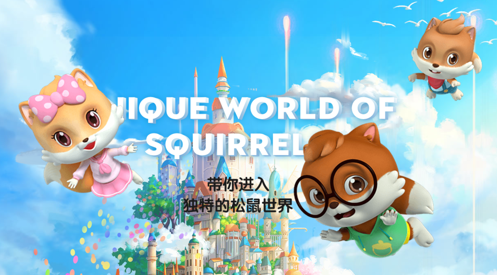
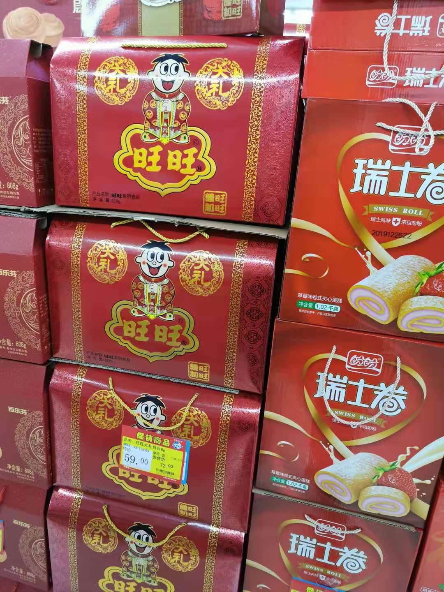
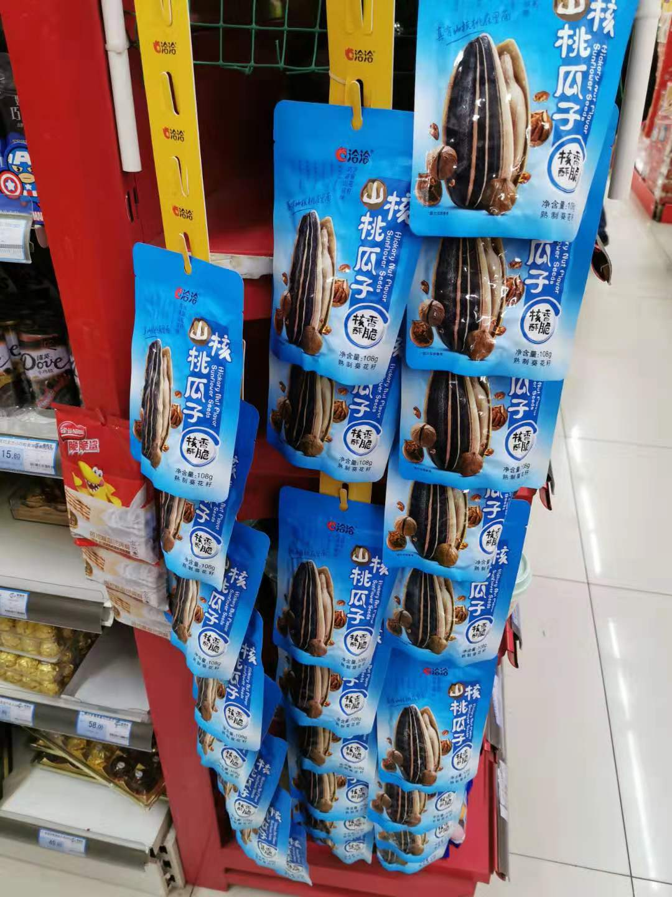
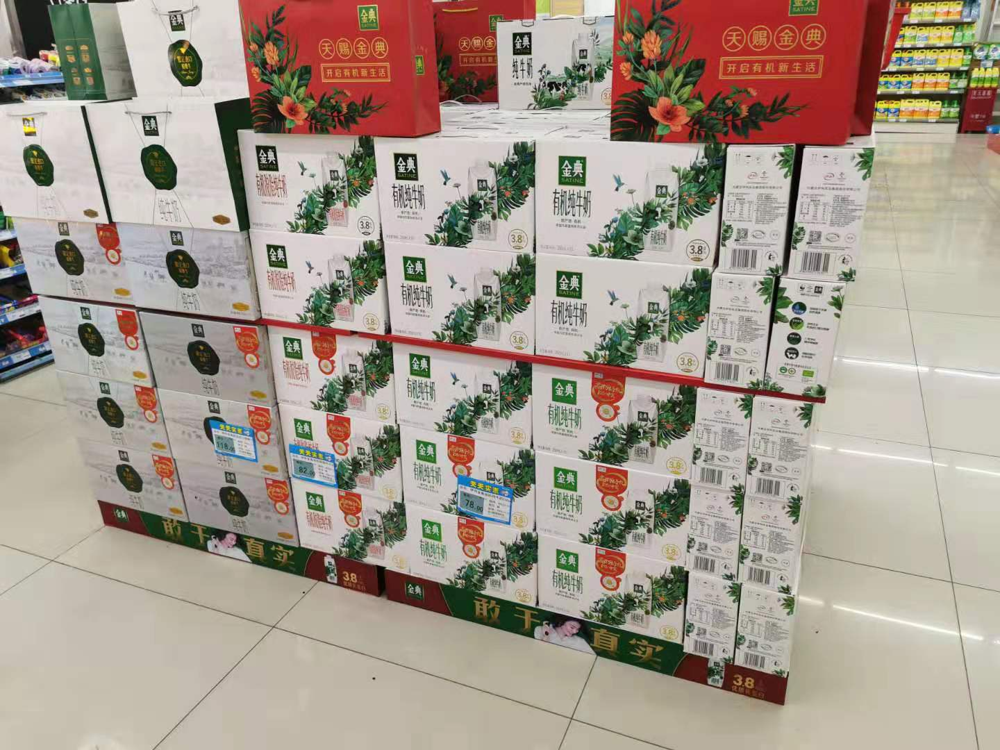
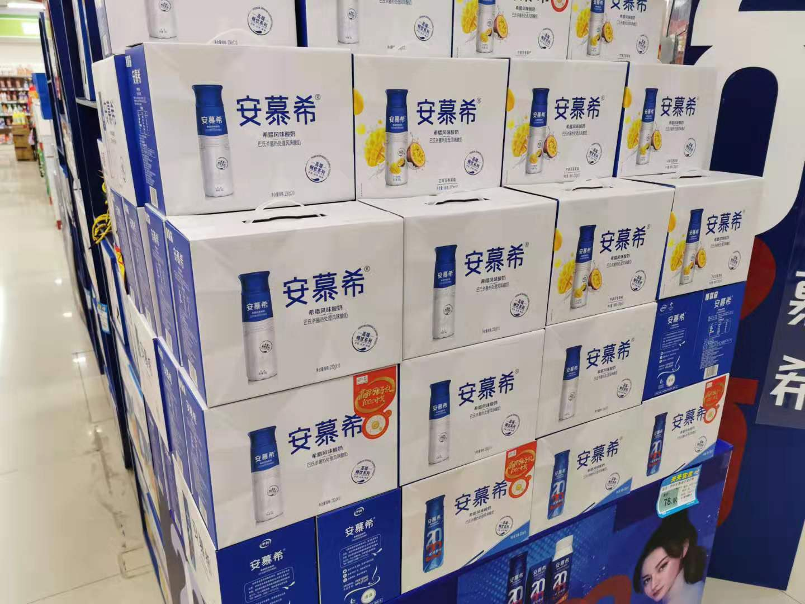
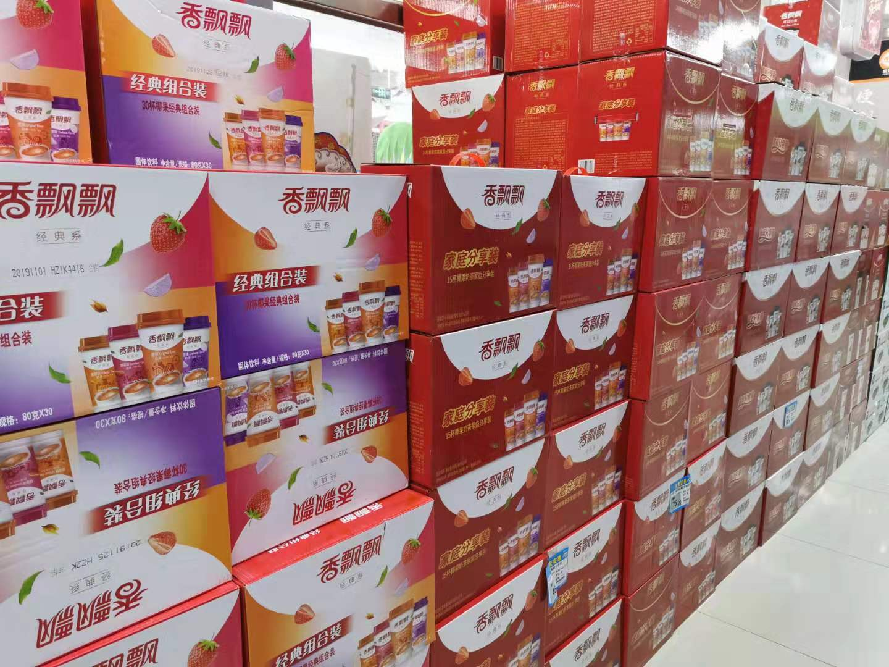

### “三、百、良”

我们中国人对过年是非常重视的：**除夕守岁夜，初一贺新春。** 而过大年肯定是要买年货的，我们家最近几年的年货清单里必有的品目是：坚果大礼盒。

买坚果最早是我向妻子提议的，因为小时候家里条件很一般，只有过年的时候曾祖母的孙辈们来看看望她，有时会送一些红枣和核桃给曾祖母。而我作为家族里长子长孙的独子，自然常能被曾祖母叫到屋内分得一些枣和核桃。

枣一会就吃完了，那时候好像也不怎么在意卫生什么的，枣子是不洗直接吃的。而核桃需要工具砸开（那时候好像没什么纸皮核桃这种说法，壳都是厚的很），常见的开壳工具就是榔头（即锤子）。我常去爷爷的工具箱里翻榔头，有时候爷爷内房锁了，但我又很想吃就会去找砖头砸来吃，有时候也会用门挤核桃吃，所以长大后每次听到有人说脑袋被门挤了，我脑海里浮现的却是曾祖母给的核桃。

现在生活条件比以前好了，每次过年我都想多买一些坚果给家里的老人小孩吃。可能是我对小时候核桃的一种执念，也可能只是让家人们都还能回忆起那时候的艰苦岁月。

---

如题目所见，我们现在常见的坚果礼盒主要是这三个品牌：**三【三只松鼠】、百【百草味】、良【良品铺子】**，分别取首个字连起来乍一听“三百两”黄金。

这三个品牌基本上都是在我刚工作（2012年）那会渐渐进入大家的视线的，我自己接触的先后顺序是：三只松鼠 > 百草味 > 良品铺子。现如今（2020年）三只松鼠已经上市了，而良品铺子的股票代码也都出来了（603719），上市也应该就是这个月的事了，唯独剩下‘孤零零’的百草味了。

这三家都从互联网销售渠道起家（也都是靠贴牌起家），可以说是纯互联网电商品牌，品牌的定位也是年轻时尚化，产品的品质不错、价格不贵（至少当年不算贵），一开始主攻坚果类，后期慢慢延伸到全品类的零食。

我们再看看已经上市的三只松鼠近 三只松鼠(SZ300783) 一年做了什么？不断的开线下店铺、制作IP影视作品（含三只松鼠动画片）、进一步扩展产品种类等。

然后我们再看看即将上市的良品铺子 良品铺子(SH603719) 近一年做什么？也搞线下店铺（但我好像没见过），但好像没拍什么动画片，可是请了吴亦凡做代言，我在公司楼下的电梯里也看过好几回它的广告了，而迅速扩展产品种类是同样的。

然后我们再看看这三家都是怎么个模式？不做线下商超销售（宁愿自己线下开自己的品牌店铺）， 不负责具体的生产、贴牌为主，迅速占领销售渠道后全产品类铺开。说到这是不是觉得很熟悉？一个已经上市的前辈也是靠这个路数发家的：来伊份！但来伊份一开始就是线下主打渠道，上海（甚至说是江浙沪）的街头来伊份店铺真的很常见。

我很佩服这些企业的创始人，或者说管理层。他们就是把**营销做到了极致**，生产零食本身不是一个很高门槛的事情，但在他们的手上**运用资本、结合渠道、营造品牌。**一系列处理之后把零食的毛利润翻了好几倍，然后迅速进一步做大做强，继而成功上市！

--- 

最后说说我自己是如何选择这三家产品的？**谁便宜买谁的！**

三家的产品高度一致，且品质我觉得也没什么区别，那么肯定是谁便宜买谁的。就像跟踪同一个指数的指数基金，我肯定是选择误差小，超额收益稳，费率低，规模大的那只基金呀！

我刚去查了下我京东的历史订单发现下单次数：三只松鼠（9次）、百草味（16次）、良品铺子（10次）。这组不严谨的数据能一定程度上体现了三只松鼠和良品铺子这样的上市企业要比百草味略贵一点，也从而印证了上市后的零食品牌毛利润会更大，这个现象在来伊份、绝味食品、安井食品等企业上已经得到了很好的印证。

所以作为消费者我希望产品能便宜点，而作为投资人我肯定是希望企业的利润更丰厚一点。那怎么办呢？只能买点消费股来‘对冲’下物价咯。

那么终极问题来了：我们该买哪个股票呢？答案是 消费龙头(SH501090)，因为我是一个指数投资者，且对于食品行业我更是注重龙头效应，所以消费龙头是我一个很中意的选择。

最后的最后我晒一组今年过年在老家农村的超市看到的年货对方图片：旺旺大礼包、盼盼瑞士卷、洽洽食品的核桃味瓜子、伊利金典纯牛奶、伊利安慕希酸牛奶、香飘飘奶茶

