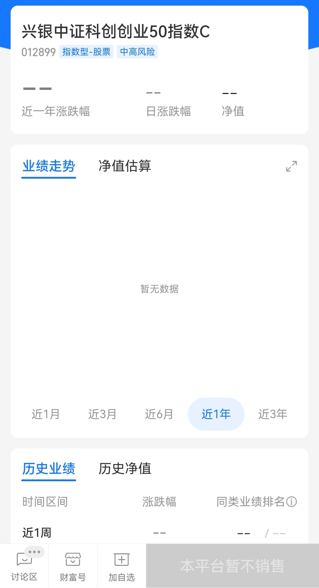

### 双创50批量上市首日观测

中证科创创业50这个指数一出来就赚足了眼球，产品的申报获批也是热闹非凡。上个月底首批募集的9家基金公司也都将会在本周陆续上市，昨天（7月5日）就有5家率先上市，分别是：易方达基金、华夏基金、嘉实基金、南方基金、招商基金。

> 易方达基金
产品代码：159781.SZ；

产品简称：科创创业；

成立规模：30.05亿（06-28）；

运作综合费率：0.6%；

上市首日成交额：16.14亿；

上市首日收盘涨跌：+0.84%

> 华夏基金
产品代码：159783.SZ；

产品简称：双创基金；

成立规模：30.01亿（06-24）；

运作综合费率：0.6%；

上市首日成交额：12.46亿；

上市首日收盘涨跌：+0.51%

> 南方基金
产品代码：159780.SZ；

产品简称：双创ETF；

成立规模：30.00亿（06-24）；

运作综合费率：0.6%；

上市首日成交额：5.32亿；

上市首日收盘涨跌：+0.72%

> 招商基金
产品代码：588300.SH；

产品简称：双创ETF；

成立规模：20.12亿（06-25）；

运作综合费率：0.6%；

上市首日成交额：3.28亿；

上市首日收盘涨跌：+0.82%

> 嘉实基金
产品代码：588400.SH；

产品简称：双创50；

成立规模：15.82亿（06-25）；

运作综合费率：0.6%；

上市首日成交额：1.79亿；

上市首日收盘涨跌：+0.92%

**流动性排序：易方达 > 华夏 > 南方 > 招商 > 嘉实 ；**

首发规模排序：易方达 > 华夏 > 南方 > 招商 > 嘉实 ；

五家都是实力不错的基金公司，最低的嘉实也超过了一亿的交易量，普通投资者交易上肯定没问题的**（大资金投资者可优先选择流动性超强的易方达和华夏）**。规模排序因为限购的原因前三名都是30亿的限额，细微差距都是小数点后的事，我觉得更多的是看运行一段时间后的规模变化。费率其实不止这个5家，首发的9家都是0.6%的综合费率，我只能说大家很有“默契”

其实昨天除了5家双创ETF上市，还有3家场外双创基金开始募集，分别是：兴银基金、天弘基金、鹏杨基金。主要费率依然是0.6%的主旋律，我着重讲下三家的C类销售服务费：

> 兴银基金（012899）：0.1%/年

> 天弘基金（012895）：0.25%/年 （募集上限30亿）

> 鹏杨基金（012908）：0.4%/年 （募集上限30亿）

对于没有证券账户的朋友可以通过场外基金参与，双创基金其实我个人还是倾向于交易型指数，所以**低费率C类是我的优先选择**。而且我在翻看这3家产品的时候，兴银基金的C类在支付宝平台是暂不销售的（见下图），支付宝这次主推的是天弘基金。唉，这个怎么说呢？人之常情吧，毕竟销售服务费主要是给代销平台的，太便宜了那就很可能没法做了。

双创基金无论场内场外，后续价格战肯定是不可避免的，**向所有低费率、高流动性、高超额收益的基金产品致敬**，如果你三点一个都沾不上边，那么早晚会被边缘化。

最后提醒下今天还有华宝基金、国泰基金、富国基金的双创产品上市，明天还剩一个银华基金。还是那句话，我非常非常看好这个指数，相关的产品我会持续关注。

