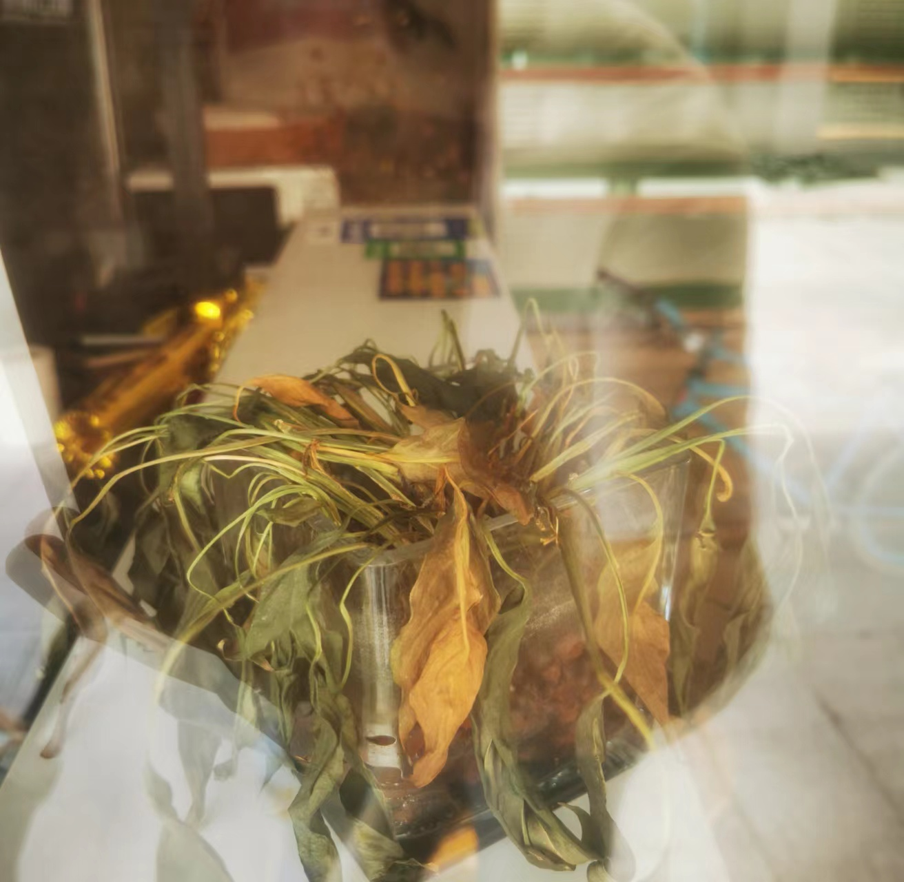

### 写在上海的儿童节前（图才是重点）

我上一次出门还是3月20日（见上图），好在今晚零点开始就能自由出入小区了，下午也正好轮到我们楼栋一户一人限时出门的档期，算是提前半天体验下围墙外的新鲜空气。结合下午出去遛弯拍的照片，我稍微和大家做个分享：

1、院外的蓝天真好看，和在阳台看的感觉完全不一样，即便天还是那个天。

2、路边的行人数量恢复得让我很满意，大家脸上的笑容也比我预想的要多。

3、附近的建设银行、农业银行、工商银行都还没开，但部分ATM机可用，排队取钱的队伍很长；上海银行、招商银行也是没开门，且ATM前几乎不用排队；上海农商行和邮储银行因为不顺路就没去拍。可见虽然银行转账已如此普遍、手机支付更是无死角覆盖，但现金依然具有一些不可替代性。

4、顾村公园的星巴克在三月份为樱花节还特意改了装扮，哪知道再次开门樱花早已不见一瓣了，而这还只是一个缩影。

5、社区周边新增很多这样常态化核酸检测点，为了后期方便市民核酸其实小区内也是有定期采样点的，今天我看到三处小亭子只有一个在排队核酸。

6、常去的留夫鸭小店关了两个月，我透过玻璃看到收银台上的绿植都已枯死，无奈只能去隔壁的久久丫买了鸭脖。绿植干枯了两个月，死了就是死了，明天店家开门浇再多水也没用，只能扔了再换一盆。

7、路边的理发店也正为明天的开业而大扫除，小伙伴们的头发还好不？反正我已经自己推过一次板寸了。

8、有些小区的围栏上的彩条布还没撤去，这些都是疫情期间防止外卖小哥从铁栏杆里偷偷递外卖，严防死守时期的产物。

9、社区服务中心正在为明天的开门而大扫除，门口的保安也在地上贴1米间距条。

10、顾村公园的地铁今天还没开，估计明天此时又是人流攒动了。

11、街边这家牛肉面馆生意不错嘛，今天就已经好几桌客人了，光膀子的这位大叔一看就是骨骼惊奇。

12、遛狗已经不局限于小区内了，话说马路上遛狗小姐姐的腿不错。

13、楼道里有个哥们出去溜了一圈啥也没买，就补了15条烟，大家都惊叹道：牛X！

14、出去一趟走了十几分钟，后面看到小黄车又骑了一个小时才有了本文这些照片（这钱还都是当年摩拜单车那会冲的没用完）。

15、回到小区门口正好看到志愿者全体在合影留念，不管怎么说，志愿者还是要感谢的，他们确实辛苦了。

