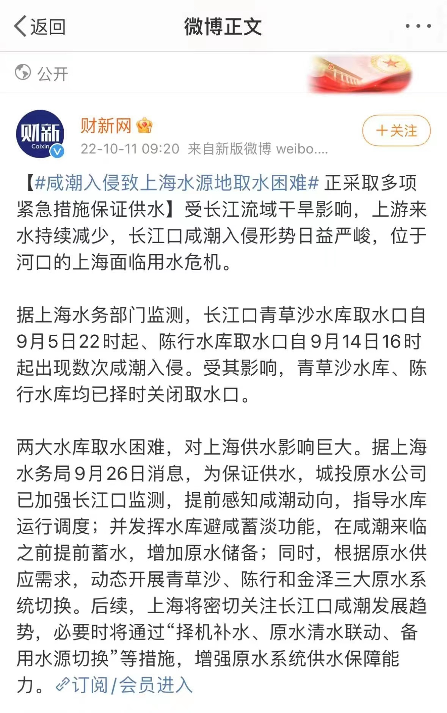
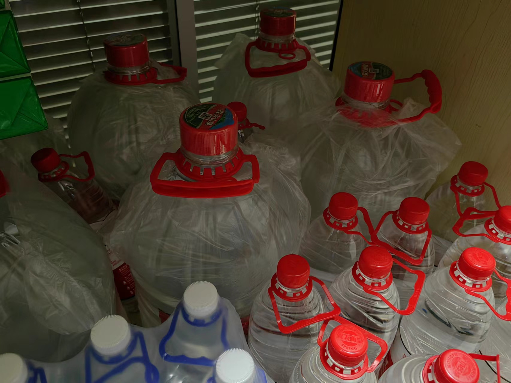
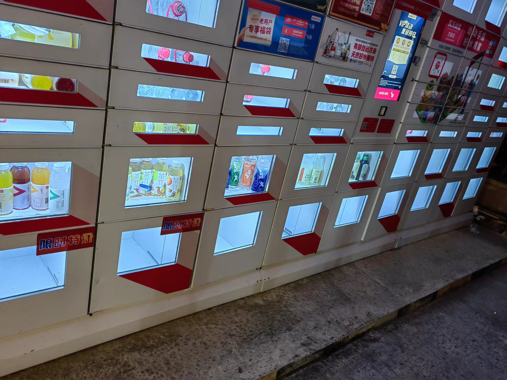
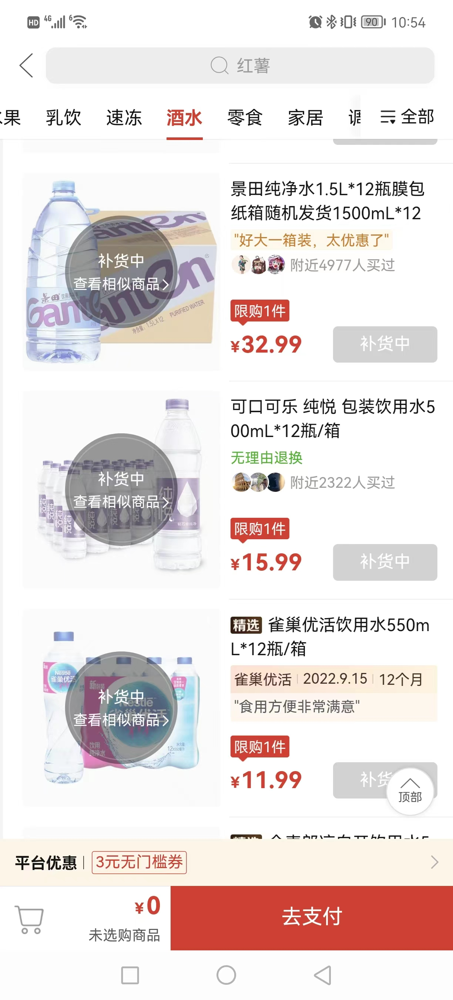
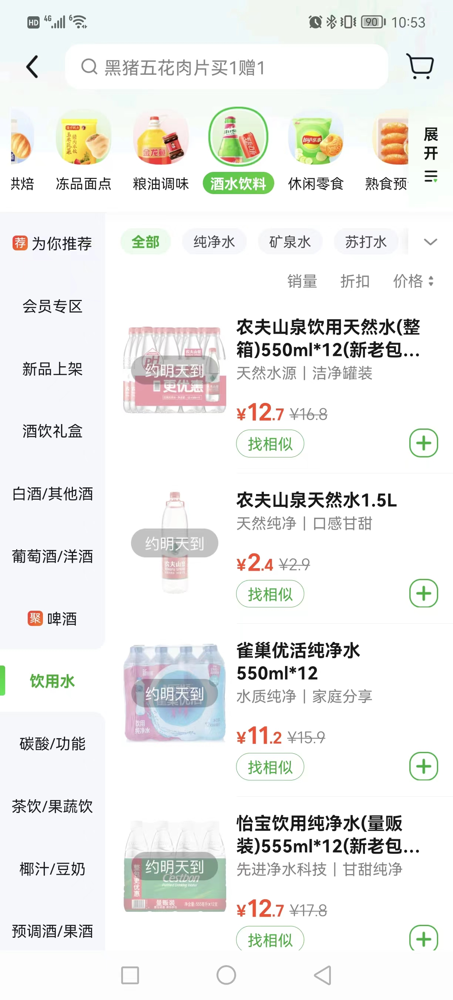
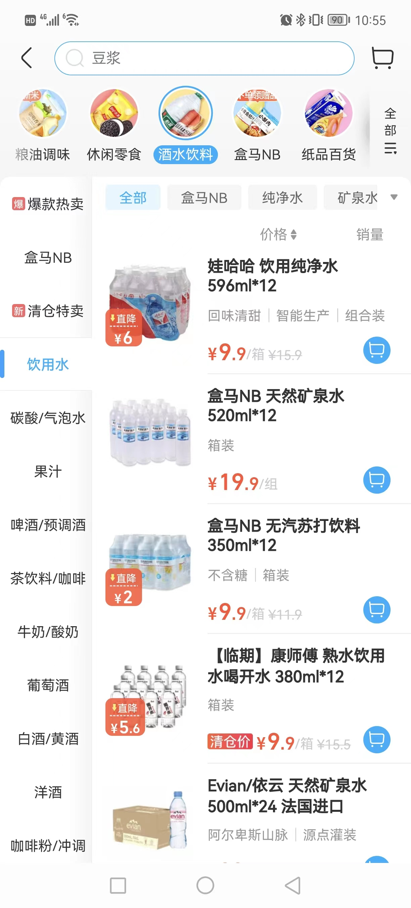

### 今天身在上海的你屯水了吗？

下午老婆突然和我说最近家里要多屯点纯净水，说是有什么“咸潮入侵”，即便我从小海边长大也是头一回听这名词。

我自己还是比较信任上海市政管理的，不认为这会对居民日常生活有所大的干扰，何况我家历来有屯水的习惯。别问，问就是今年的三个月让我们十年怕井绳。

让我想要写这篇文章的动力还是刚去下楼扔垃圾见到的几个惊讶场面：小区里外卖小哥忙碌地骑行着，踏板上放的不是啥外卖夜宵，而是整箱整箱的纯净水。

我意识到不少人在大量屯水，回头一看小区农夫山泉的自助售卖柜里面12L的大桶装一抢而空，这也太猛了吧。

然后我打开了多多买菜、美团买菜、盒马生鲜，去看了下它们的水卖得如何：多多买菜全部被抢空、美团买菜只能预约明天、盒马生鲜有货（但因为盒马是次日自提），分别见下面三个截图。

最后我想说：我认为这不会影响大家的日常生活，但大家的这种情绪和行为我表示理解，大家如果还是不放心，那么就屯一点也行，毕竟这东西平时也要喝的，就当提前过双11购物节了！

