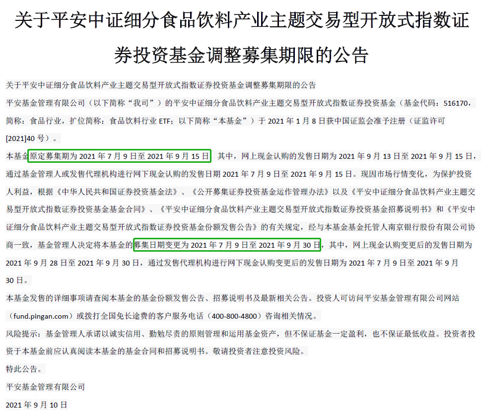
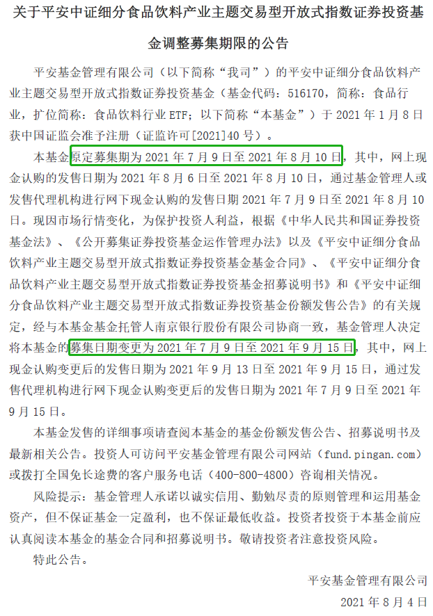
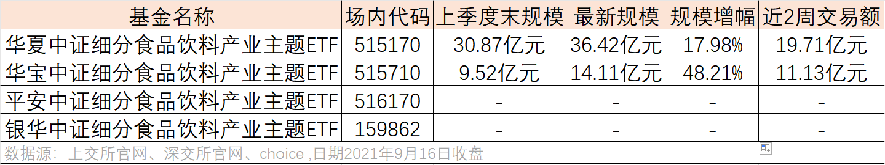

### 食品饮料行业ETF延期募集2次

随着中秋、国庆双节的临近，今年的消费板块能否在“金九银十”之际有所表现？我不知道，但不少基金公司已经开始借机布局相关产品（主动基金和被动基金都有），这是在募集资金准备抄底了？

在众多的新发消费板块基金里，有一只食品饮料ETF发行遇冷宣布延长募集期引起了我的注意，再仔细一看发现这已经是该ETF的第二次延期募集了。是什么原因导致了这种反常现象，是基金公司不重视亦或是产品有问题，还是说市场依然有很浓的观望情绪呢？那我们今天就简单聊一聊：

我们不吊胃口，直接公布说是哪只ETF延期募集2回：平安中证细分食品饮料产业主题ETF，场内简称（食品饮料行业ETF）。上图这份基金公告就是这篇文章的源头，看到这份延期公告时我多少还是有些惊讶的，毕竟平安基金也不是什么小基金公司，他们最近几年在ETF方面的布局也很积极。何况四季度消费还是有很大可能反弹一波的，食品饮料板块上的调整今年也比较充分了，甚至有些机构认为食品饮料板块已经具备一定的防御属性了。

我顺着公告往下看，紧接着的上一份公告也是延期募集公告（8月4日，详见下图），这就让我有了进一步仔细查阅这个ETF的好奇心了。平安基金的这只食品饮料ETF是1月8日获批的，我们知道新基金获批后要在6个月内发行，而该基金的首发日期是7月9日，也就是监管的最后期限。首发募集时间是一个月，然后8月公告延期一个多月、9月公告延期到9月底。为什么第二次只延期了半个月呢？因为有规定要求新基金募集时间不能超过3个月，9月底也就是该基金的最后发行期限了。

平安基金的这一系列操作让我有些困惑，年初拿到的批文硬是拖到最后才发行（或者说最后不得不发行了）。然后一个ETF上来就募集1个月，两次延期后直接募满3个月，也是最后期限到了。话说对于平安基金来说，发行一个食品饮料的ETF有那么不情愿吗？募集2个亿有那么难吗？还是只单纯的不在意这个产品呢？

何况你要说单纯的行业不景气也站不住呀，因为近期发行食品饮料板块的主动基金也一大把，另外作为跟踪同一指数的两只已上市ETF也是逆市份额大增、频频吸金呀。我们先看一组数据（详见下图）：华夏中证细分食品饮料产业主题ETF二季度末规模为30.87亿元，最新规模为36.42亿元，三个月不到规模增幅达17.98%，这还是在净值下跌的情况下，非常了不起；再看华宝中证细分食品饮料产业主题ETF二季度末规模为9.52亿元，最新规模为14.11亿元，三个月不到规模增幅达48.21%，这个增速堪称霸气。这里也补充说明下，这两只ETF虽然近期规模增长额度差不多，但因为华夏的规模基数较大，所以增幅显得稍微小了点，而且我们看到近2周的交易额两家是差不多的，所以我认为这两家旗鼓相当。

当然细心的小伙伴也发现了，上面表格里还有一只相关ETF：银华中证细分食品饮料产业主题ETF。该基金也是处于募集期（7月22日~10月21日），ETF募集那么久我也是只能直呼牛X，但和平安基金不同的是，银华这个产品是上来就是募集三个月，也不扭扭捏捏公告2次延期了，上来就给募集期“满上”。

那为什么会这样冰火两重天呢？我认为除了两家基金公司可能不是太重视外，也主要是现有的两家产品规模和流动性上已经挺好了。而新发的ETF距离上市有一段时间，募集期越长就有越大的不确定性，食品饮料板块震荡行情大概率还要持续，那么不认购新基金持观望态度就更浓。而老基金就不同，越跌越买、越涨越卖是常有的事，最近的白酒板块和券商板块就分别是两者的典型，这也是为什么华夏和华宝的两个产品在回调行情下继续逆市大幅增长规模。

我是一直很关注ETF相关信息的，也很乐意看到各家不断地补充ETF的品类，充分的产品竞争对基金行业的发展已经投资人都是有好处的。但我希望同质化的ETF要有自己的特色，要么流动性足够好、要么费率上更具优势、要么在跟踪误差可控下有更多稳健的超额收益等。可现状就是ETF行业蓬勃发展后出现了很多优秀的产品，但更多的是同质化的迷你ETF。ETF于投资人而言就是工具，我是希望这个工具箱越来越好用的。