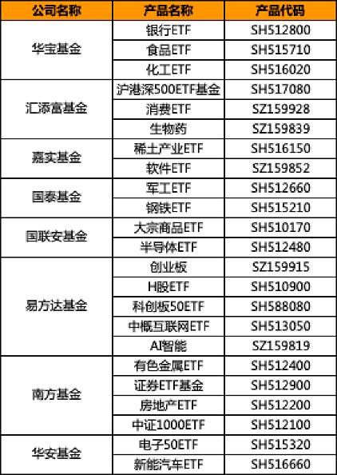

### 认真地回答几个问题

很开心近日接受了雪球的访谈，自认为还是很认真地回答了所有问题，主要是关于ETF投资方面的。现在发出来做个分享，有兴趣的朋友可以往下看看。

Q：您好，请您先向粉丝们介绍一下自己吧。

A：大家好，雪球官方给我的标签是“基金理财自媒体”，其实我是一个从雪球重度用户慢慢成长起来的自媒体，平日里发的帖子除了基金投资方面的，也会分享一些生活中的趣事。我的ID昵称是【老豆说】，因为我女儿乳名叫“豆豆”，虽然老朋友们都知道，但既然是访谈那就有必要再解释下，减少不必要的误会。

Q：看到您的雪球介绍上写道“曾经仗剑闯股海，如今偏爱作基民。”您是出于什么情况由股转基了呢？

A：其实我最早参与投资的方式是基金而非股票，我高二暑假就开通了基金账户买了基金产品（那时候在农村只能去银行柜台开户，交易什么的也都很不方便），但也很荣幸亲身经历了2007~2008年的那轮牛市。

而买股票其实比较晚了（2013年），工作一段时间后手上有了些闲钱就想着不能光放余额宝呀，自然而然的开始了炒股投资之路。

因为早年的基金市场有些不规范的地方（这也是为什么我至今对主动基金有所芥蒂的原因之一），所以我总想着自己亲自下场炒股投资，可是经历了2015年的牛市后，发现折腾了一圈收益也就那样（庆幸自己在两轮牛市里都没亏钱）。

恰巧后面ETF产品越来越丰富，让我开始把重心转向了指数投资。我身边也有不少从股民转为基民的，那么ETF就是大家最主要的选择。

Q：那在个人投资方面有哪些让您印象深刻的挫折和对以后的影响 ？

A：因为高三要封闭学习，所以提前卖出基金逃过了2008年的股灾；因为有一定的投资经验在2015年高点之前感觉市场已经疯了，就几乎清仓了手里的个股。可是早期的投资太顺了也不好，在4000点国家号召救市的时候我信了，我从新重仓杀回去，结果就是2周时间跌到3000点，一首凉凉送给自己。

这个教训太惨痛了，唯一庆幸的是2015年那一轮牛市总体还是略有盈余，但是伤痛永刻心头。这也是为什么我现在的组合一直会保持一个25%左右的债券仓位，就是凡事留个后手，很多时候只有你自己撞过墙才知道这样不对。我也因此常劝诫新手投资吃亏要趁早，等你手握重金了才进入市场，那时候“学费”就会更贵。

Q：近年来，也有很多投资者从股票投资转到了ETF投资，您觉得原因是什么？

A：近几年个股暴雷的太多了，而ETF可以很好的规避非系统性风险。其实大部分股民都习惯了自己动手，而且ETF确实可以很好的满足大家对市场波动的需求。比较典型的有券商ETF（一个可以涨停的ETF），而且数据也显示券商类ETF、食品饮料类ETF等交易量占成份股总交易量的占比在逐年增加。

当然也要感谢现在遍地开花的ETF，在各家基金公司的努力之下如今即便你不买个股，也可以用ETF搭建一个不错的投资配置了。而且你会发现ETF可以装的东西很多，远不止A股，有港股、美股、黄金、大宗期货（豆粕等）、地产资产（REITs）、原油等。

Q：想了解下长期以来您主要擅长的投资的策略和方法是什么？

A：我是一个程序员，所以对交易策略的有效性和可靠性要求极高，这也会导致我策略的底层基础非常简单，就是低买高卖。对于ETF的投资我其中一个策略就是：基于估值系统的网格自动交易。简单说就是，我会在一个指数低估的时候建底仓，然后通过券商软件设置好全自动的条件网格单，后期执行其实是全程自动的，我一般是每周复查一遍有无异常。当然具体的指数选择、估值方式、网格步数的设定等细节就不展开了，这个太复杂，也不好简单概括。

我也知道有些人是不待见网格的，但是随着自动化交易以及券商佣金的降低，交易成本和人力成本都近乎为0 的时候，这个策略对于上班族没时间盯盘的人来说，是非常实用的。

Q：您对ETF产品了解多少？您认为ETF有何优势？

A：ETF其实也算是一种“退而求其次”的策略选择，是“懒人”们的一种生存智慧。有点投资经验的朋友都能体会到，个股投资其实门道极深，要想做好也是很难的。我们在研究一个企业的时候，面对的信息是超级庞大的，我们甚至需要反复甄别信息的真伪和然后做出对应的操作决策，这些都还不考虑信息的时效性等其他干扰。

我自知能力不足以研究好一只个股，那么本能的就会选择‘次优’解，把研究的粒度扩宽一点，从个股的研究延展到一个行业或者一个相关性较强的主题板块上来，而这个次优解最终会在相应的ETF上得到落实。
概括下优势：①、交易费用更便宜（因为我有一些策略是较高频的交易，要考虑摩擦成本）；②、ETF的投资研究是一个行业或一个相关主题，研究粒度更粗、更省力，也可以有效规避非系统性风险；③、ETF具备永续性，且有自我新陈代谢的优化功能。

Q：有人说投资指数基金是散户或者上班族的投资神器，您觉得呢？

A：是的，我甚至觉得有经验的投资者也应该好好利用指数基金，特别是ETF这个好东西。

Q：您有多少年ETF投资经验了？您购买的第一支ETF产品是哪支？

A：我交易ETF已经4年多了，我的第一支ETF就是券商ETF，是极佳的券商个股替代品。对于行业同质化较严重的板块是可以考虑用ETF去替代的，比如：券商、银行、白酒、钢铁、煤炭等；对于一些个股参与不是很方便的行业或板块也可以用ETF代替，比如：中概互联、科创50、纳斯达克100、标普500、德国30、日经225、法国CAC40等。

Q：对于一个投资经验比较浅的人，如果他要接触ETF投资，您建议的进阶过程是怎么样的？

A：其实可以先从场外指数基金开始，这个不需要证券帐号，蛋卷基金上就能买卖。你在买卖场外指数基金的时候会自然而然的学会了指数基金的基础知识。等你了解了什么是指数基金，然后就会发现原来还有更高效的跟踪指数的产品---ETF，当然你本身就有个股投资经验的可以直接进入ETF买卖阶段。

Q：对于ETF争霸赛的23支产品，您比较看好哪几个领域的ETF产品？有没有真正的购买了争霸赛里面的产品呢？

A：我看了下列表，自己买过的有华宝的食品ETF；国泰的钢铁ETF；国联安半导体ETF买的是场外联接；易方达的创业板、H股ETF、科创板50ETF、中概互联网ETF；南方的有色金属ETF、证券ETF买的是联接；华安的电子50ETF。

我不知道怎么算是看好，行动胜于言语吧，反正我当前还有的持仓有： 食品ETF、 中概互联网ETF 、 有色金属ETF （仅限下图列表内的，我还有很多该列表外的ETF持仓）。

Q：前一段时间站内的很多用户也是在不断地关注易方达中概互联ETF这个产品，它也是本次参赛的王牌产品之一，您觉得目前它适合实盘买入么？

A：比赛是否适合我不知道，因为毕竟比赛是有时间限制的，但是我自己的持仓里中概互联占比不小，类似的恒生科技我也有一定的持仓。当前价位的中概互联我认为是可以做一个慢慢定投的，这或许也和我以前是个程序员有关，对互联网科技企业会格外看好。

Q：请问您是如何看待港股市场的机会呢？

A：港股是个大趋势，我说两个细节吧：①、大量优质中概股回港股二次上市，大量互联网企业会给港股注入新的活力；②、近两年新发的主动基金都会带上港股的标的，我的理解是机构担忧A股核心资产后期普遍偏贵，而港股作为全球价值洼地是很有吸引力的。

当然我也要提醒下大家，普通投资者参股港股最好还是通过ETF，因为港股个股的风险不小，特别是那些没有流动性的小票。如果以前人们买港股是看中了金融地产股的AH溢价，那么我认为现在港股最好的价值点是二次回归的互联网企业。

Q：您觉得恒生科技、中概互联、恒生互联网这三个有哪些不同？哪个更适合普通投资者呢？

A：因为先入为主的关系，我自己持仓最多的肯定是中概互联，中概互联指数里25%的阿里+30%的腾讯这点就足够吸引我了（因为我的策略之一就是需要波动）。对于更普遍的投资人，我觉得新出的恒生科技也是非常好的选择，我自己也有慢慢定投该ETF。

Q：有色金属前段时间走出了一波行情？您认为这波行情会持续多久呢？

A：顺周期的ETF其实去年8月开始我就公开表示一直在做波段，实际跑下来确实收益还是不错的。5月初我对于钢铁ETF、煤炭ETF、有色ETF都做了清仓操作，主要是觉得下调的可能性越来越大了，但在前不久拜登宣布再加6万亿计划的时候，我重新又买入了有色ETF。

其实有色ETF的行情能否继续就看国际大宗商品能否继续，虽然国家有意在抑制大宗原材料的快速上涨，但是定价权不在我们这里，美国的水龙头只要继续开着，那么上涨的大趋势短期很难抑制。

对于有色ETF的我还是提个醒，可以参与顺周期，但要时刻警觉，切莫动真情。只要出现水龙头关闭的预期，就要立马跑路。

Q：实盘来讲，这23支产品您能给粉丝们推荐一个您认可的长期可以拿得住的组合么？

A：因为我自己ETF方面的策略主要还是赚波动的钱，所以选择的标的是长期看好且波动较大的指数板块。比如 食品ETF + 中概互联网ETF + 创业板 + 证券ETF ，总的一个原则就是行业相关性要弱，要做到行业对冲、阶段止盈。

Q：您认为雪球ETF争霸赛它对于我们普通投资人有什么好处么？

A：有一个较为真实的参战体验，很多东西只有真正的参与进来了，才有更真切的体会和经验获得。

Q：近期疫情又开始反复了，您觉得这波疫情的反复可以带来哪些新的投资机会？

A：我认为全球的疫情大趋势在明显转好，特别是我们中国几乎是一枝独秀。客观地说，美国随着接种疫苗的推进，已经有了很好的转变，这也是他们频繁给我们施压的内因之一。

所以我们在关注疫情带来的机会时，也要清醒地看到疫情被控制后哪些前期有业绩透支的板块可能存在回调，投资很多时候要多一份清醒。

Q：最后想问下您，怎么去看下半年整体的投资机会？

A：机会就不说了，说几个下半年可能的风险点吧：①、谨防前期暴涨行业盈利下行的风险；②、美债冲高对A股核心资产的估值可能存在扰动；③、美联储缩表与资金外流，让A股面临估值和资金流双重冲击；④、美疫情缓和后会对我国进一步施压，会扰动市场情绪和影响出口。