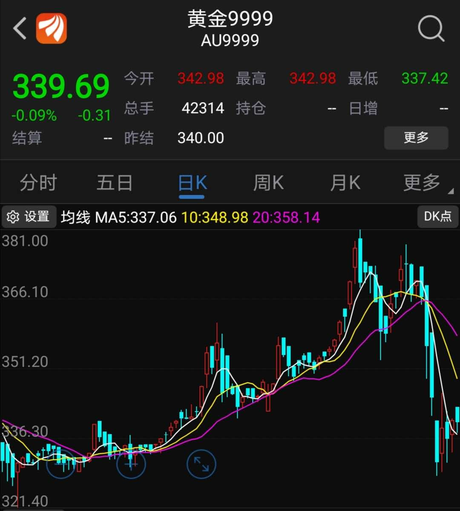
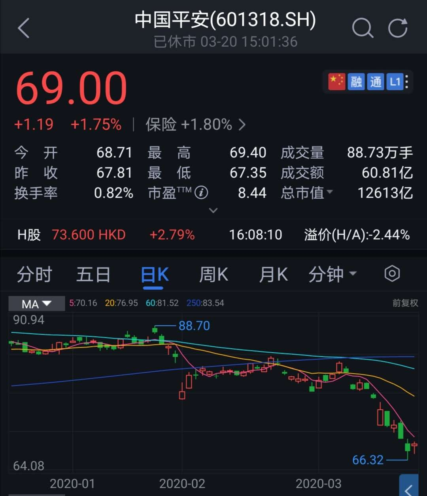
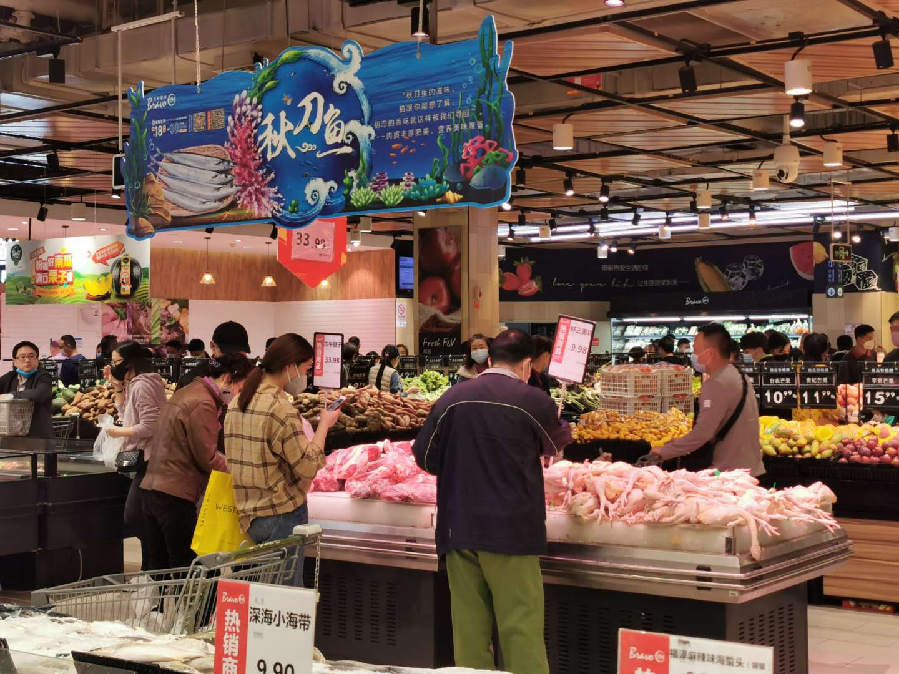

### 近日关于投资的几点思考

**1、黄金到底算不算避险资产？**

- 不算：最近两周金价不涨反跌，还不如美元来得坚挺。

- 算：黄金近期的下跌主要是因为流动性危机，能在这时候卖个还算可以的价格也证明了黄金确实具备避险属性。

老豆说：我们从小就接受了黄金是避险资产的这一‘事实’，并且所有黄金ETF在宣传的时候也必然会突显其避险这一特性。在这次全球股灾之下，流动性危机席卷全球，使得众多机构不顾一切的抛售资产来补充流动性，黄金也是主要被抛售的资产之一。外加黄金在去年的连续上涨之后，确实有短期调整的需求和可能，当然黄金的下跌和原油也有点关系。所以综合看我认为黄金依然是具备避险属性的（但不是说现在这个价格的黄金可以买哈），是当下仅次于美金的全球避险资产。（额外补充一个佐证：全球最流行的数字货币-比特币，在这次流动性危机中被腰斩，这也映衬出黄金还是可以的）

**2、流动性好到底算不算加分项？**

为什么会有这样的思考呢？如刚上面说的，当机构遇到流动性危机的时候，优先卖出的往往是流动性好的白马蓝筹股。所以我们平日里总是说蓝筹股的优点之一就是流动性强，可这次的金融危机让集中重仓蓝筹股的朋友亏损很惨。比如说中国平安，一月份还有88元多，而最近低点到过66元附近了。但我不认为流动性好是减分项，那些流动性差的股票只是因为跌停无法交易了了，机构才不得不减仓蓝筹股，而且机构本身持有的蓝筹股肯定也是远大于中小盘。还有就是流动性好的资产往往会伴随着一些溢价，因为大家愿意适度的加价买入流动性好的资产。

**3、回头看，外资真的是及时雨吗？**

去年听得比较多的是国外指数公司又加入了多少A股比例，会带来多少亿美金的‘洋韭菜’（比如**MSCI、富时罗素、标普道琼斯**），甚至有几次出现了纳入A股生效的首日尾盘暴涨拉伸的情况。与之相对应的是最近本该企稳的A股，受多日的外资净流出而阴跌不止。所以外资也不见得就是什么及时雨，随着A股外资占比的提高，我们股市受世界经济的影响也会越来越大，因此还是要理性看待资本市场的开放。我们常说盈亏同源，类似的外资对我们股市到底是‘**助力**’还是‘**阻力**’？

**4、一根大阳线，千军万马来相见；一日好天气，家家户户来消费。**

今天是周六，老婆说要去超市买点食材，晚上弄火锅吃。去了超市看到人气真的很足，两周前去超市大家都是目的性很强，想好了买啥，然后赶紧买了付款回家。今天沿街的商铺也都开了，我看到许留山里坐满了客人，大人们也愿意带着小孩出来逛超市了，而且明显感觉大家逛超市的时候比之前悠然了很多。这种变化主要取决于国内疫情的显著改善，最明显的是身边的同事不再讨论每天新增多少病例了，大家也不会每天醒来第一件事去看下丁香园的最新数据了。周末的天气格外明媚，**暖洋洋的太阳晒在身上，确实也会给人心带来更真实的乐观情绪**。复工复产正在有序进行，口罩等医疗资源也不再紧张，大家消费的信心也逐步恢复，只要守住境外输入型病例，我们肯定可以收获更好的明天。

